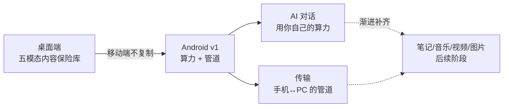
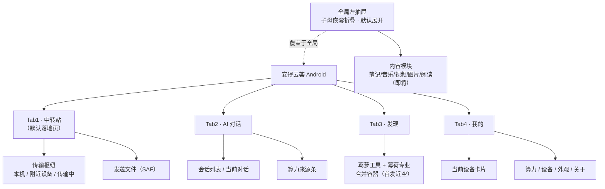
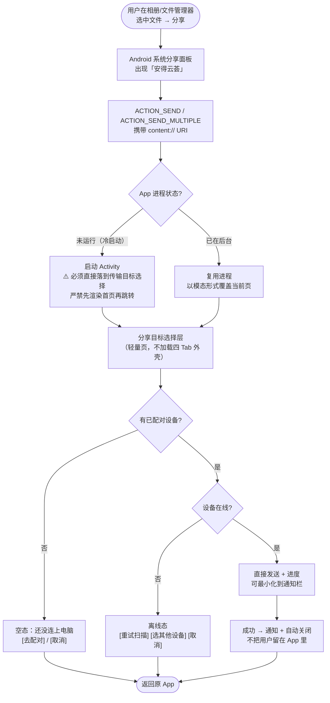
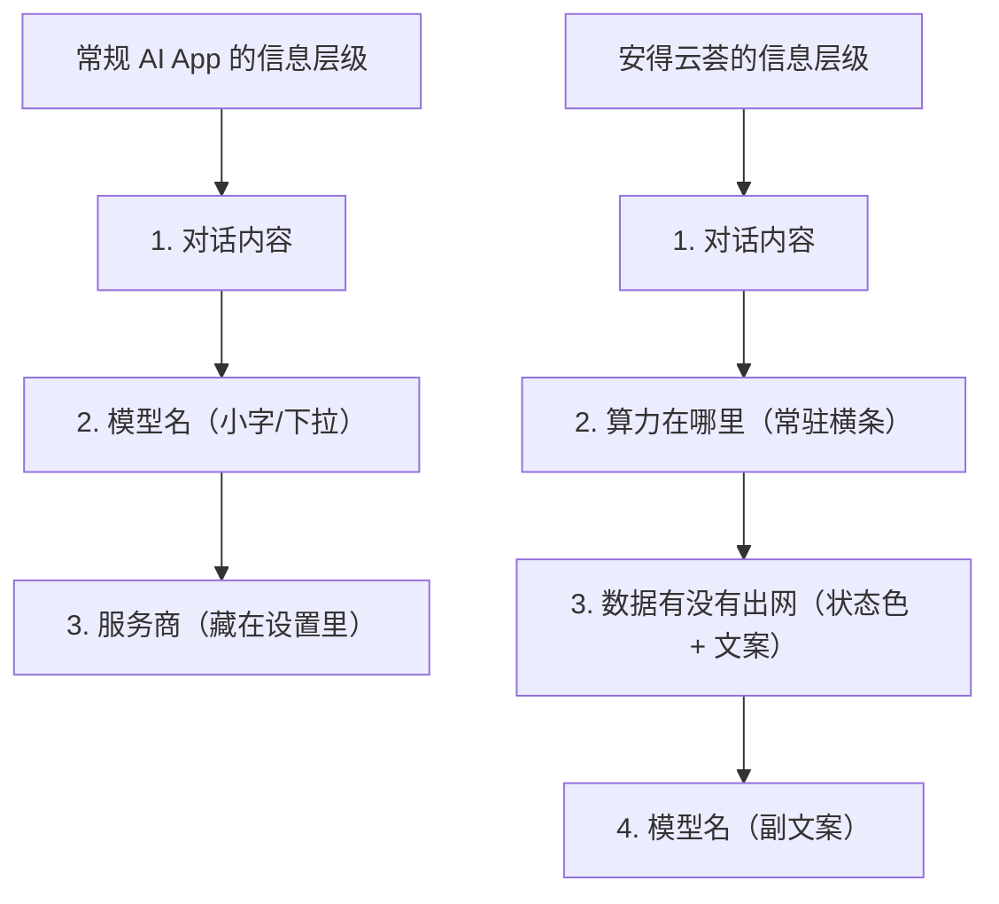
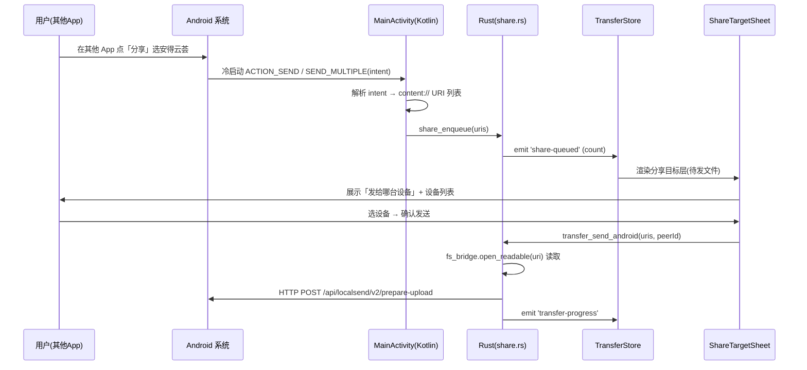
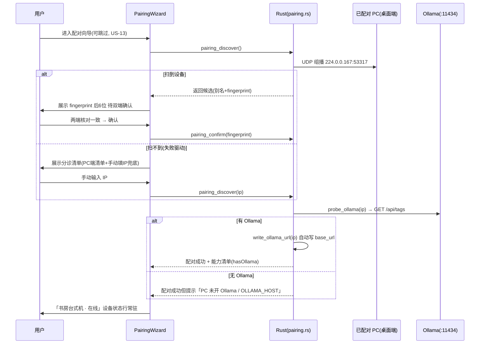
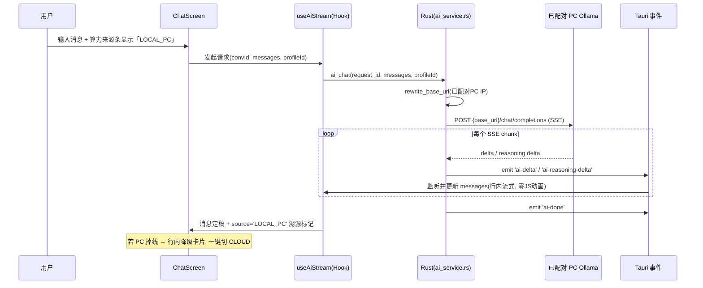
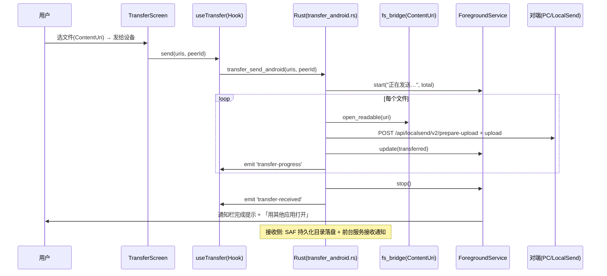

# 安得云荟 Android v1 · 交接总规格书

| 项 | 值 |
| --- | --- |
| 文档类型 | **唯一权威交接文档**（合并全部计划分册，自包含，无需查阅其他文档即可开工） |
| 版本 | v1.0 |
| 目标读者 | **完全没有本项目上下文的外部编码代理 / 工程师** |
| 仓库根 | `C:/Users/Rosary/Desktop/andeyunhui` |
| 分支 | `feat/android-v1` |
| 技术栈 | Tauri v2 + React 18 + TypeScript + Vite + Rust（沿用桌面端，不换栈） |
| 语言 | 简体中文 |
| 代码审计基准 | 本文档所有「实测」数据均于交接当日在 `feat/android-v1` 分支实际执行命令核实，非推测 |

---

## 0. 交接须知与如何使用本文档

### 0.1 TL;DR · 5 分钟速览

> 如果你只读一段，读这一段。

**这是什么项目**
安得云荟是一个已经成熟的 **Windows 桌面应用**（Tauri v2 + React + Rust），本地优先的「五模态内容保险库」——笔记、音乐、视频、图片、阅读，外加一个叫「茑萝」的工具扩展坞（内含局域网传输、加密、IDE 等子模块）。

**上一轮发生了什么（失败教训）**
上一轮有人把 Android 当成**编译目标**来做：让 Rust 交叉编译过、让 Gradle 出包、让 `.so` 进 APK。产出了一个 470MB 的 arm64 debug APK，在 MuMu 模拟器上能跑。用户的评价是一句话：

> **「能用，但是生搬硬套 Windows 版本。」**

技术上成立，产品上不成立。**本次交接的全部意义，就是不要重复这个错误。**

**这一轮要做什么**
不是「把桌面版塞进手机」，而是回答「在手机上，这个产品到底是什么」。答案已锁定：

> **安得云荟 Android 版 = 你自己那台电脑的随身终端。**
> 手机不当保险库（存储受限、不是主力生产设备），手机当**入口**和**遥控器**。

所以 Android v1 **只做两件事**：
1. **接上算力** —— 手机连回家里 PC 上的 Ollama 跑 AI 对话，数据不出路由器。
2. **接上文件** —— 手机 ↔ PC 局域网互传，不经过任何第三方服务器。

其余五个内容模块**全部留空壳**，进左抽屉，标「即将」。

**四个 Tab 已锁死**（不许改）：`中转站 | AI对话 | 发现 | 我的`

**最重要的一条铁律**
> **先隔离后扩平台。Android 的任何改动，Windows 桌面代码路径必须零改动、零回归。**

用户明确担心「搞崩 Windows 版」。这是**一级红线**，优先级高于任何 Android 功能。详见第 5 章，每个任务合并前必须过第 11 章的回归门槛。

**你最容易踩的 5 个坑**（详见正文）
| # | 坑 | 后果 |
| --- | --- | --- |
| 1 | 不持有 `WifiManager.MulticastLock` | 局域网**永远扫不到设备**，传输和配对全部失效。当前代码库中**完全没有**这个实现 |
| 2 | Ollama 用 `http://localhost:11434/v1` | 手机上 localhost 指向手机自己，**必然失败**。配对后必须自动改写为 PC 的 IP |
| 3 | 保留 `ThemeProvider` 的 `zoom` 包裹层 | `vh/vw` 与媒体查询断点**全部错乱**，响应式失效 |
| 4 | 沿用 `App.tsx` 的单一 `activeModule` 状态 | 系统返回键行为错乱，必须重构为每 Tab 独立导航栈 |
| 5 | 为了让 Android 编译过而改 Windows 分支代码 | **触碰一级红线，直接打回** |

**首阶段出口标准**：配对能通 + AI 对话能用 + 文件能双向传 + Windows 零回归。达成即可打包给用户试用。

---

### 0.2 本文档的三类信息，请严格区分

这一节**极其重要**。你是一个自主执行的代理，如果分不清哪些能改哪些不能改，你会擅自推翻产品决策。

| 标记 | 含义 | 你的权限 |
| --- | --- | --- |
| 🔒 **用户已锁定决策** | 用户本人拍板的产品决策 | **绝对不可改动。** 即使你认为技术上更优，也不许改。若发现与技术现实冲突，**写进风险清单交回主理人**，不要自作主张 |
| 🔧 **执行者可自行判断** | 实现细节、代码组织、命名、文件拆分粒度 | 你可以自主决定，只要满足验收标准 |
| ⚠️ **非阻塞·已知项** | 已知的缺口/风险，但不阻塞首阶段 | 知悉即可，不需要在首阶段解决，**不要因此停下来提问** |

> **本文档中不存在需要向用户提问才能推进的空洞。** 所有「建议 / 待定 / 可选」措辞均已在合并时清除或明确降级为 🔧 或 ⚠️。如果你觉得某处需要提问，先重读本文档——答案大概率已经写在里面了。

### 0.3 推荐阅读顺序

```
第 1 章（失败教训）  ← 建立「为什么」，别跳过，这决定你的审美判断
     ↓
第 3 章（锁定决策）  ← 建立「不许碰什么」
     ↓
第 4 章（工程现状）  ← 建立「代码长什么样」
     ↓
第 5 章（平台隔离）  ← 建立「怎么不搞崩 Windows」，一级红线
     ↓
第 10 章（任务分解） ← 开始干活
     ↓
第 6-9 章按需查阅（设计规范 / 交互映射 / 架构）
     ↓
第 11 章（验收门槛） ← 每个任务合并前必过
```

### 0.4 全文导航

| 章 | 标题 | 它回答什么问题 | 强制性 |
|---|------|--------------|-------|
| **0** | 交接须知与如何使用本文档 | 我该怎么读这份文档？ | 必读 |
| **1** | 项目背景与失败教训 | 这项目是什么？上次为什么失败？ | 必读 |
| **2** | 产品定位与目标 | 做什么、不做什么？ | 必读 |
| **3** | 用户已锁定决策清单（L1–L14） | 哪些事我无权更改？ | 必读 |
| **4** | 工程现状实测 | 代码现在长什么样？有哪些坑？ | 必读 |
| **5** | **平台隔离策略（A 章 · 一级铁律）** | 怎样保证不搞崩 Windows？ | **必读** |
| **6** | 信息架构与导航 | 四 Tab、抽屉、返回键怎么组织？ | 实现前读 |
| **7** | UI/UX 设计规范 | 每个页面长什么样？令牌怎么用？ | 实现时查 |
| **8** | 桌面 → 移动交互原语映射 | 右键菜单/悬浮提示在手机上变成什么？ | 实现时查 |
| **9** | 系统架构设计 | 文件怎么放？类怎么设计？流程怎么走？依赖装哪些？ | 实现前读 |
| **10** | **任务分解与进度追踪（B 章）** | 我现在该做哪个任务？做到哪了？ | **每次开工必读** |
| **11** | 验收标准与回归门槛 | 什么算做完了？ | 每次合并前必过 |
| **12** | 竞品参考精要 | 那些硬约束为什么存在？ | 建议读 |
| **13** | PC 端手动配置指南（内联） | 用户侧要怎么配？（= T08 的行为规格） | T08 前读 |
| **14** | 非阻塞项与已知风险 | 什么可以将就？遇到疑难怎么办？ | 必读 |
| **附录 A** | 原始文档索引 | 本文档从哪来？冲突时听谁的？ | 备查 |
| **附录 B** | 本文档相对源文档的增量 | 哪些结论是源文档里没有的？ | 备查 |

---

## 1. 项目背景与失败教训

### 1.1 桌面端是什么

安得云荟桌面版是一个 Windows 上的本地优先内容管理应用，核心价值主张是「把五类内容收进同一个本地保险库」。

代码组织上，插件分两层：

| 分组 | 代码位置 | 成员 | 共同特征 |
| --- | --- | --- | --- |
| 顶层模块 | `plugins/铃兰\|莲花\|玉兰\|三色堇\|薄荷/` | 音乐、图片、视频、阅读、专业 | 都是**内容类型的容器**——「我的东西存在这里」 |
| 茑萝子模块 | `plugins/茑萝/*` | 传输、加密、文本工具箱、IDE、WPS、绘画、RAG、桌宠、胶囊、AI 编程 | 都是**对内容做事的工具**——「我要执行一个动作」 |

**花名体系**（品牌资产，移动端继承）：

| 花名 | 功能词 | 插件 ID | 导航层显示 | 页内显示 |
| --- | --- | --- | --- | --- |
| 鸢尾花 | 笔记 | `notes` | 笔记 | 鸢尾花 · 笔记 |
| 铃兰 | 音乐 | `music` | 音乐 | 铃兰 · 音乐 |
| 玉兰 | 视频 | `video` | 视频 | 玉兰 · 视频 |
| 莲花 | 图片 | `image` | 图片 | 莲花 · 图片 |
| 三色堇 | 阅读 | `reading` | 阅读 | 三色堇 · 阅读 |
| 薄荷 | 专业 | `professional` | 专业 | 薄荷 · 专业 |
| 茑萝 | 工具 / 扩展坞 | `niaoluo` | 工具 | 茑萝 |
| （无花名） | 传输 | `transfer` | 传输 | 黄金棋盘 · 传输 |

**花名使用规则**（🔒 锁定）：
1. 导航层（Tab 栏、抽屉、面包屑）**只写功能词**，用户永不需要猜谜。
2. 进入页面后，页头以「花名 · 功能词」形式呈现，花名可用品牌字重/色彩强化。
3. 花名**不可**作为唯一标识出现在任何需要用户做选择的位置。

### 1.2 上一轮为什么失败

上一轮 Android v1 被当作**编译目标迁移**执行，全程无产品阶段、无 PRD。结果是一个**能安装但不能用的产品**。

「生搬硬套」的具体体征（这些是**一票否决项**，见第 11 章）：

- 桌面尺寸的控件（小于手指的按钮、密集的图标网格）
- 右键菜单（手机上根本触发不了，**100% 不可达**）
- hover 依赖（手机没有 hover，信息永远看不到）
- 窗口标题栏残留
- 冷启动分享时先闪现首页
- 扫不到设备时只说「未找到设备」而不给原因

### 1.3 病根的教科书案例：Syncthing Android

Syncthing Android 是本地优先同步的标杆产品，但它的移动端是**「桌面思维移植到手机」的反面教材**。它的病症和我们上一轮**是同一类**：

| Syncthing 的病症 | 我们上一轮的对应 |
| --- | --- |
| 桌面端的配置概念全量搬到手机 | 桌面端的模块全量搬到手机 |
| 用户要理解「设备 ID」「文件夹 ID」「introducer」才能用 | 用户要理解花名体系与模块划分才能找到功能 |
| 首次使用需要在两台设备间来回操作 | 首次使用无引导 |
| 失败时给的是技术层错误 | 同上 |

> **我们做 Android v1 的整个动机，就是不要变成 Syncthing Android。**

三条从中提炼的硬约束（🔒）：
- **SX1**：不要把技术概念外露给用户。fingerprint、组播地址、端口，一律不进主流程，只放「高级设置」。
- **SX2**：不要要求用户理解架构才能用。用户不需要知道什么是 UDP 组播，只需要知道「手机和电脑要连同一个 Wi-Fi」。
- **SX3**：不要用长 ID 作为用户可见标识。fingerprint 只展示**后 6 位**用于校验。

### 1.4 正面参照：Obsidian 移动版

Obsidian 是本地优先的桌面笔记产品做移动端——**处境和我们完全一致**。它做对的关键一条：

> **移动端重建导航模型，而不是压缩桌面布局。** 桌面独有能力（部分插件、复杂多面板）**直接不提供**，不做残缺版。

Obsidian 的插件清单里，桌面专属插件在移动端**直接不显示**，而不是显示了但点了报错。

对照我们（🔒 锁定）：
- 桌宠、托盘、悬浮歌词、截图录屏在 Android 上**不加载、不显示**。
- 关键是**不要让它们以灰色/报错的形式出现在移动端界面上**——那比不做更糟。

---

## 2. 产品定位与目标

### 2.1 一句话定位（🔒）

> **安得云荟 Android 版 = 你自己那台电脑的随身终端。**
> 在手机上直接用上家里 PC 的算力和文件，AI 对话不必把数据交给任何厂商。

### 2.2 三个正交目标

| # | 目标 | 成立判据 |
| --- | --- | --- |
| G1 | **算力回流**：让手机用上用户自己 PC 的模型算力，而不是只能用云 API | 用户能在手机上与 PC 上的 Ollama 对话，并清楚知道「这段对话没有出我家路由器」 |
| G2 | **文件双向流动**：手机 ↔ PC 的文件传输，不经过任何第三方服务器 | 从相册分享一张图到 PC，全程不超过 3 步、不需要先打开 App |
| G3 | **去桌面味**：交互原语从「鼠标 + 窗口」重建为「拇指 + 页面」 | 陌生用户拿到手机不需要指导即可完成配对与首次对话 |

### 2.3 取舍逻辑



桌面端的价值主张是「把五类内容收进同一个本地保险库」。手机不适合当保险库（存储受限、分区存储限制、不是主力生产设备）。手机适合当**入口**和**遥控器**。所以 Android v1 只做两件事：**接上算力**、**接上文件**。

### 2.4 核心用户角色

| 角色 | 描述 | 关键诉求 |
| --- | --- | --- |
| **主力用户「有 PC 的人」** | 家里/工位有一台常开的 Windows PC，已装安得云荟桌面版 | 出门在外或在沙发上，想用手机接着用 PC 的东西 |
| **隐私敏感用户** | 不愿把内容交给云厂商 | 需要确信数据没出本地网络 |
| **尝鲜试用者** | 朋友推荐，第一次装 | 装完能不能 5 分钟内跑通一次对话 |

### 2.5 用户故事清单

#### AI 对话

| ID | 故事 | 优先级 |
| --- | --- | --- |
| US-01 | 作为主力用户，我想在手机上直接与家里 PC 上的 Ollama 模型对话，这样我不用付云 API 的钱，也不用把内容发给厂商 | P0 |
| US-02 | 作为隐私敏感用户，我想在对话界面上**一眼看到**这段对话跑在哪里（我的电脑 / 云端 / 本机），这样我能判断敢不敢把敏感内容发进去 | P0 |
| US-03 | 作为主力用户，当我的 PC 睡眠或不在同一网络时，我想得到明确的原因说明和「改用云端」的一键切换，而不是一个转圈或红色报错 | P0 |
| US-04 | 作为尝鲜试用者，我想在没有 PC 的情况下也能填一个云 API Key 就开始用，这样我不会因为配置门槛直接卸载 | P0 |
| US-05 | 作为主力用户，我想让历史会话在手机上留存并可回看，这样我不用每次重开 | P1 |
| US-06 | 作为主力用户，当对话中途从「我的电脑」切到「云端」时，我想在会话里看到一条分隔标记，这样我知道哪部分内容出过网 | P1 |

#### 传输

| ID | 故事 | 优先级 |
| --- | --- | --- |
| US-07 | 作为主力用户，我想把手机上的照片/文件发到 PC，不经过微信、不经过任何云盘 | P0 |
| US-08 | 作为主力用户，我想从 PC 往手机发文件，手机上收到明确的接收确认弹窗 | P0 |
| US-09 | 作为主力用户，我想在**相册里直接点「分享」→ 选安得云荟**就把图片发给 PC，不用先打开 App 再一层层找入口 | P0 |
| US-10 | 作为主力用户，当局域网里找不到我的 PC 时，我想知道**具体为什么**（不同网段？PC 没开？防火墙？），以及下一步该做什么 | P0 |
| US-11 | 作为主力用户，我想看到传输进度和失败重试，而不是发完不知道有没有到 | P1 |

#### 配对与首次使用

| ID | 故事 | 优先级 |
| --- | --- | --- |
| US-12 | 作为尝鲜试用者，首次打开 App 时我想被一步步引导完成「发现并连上我的电脑」，包括告诉我 PC 端需要做什么 | P0 |
| US-13 | 作为尝鲜试用者，如果我暂时没有 PC，我想能跳过配对直接用云 API，而不是被卡在向导里 | P0 |

#### 平板

| ID | 故事 | 优先级 |
| --- | --- | --- |
| US-14 | 作为平板用户，我想在横屏时看到左侧会话列表 + 右侧对话区的双栏布局，而不是被拉伸的手机界面 | P1 |

### 2.6 非目标（🔒 明确排除，出现在任何需求讨论中都应被直接驳回）

#### 2.6.1 桌面隐喻功能（结构性不做）

| 功能 | 桌面端形态 | Android v1 处置 | 理由 |
| --- | --- | --- | --- |
| 系统托盘 / 托盘菜单 | `TrayMenu.tsx` | **不做** | Android 无托盘概念，等价物是前台服务 + 常驻通知，后续阶段评估 |
| 桌宠 | `DeskpetPet.tsx` + 独立 overlay 窗口 | **不做** | 依赖桌面多窗口与穿透窗口，Android 需 `SYSTEM_ALERT_WINDOW` 悬浮窗权限，成本高收益低 |
| 悬浮歌词 | `src/core/lyrics` + overlay | **不做** | 同上，且音乐模块本身不在首发范围 |
| 截图 / 录屏 | `screenshot.rs` / `overlay-recorder.ts` | **不做** | Android 需 `MediaProjection` 全套重写，与首发目标无关 |
| 胶囊浮窗（Capsule） | `Capsule.tsx` 独立窗口 | **不做浮窗形态**，但其内的 AI 对话能力迁移为主 Tab | 这是本次最关键的形态转换 |
| 桌面拖入 / 拖出（中转站） | `FloatingDropzoneView.tsx`、`import_to_dropzone` | **不做** | 由「系统分享目标」替代 |
| 窗口标题栏 / 多窗口 | `Titlebar.tsx` | **不做** | Android 单 Activity 全屏 |

#### 2.6.2 首发不做的产品能力

| 能力 | 状态 | 说明 |
| --- | --- | --- |
| 笔记（鸢尾花）、音乐（铃兰）、视频（玉兰）、图片（莲花）、阅读（三色堇）、专业（薄荷） | **不做** | 降级进左抽屉，标「即将」 |
| AI 剪辑 | **不做** | — |
| 工具调用 / Function Calling | **不做** | AI 只能「读」注入的上下文并回答，不能反向操作 App |
| RAG / 向量检索 | **不做** | 桌面端已有资产（`rag_service.rs` + rusqlite + 分块管线），移动端首发不启用 |
| 内网穿透 / 中继服务器 / 公网访问 | **不做** | 仅局域网。手机与 PC 必须同网段 |
| 账号体系 / 云同步 | **不做** | 本地优先，无账号 |
| 端侧小模型推理 | **可取舍（P2）** | 优先级低于「连回 PC」与「云 API」 |
| 手机横屏 | **不做** | 手机锁定竖屏，仅平板允许横屏 |
| iOS | **不做** | 本轮仅 Android |

---

## 3. 用户已锁定决策清单（🔒 硬约束）

> **本章所有条目均为用户本人拍板，不可改动。** 若发现某条与技术现实冲突，写进风险清单交回主理人，**不要自作主张改**。

| # | 决策 | 细节 |
| --- | --- | --- |
| **L1** | **视觉方向 = ab 并行** | **素纸基调做画布** + **琉璃质感（`backdrop-blur`）仅限 Tab栏 / 抽屉 / Bottom Sheet 三处静态层**。**非**实心色分层。其余位置一律不得使用 `backdrop-filter` |
| **L2** | **导航终态 = 四 Tab 固定** | 顺序固定为 **中转站 \| AI对话 \| 发现 \| 我的**。「模块」Tab 已砍；「茑萝」+「薄荷」合并为「发现」 |
| **L3** | **中转站 = 默认落地页** | 中转站 = Windows 同款传输枢纽 + 默认落地页（**不是**内容壳） |
| **L4** | **内容模块全部降级进「全局左抽屉」** | 子母嵌套折叠式、**默认展开**。抽屉触发 = 左上角按钮为**主入口** + 内容区侧滑限宽为**辅**；**引导中不教侧滑** |
| **L5** | **配对向导 = 失败驱动 3 步** | 默认直接扫描 → 扫到即**跳过** PC 端清单直达完成；**扫不到才**展示 PC 清单作分诊 |
| **L6** | **上下文注入协议 = 接受风险** | v1 只建协议层、标注「未验证契约」，**不额外制造第二个消费者** |
| **L7** | **桌面端 v1 不动** | PC 侧前提（`OLLAMA_HOST=0.0.0.0` 等）全部由用户按第 13 章手动配置，**非阻塞** |
| **L8** | **AI 对话提升为主模块级 Tab** | 原寄生胶囊浮窗形态取消。首阶段范围 = **AI对话 + 传输（+配对前置）**，其余模块留接口/空壳 |
| **L9** | **手机锁定竖屏** | 平板用 Rail 替代 Tab 栏 + 内容双栏 |
| **L10** | **平板判据 = 最小宽度 ≥600dp** | **不判断设备类型**。断点 600dp / 840dp |
| **L11** | **系统分享目标** | 注册 `ACTION_SEND` / `ACTION_SEND_MULTIPLE`，冷启动**直接进传输流程**（独立轻量路由，**不挂 Tab 栏与抽屉**，完成后自动退回原 App） |
| **L12** | **动效红线** | 引入 `framer-motion`，但：列表滚动 / 虚拟列表项 / 流式文字输出 / 骨架屏**一律零 JS 动画**；同时运行 JS 动画 **≤3**；**流式输出期间禁止任何动画** |
| **L13** | **首次引导仅做配对向导** | 不做其他 onboarding |
| **L14** | **平台隔离铁律** | **先隔离后扩平台**：Android 的任何改动，Windows 桌面代码路径必须**零改动、零回归**。详见第 5 章 |

### 3.1 由锁定决策推导出的信息架构变更

上一版计划文档写的是「AI对话 \| 模块 \| 工具 \| 我的」四 Tab。**该版本已作废。** 以 L2/L3/L4 为准：

| 变更 | 旧（作废） | 新（🔒 生效） |
| --- | --- | --- |
| Tab 1 | AI 对话 | **中转站**（传输枢纽 + 默认落地页） |
| Tab 2 | 模块（路线图预告页） | **AI 对话** |
| Tab 3 | 工具（茑萝容器 → 传输） | **发现**（茑萝 + 薄荷合并） |
| Tab 4 | 我的 | **我的**（不变） |
| 内容模块位置 | 「模块」Tab 的路线图页 | **全局左抽屉**，子母嵌套折叠、默认展开 |
| 传输位置 | 工具 Tab 二级页 | **中转站 Tab 一级页**（升为 Tab1 主内容） |

> ⚠️ **本文档第 7 章保留的部分 ASCII 线框来自旧版四 Tab 方案**（线框底部画的是「AI对话 / 模块 / 工具 / 我的」）。**线框的布局规格、间距、组件细节全部有效，但 Tab 栏的四个标签请一律按新版 `中转站 | AI对话 | 发现 | 我的` 理解。** 这是合并时保留的历史痕迹，不是新的决策。

---

## 4. 工程现状实测

> 本章全部数据在 `feat/android-v1` 分支实际执行命令核实。你可以信任这些数字，但建议在动手前自行复跑一遍确认没有漂移。

### 4.1 前端技术栈（实测）

```
react                        ^18.0.0
tailwindcss                  ^3.4.19
zustand                      ^5.0.14        ← 注意是 v5，不是 v4
@tanstack/react-virtual      ^3.13.12
lucide-react                 ^1.21.0
marked                       ^18.0.5
tw-animate-css               ^1.4.0
@tauri-apps/api              ^2.11.1
framer-motion                —— 未安装      ← 需新增
@mui/material                —— 未安装
antd                         —— 未安装
```

**Radix UI 仅 3 个包**（headless，无样式）：

```
@radix-ui/react-context-menu ^2.2.0    ← 移动端 100% 不可达，必须替换
@radix-ui/react-slider       ^1.3.0
@radix-ui/react-switch       ^1.2.0
```

`react-context-menu` 的使用位置（实测 2 处）：
- `src/components/ui/context-menu.tsx`（封装层）
- `plugins/茑萝/ide/src/modules/explorer.tsx`（IDE 插件，移动端不加载，可忽略）

> 🔧 **执行者可自行判断**：由于 context-menu 仅被 IDE 插件（移动端不加载）实际消费，首阶段**可以不动它**，只要保证移动端页面不引用即可。不必为了「替换 context-menu」去改桌面端代码——那反而违反 L14。

### 4.2 关键代码位点（实测，逐条已核对行号）

#### 4.2.1 `src-tauri/src/transfer.rs` —— LocalSend v2 协议独立重实现

文件头部（第 1–13 行）明确标注：

```rust
// 黄金棋盘 · 局域网传输后端（LocalSend v2 兼容）
//
// 本模块依据 LocalSend 项目（Apache License 2.0, Copyright 2022-2025 Tien Do Nam）的
// 协议规范与 Rust core 逻辑，在 Tauri 2 + Rust 架构下*重新实现*了局域网文件传输：
//   - UDP 组播发现（224.0.0.167:53317）
//   - HTTP 文件传输服务端（/api/localsend/v2/* 路由）
//   - 向对等端发送文件（兼容官方 LocalSend 与本应用互通）
//
// 第三方许可证与署名见 third_party/localsend/（LICENSE + NOTICE）。本应用不使用
// 「LocalSend」名称/商标；该功能在产品内称为「黄金棋盘 · 传输」。
//
// 本文件为对 LocalSend 协议的独立重新实现（非直接复制其 Flutter/Dart 或 Rust 源码），
// 依 Apache-2.0 第 4(b) 条在此标注。
```

实测常量与路由：

| 项 | 值 | 位置 |
| --- | --- | --- |
| `PROTOCOL_VERSION` | `"2.1"` | `transfer.rs:45` |
| `DEFAULT_PORT` | `53317` | `transfer.rs:46` |
| `MULTICAST_PORT` | `53317` | `transfer.rs:48` |
| 组播地址 | `224.0.0.167:53317` | 文件头 + 实现 |
| HTTP 路由 | `/api/localsend/v2/info`、`/register`、`/prepare-upload`、`/upload`、`/cancel`、`/download` | `transfer.rs:441–446` |

**实测事件名**（⚠️ 这里有一个必须纠正的错误，见 §4.4）：

| 事件 | 位置 |
| --- | --- |
| `transfer-peer-found` | `transfer.rs:578` |
| `transfer-progress` | `transfer.rs:709` |
| `transfer-received` | `transfer.rs:710` |
| `transfer-receive-request` | `transfer.rs:793`、`806` |

**依赖**：`use std::path::PathBuf;`（`transfer.rs:18`）—— 这是 Android 化的核心冲突点，见 §4.3。

> 🔴 **Android 必须持 `WifiManager.MulticastLock`，否则永远扫不到设备。**
> **实测：整个代码库（`src-tauri` + `crates`）中 `MulticastLock` / `multicast_lock` 出现次数 = 0。完全未实现。**

#### 4.2.2 `src/core/settings/ModelSettings.tsx:37` —— Ollama 端点必然失效

实测第 37 行：

```ts
{ id: 'ollama', name: 'Ollama (local)', base_url: 'http://localhost:11434/v1', models: ['llama3', 'qwen2.5', 'codellama', 'deepseek-coder'], visionModels: ['llava', 'llama3.2-vision', 'qwen2.5vl:7b'] },
```

手机上 `localhost` 指向**手机自己**，必然失败。且 Ollama 服务端默认只监听 `127.0.0.1`，即使改成 PC 的 IP 也连不上，除非 PC 端设置 `OLLAMA_HOST=0.0.0.0`（见第 13 章）。

**要求**（🔒）：配对成功后**自动改写**为 `http://<已配对PC IP>:11434/v1`，**绝不让用户手填 IP**。

#### 4.2.3 `src/components/capsule/` —— AI 现寄生于胶囊浮窗

实测目录内容：

```
CapsuleAide.tsx     20230 B
CapsuleChat.tsx     14016 B    ← AI 对话 UI
constants.tsx        2752 B
helpers.ts           1826 B
icons.tsx            6588 B
types.ts             1337 B
useAiStream.ts       4679 B    ← 流式逻辑，可直接复用
```

`useAiStream.ts` 实测结构（**设计良好，可直接复用**）：

```ts
// 三套监听结构同构：delta（append 追加 / replace 整段替换）+ done/error（finish 定稿）+ 可选 reasoning-delta。
// 仅事件前缀与 delta 写入方式不同，故抽为单一 Hook 按配置复用。零新依赖。
interface Config {
  prefix: string;                      // 事件前缀，可配置
  deltaMode: 'append' | 'replace';
  hasReasoning: boolean;
}
// 监听：`${prefix}-delta` / `${prefix}-done` / `${prefix}-error` / `${prefix}-reasoning-delta`
```

Rust 侧 `src-tauri/src/services/ai_service.rs` 实测 emit `"ai-done"`（第 458、506 行），即前缀为 `ai`。

> ✅ **「AI 升为 Tab」= 迁移 `CapsuleChat.tsx` + `useAiStream.ts` 这两份。流式逻辑零改动可复用。** 这是首阶段技术风险最低的一块。

#### 4.2.4 `src/lib/ThemeProvider.tsx:441` —— zoom 包裹层（🔴 移动端必须禁用）

实测第 441 行：

```tsx
<div ref={zoomRef} style={{ zoom: `${zoom}%`, position: 'relative', zIndex: 1 }}>
```

相关位点：`zoom: number`（L16）、默认值 `zoom: 100`（L48）、`useState` 读 localStorage（L136–137）、`setZoom` 写 localStorage（L202）、Context 导出（L397）。

**问题**：CSS `zoom` 在 Android WebView 中会干扰 `vh`/`vw` 单位与媒体查询断点的对应关系。当缩放非 100% 时，`@media (min-width: 600px)` 的判定与实际布局宽度**脱钩**，响应式全部错乱。

**要求**（🔒 L14 相关）：移动端**禁用**该包裹层，但**不得改变桌面端行为**。隔离写法见 §5.4。

#### 4.2.5 `src/App.tsx:32` —— 单一 activeModule 状态

实测第 32 行：

```tsx
const activeModule = useAppStore(s => s.activeModule);
```

**问题**：桌面端只有一个「当前模块」概念。移动端 4 个 Tab 各需**独立导航栈**，否则系统返回键行为错乱（在 Tab3 二级页按返回，会跳到 Tab1 的历史，而不是 Tab3 的上一级）。

**要求**：重构为 `activeTabs: Record<TabId, NavStack>`。

#### 4.2.6 `backdrop-blur` 使用现状

实测：**41 处出现，分布在 13 个文件**（含 `GlobalSettingsPanel` 等）。

**要求**（🔒 L1）：琉璃质感仅限 **Tab栏 / 抽屉 / Bottom Sheet 三处静态层**。其余处置方式见 §5.4。

#### 4.2.7 `index.html:6` —— viewport 缺 `viewport-fit=cover`

实测第 6 行：

```html
<meta name="viewport" content="width=device-width, initial-scale=1.0" />
```

缺 `viewport-fit=cover`，导致 `env(safe-area-inset-*)` **不生效**，安全区适配全部失效。必须改（见 T01）。

> ⚠️ 注意：`index.html` 第 203–281 行有一段**运行时注入 viewport** 的桌面端逻辑（为 iframe 宿主窗口同步宽度）。移动端改动时**不要碰这段**，它属于桌面路径。

#### 4.2.8 `tailwind.config.js` —— 无自定义断点

实测：`theme.extend` 下**没有 `screens` 键**。`md-win`(600px) / `lg-win`(840px) 需新增。

#### 4.2.9 `src-tauri/Cargo.toml` —— `[profile.release]` 缺 `strip`

实测 `[profile.release]` 现状：

```toml
[profile.release]
lto = true
codegen-units = 1
panic = "abort"
opt-level = 3
overflow-checks = true
# ⚠️ 实测：没有 strip = true
```

APK 瘦身需补 `strip = true`（见 T11）。

#### 4.2.10 `src-tauri/gen/android/app/src/main/AndroidManifest.xml` —— 🔴 重大发现

实测现状：

```xml
<manifest xmlns:android="http://schemas.android.com/apk/res/android">
    <uses-permission android:name="android.permission.INTERNET" />
    <!-- 仅此一条权限 -->
    <uses-feature android:name="android.software.leanback" android:required="false" />
    <application ...>
        <activity
            android:configChanges="orientation|keyboardHidden|keyboard|screenSize|locale|smallestScreenSize|screenLayout|uiMode"
            android:launchMode="singleTask"
            android:name=".MainActivity"
            android:exported="true">
            <intent-filter>
                <action android:name="android.intent.action.MAIN" />
                <category android:name="android.intent.category.LAUNCHER" />
                <category android:name="android.intent.category.LEANBACK_LAUNCHER" />
            </intent-filter>
            <!-- tauri-file-associations. AUTO-GENERATED. DO NOT REMOVE. -->
            <intent-filter>
                <action android:name="android.intent.action.SEND" />
                <action android:name="android.intent.action.SEND_MULTIPLE" />
                <action android:name="android.intent.action.VIEW" />
                <category android:name="android.intent.category.DEFAULT" />
                <category android:name="android.intent.category.BROWSABLE" />
                <data android:mimeType="image/gif" />
                <data android:pathPattern=".*\\.png" />
                ... (每种 mimeType 重复一个 intent-filter 块)
            </intent-filter>
            <!-- 上述块按 image/gif、image/bmp、image/tiff、image/jpeg… 逐个重复 -->
```

**这里有三个必须纠正的认知**：

| # | 旧文档的说法 | 实测真相 | 影响 |
| --- | --- | --- | --- |
| 1 | 「需补 `ACTION_SEND` intent-filter」 | `ACTION_SEND` / `SEND_MULTIPLE` **已存在**，但是 Tauri **自动生成的 file-associations 块**，标注 `AUTO-GENERATED. DO NOT REMOVE` | 不能简单「新增」，要理解现状 |
| 2 | 该 filter 可用作分享目标 | 🔴 **不可用**。它把 `SEND` 与 `VIEW` 混在同一 filter，并附带 `android:pathPattern`。而 `ACTION_SEND` 携带的是 `content://` URI + mimeType，**没有 path**，`pathPattern` 会导致匹配失败或行为不可预期。且只覆盖 image/* 的若干具体子类型，**不覆盖 `video/*` 和 `*/*`** | 分享面板里大概率**不出现**或只对部分图片出现 |
| 3 | 权限已就绪 | 🔴 **只有 `INTERNET` 一条**。缺 `CHANGE_WIFI_MULTICAST_STATE`、`ACCESS_WIFI_STATE`、`NEARBY_WIFI_DEVICES`、`POST_NOTIFICATIONS`、`FOREGROUND_SERVICE`、`FOREGROUND_SERVICE_DATA_SYNC` | 组播锁申请不到、通知发不出、前台服务起不来 |

> 🔴 **本次审计新发现（源文档均未提及）**：`WifiManager.MulticastLock` 需要 **`android.permission.CHANGE_WIFI_MULTICAST_STATE`** 权限。所有源文档都只提到「要持有 MulticastLock」，**没有一份提到这条权限**。漏掉它，`acquire()` 会静默失败，症状与「没加锁」完全一样，极难排查。**这是 T01 的必做项。**

**处置要求**：
- **不要删除** `AUTO-GENERATED` 块（Tauri 会重新生成，删了也白删）。
- **新增一个独立的、干净的分享目标 intent-filter**，不带 `pathPattern`，mimeType 至少覆盖 `image/*`、`video/*`、`*/*`。
- `android:configChanges` 当前含 `orientation`，且**没有** `android:screenOrientation` —— 手机竖屏锁定需要按 L9 补上（运行时按最小宽度判断，见 §7.6）。

#### 4.2.11 构建产物现状

实测：`src-tauri/gen/android` 下**当前没有 `.apk` 文件**。上一轮产出的 470MB arm64 debug APK 不在工作树中（已清理或产在别处）。470MB 这个数字来自上一轮的实测记录，本次无法复核，**按参考值对待**。

### 4.3 SAF 与分区存储（🔴 首发必撞，独立技术任务）

| 维度 | Windows 桌面端 | Android | 影响 |
| --- | --- | --- | --- |
| 文件标识 | 绝对路径 `C:\Users\...\a.jpg` | `content://` URI | Rust 侧 `PathBuf` 假设失效 |
| 访问方式 | 直接 `std::fs` 打开 | 需通过 `ContentResolver` 取 fd | 需 JNI 桥或 Tauri 插件 |
| 权限时效 | 永久 | URI 权限可能是**一次性**的，进程重启即失效 | 「重发上次文件」等功能不可直接实现 |
| 落盘位置 | 任意路径 | 应用私有目录 / MediaStore / SAF 选定目录 | 接收文件的落点需用户选择并**持久化授权** |
| 目录遍历 | 自由 | 受限，`READ_EXTERNAL_STORAGE` 在 API 33+ 被拆分为按类型权限 | 不做文件浏览器 |

> ⚠️ **这不是「适配一下」，是数据层改造。** `transfer.rs` 当前基于 `PathBuf` 的收发路径需要在移动端走不同的 IO 抽象。排期时按**独立技术任务**计算（T03），不要并入「传输 UI 移动化」（T04）。

### 4.4 Android 组播限制（🔴 头号失败原因）

| 约束 | 说明 | 产品影响 |
| --- | --- | --- |
| **MulticastLock** | Android Wi-Fi 驱动默认过滤组播包，必须持有 `WifiManager.MulticastLock` 才能收到 | **不加锁 = 永远发现不了设备。这是最可能导致「扫不到 PC」的头号原因** |
| **`CHANGE_WIFI_MULTICAST_STATE` 权限** | 🔴 本次审计新发现，源文档均未提及。没有它 `acquire()` 静默失败 | 症状与没加锁完全相同，极难排查 |
| **本地网络权限** | Android 13+ 部分 ROM / Android 15 对本地网络访问有额外提示 | 需在配对向导中申请并解释 |
| 省电策略 | 息屏 / Doze 模式下组播接收会被抑制 | 后台接收需前台服务 |
| AP 隔离 | 部分路由器（尤其访客网络）隔离客户端 | 需在失败分诊中列为可能原因 |
| 移动热点 | 手机开热点时网段行为不同 | 需测试 |

### 4.5 ⚠️ 计划文档中需要纠正的 4 处错误

合并过程中发现旧计划文档与代码现实不符，**以本文档为准**：

| # | 旧文档说法 | 实测真相 | 处置 |
| --- | --- | --- | --- |
| E1 | 架构文档：「**新增** `src-tauri/src/android/` 子模块」 | `src-tauri/src/android/mod.rs` **已存在**（34 行，PAL 桩，`#[tauri::mobile_entry_point]` 骨架） | 改为「**扩展**已有模块」 |
| E2 | 架构文档 §7：事件 `'transfer-peer-done'` | 🔴 **该事件不存在**。实测为 `transfer-received`（`transfer.rs:710`） | 用 `transfer-received`，或新增时明确是新事件 |
| E3 | 架构文档 §6.1：`zustand@^4` | 实测 `^5.0.14` | 按 v5 API 写（v5 移除了默认导出等，注意迁移差异） |
| E4 | 架构文档 §2.1：「需补 `ACTION_SEND` intent-filter」 | 已存在但形态错误（见 §4.2.10） | 新增独立干净 filter，保留 AUTO-GENERATED 块 |

---

## 5. 平台隔离策略（一级铁律）

> 🔒 **L14：先隔离后扩平台。Android 的任何改动，Windows 桌面代码路径必须零改动、零回归。**
>
> 用户明确担心「搞崩 Windows 版」。**这一章的优先级高于任何 Android 功能。** 任何任务在合并前必须通过 §5.5 的回归门槛。

### 5.1 已完成的隔离现状（实测审计）

#### 5.1.1 `#[cfg]` 门控全量分布

实测命令：`grep -rIhoP '#\[cfg\([^\]]*\)\]' --include=*.rs src-tauri/src crates plugins | sort | uniq -c | sort -rn`

**全仓 `#[cfg(` 出现总数 = 232 处。** 完整分布：

| 谓词 | 数量 | 性质 |
| --- | --- | --- |
| `#[cfg(windows)]` | **107** | 平台 · Windows 专属 |
| `#[cfg(not(windows))]` | **21** | 平台 |
| `#[cfg(test)]` | 18 | 非平台（测试） |
| `#[cfg(not(any(target_os = "android", target_os = "ios")))]` | **17** | 平台 · 桌面专属（**拼写正确**） |
| `#[cfg(any(target_os = "android", target_os = "ios"))]` | **9** | 平台 · 移动专属（**拼写正确**） |
| `#[cfg(target_os = "windows")]` | **6** | 平台 |
| `#[cfg(feature = "reverse")]` | 6 | 非平台（feature） |
| `#[cfg(feature = "automation")]` | 6 | 非平台 |
| `#[cfg(not(feature = "automation"))]` | 5 | 非平台 |
| `#[cfg(feature = "pentest")]` | 5 | 非平台 |
| `#[cfg(feature = "gateway")]` | 5 | 非平台 |
| `#[cfg(not(feature = "gateway"))]` | 4 | 非平台 |
| `#[cfg(target_os = "android")]` | **3** | 平台 |
| `#[cfg(not(target_os = "windows"))]` | **3** | 平台 |
| `#[cfg(not(feature = "pentest"))]` | 3 | 非平台 |
| `#[cfg(feature = "crawler")]` | 3 | 非平台 |
| `#[cfg(not(feature = "reverse"))]` | 2 | 非平台 |
| `#[cfg(not(feature = "crawler"))]` | 2 | 非平台 |
| `#[cfg(feature)]` | 2 | 非平台 |
| `#[cfg(target_os = "macos")]` | **1** | 平台 |
| `#[cfg(target_os = "linux")]` | **1** | 平台 |
| `#[cfg(not(any(android,ios)))]` | **1** | ⚠️ 见 §5.2 —— **在注释里，非代码** |
| `#[cfg(feature = "crawler-browser")]` | 1 | 非平台 |
| `#[cfg(debug_assertions)]` | 1 | 非平台 |

**平台相关小计 = 169 处**（107+21+17+9+6+3+3+1+1+1）。

#### 5.1.2 Cargo 依赖门控

实测 `src-tauri/Cargo.toml`：

```
101:[target.'cfg(windows)'.dependencies]
160:[target.'cfg(not(any(target_os = "android", target_os = "ios")))'.dependencies]
```

两段均**拼写正确**。Windows 专属依赖（winapi / windows-capture / arboard / rdev / portable-pty / DoDragDrop 相关）已迁入门控段。

#### 5.1.3 模块级隔离（实测 `src-tauri/src/lib.rs`）

```rust
// L13-15
// === 平台隔离：命令模块仅桌面编译（移动端由 android/ios 入口驱动，命令注册见 T4） ===
#[cfg(not(any(target_os = "android", target_os = "ios")))]
pub mod commands;

// L59-63
// === 平台专属入口 ===
#[cfg(target_os = "android")]
pub mod android;
#[cfg(target_os = "windows")]
pub mod windows;
```

**拼写全部正确，隔离成立。**

#### 5.1.4 `src-tauri/src/android/mod.rs` 现状（已存在，34 行）

```rust
//! Android 平台入口（T2：PAL 隔离 + Tauri-Android 骨架）。
//! 本模块仅在 `target_os = "android"` 下编译（见 lib.rs 的 `#[cfg(target_os = "android")]`）。
//! 不引入任何 Windows 专属逻辑；仅搭建最小可用 Tauri-Android 入口。

#[tauri::mobile_entry_point]
pub fn run() {
    let _cloud = crate::cloud::local::LocalCloudContext::default();
    let builder = tauri::Builder::default();
    builder
        .setup(|app| {
            // PAL / 云就绪句柄占位：T4 将在此注册 Android 平台抽象与本地-only 业务命令
            let _ = app;
            Ok(())
        })
        .run(tauri::generate_context!())
        .expect("error while running 安得云荟 on Android");
}
```

**结论**：这是一个**已存在的 PAL 骨架**，`Builder` + `setup` 占位齐全，**尚未注册任何命令**。后续工作是**在此基础上扩展**（注册传输/配对/AI/前台服务/分享命令），**不是新建模块**。

#### 5.1.5 已提交的隔离 commit（实测 `git log --oneline`）

```
a72dc8c  fix(android): cfg 收口桌面专属代码（main.rs 托盘创建块 + lyrics_service 移动桩）(#android-v1)
fbb4d1b  fix(android): cfg-gate desktop WebviewWindowBuilder calls in window_manager.rs
73a401c  build(android-v1): T2 补全——arboard/rdev 迁至非 Android 目标依赖门控
81bb6de  feat(android-v1): T2 PAL 隔离 + T3 云就绪 stub
```

（再往前：`215c5ed` 修复音乐封面刷新、`54dc39a` 迁移 Windows 专属依赖以支持 Android 交叉编译）

### 5.2 🔴 疑似失效门控的核实结论

**主理人提出的假设**：
> 实测存在 1 处 `#[cfg(not(any(android,ios)))]`。`android` / `ios` 并非合法的 cfg 谓词键（正确写法是 `target_os = "android"`）。未定义的 cfg flag 求值为 false，因此 `not(any(false, false))` 恒为真 —— 这道隔离墙很可能根本没生效。

#### 核实过程

1. 全仓搜索 `any(android`（`.rs` + `.toml`，排除 `node_modules` 与 `target`）：**唯一命中 1 处**
2. 位置：`crates/pro-tools-kit/src/commands.rs:100`
3. 读取该处上下文（第 91–102 行）：

```rust
// ============ t16 剪贴板 ============
// ...
// 平台隔离（T2 收尾补漏）：arboard 仅依赖 X11/Wayland/Windows 系统 API，无 Android/iOS
// 后端，故下列 4 个命令仅在「非 Android/iOS」下编译真实实现；移动端编译同名 PAL 桩
// （返回 Unsupported），保证 pro-tools-kit 在 aarch64-linux-android 下可编译且零行为变化。
// 注：pro-tools-kit 是独立 lib crate，其 commands.rs 默认总编译（与主 crate 已整体
// #[cfg(not(any(android,ios)))] 的 commands 模块不同），故逐函数门控。      ← 第 100 行

#[cfg(not(any(target_os = "android", target_os = "ios")))]                  ← 第 102 行，真实代码
#[tauri::command]
pub fn clipboard_read() -> Result<String, String> { ... }
```

#### 结论：**主理人的判断不成立。这不是一处失效的门控。**

我如实说明理由，不附和：

| 维度 | 判定 |
| --- | --- |
| **技术原理层面** | ✅ **主理人是对的**。`android` / `ios` 确实不是合法的 cfg 谓词键。Rust 中未定义的 cfg 标识求值为 `false`，`not(any(false, false))` = `not(false)` = **恒真**。如果这真的是代码，那道墙确实等于没有 |
| **本例是否适用** | ❌ **不适用**。该字符串位于 `//` 行注释内（第 100 行），是散文描述，**不参与编译**，对代码生成零影响 |
| **它在描述什么** | 它是在**口语化地指代**主 crate `src-tauri/src/lib.rs:14` 的那道门控。而那道门控实测拼写为 `#[cfg(not(any(target_os = "android", target_os = "ios")))]`，**完全正确** |
| **为什么会被统计到** | 我最初的统计正则 `#\[cfg\([^\]]*\)\]` 匹配的是文本，注释行里恰好包含 `#[cfg(...)]` 字面量，因此被计入 232 的总数。**232 这个总数没错，但其中 1 处是注释** |
| **17 处真实的桌面门控** | 全部拼写为 `#[cfg(not(any(target_os = "android", target_os = "ios")))]`，**无一错误** |

**因此：不存在被绕过的隔离墙。原判定的 P0 修复项应当撤销。**

#### 但仍有两项值得做（降级处置）

| ID | 项 | 优先级 | 理由 |
| --- | --- | --- | --- |
| **X01** | 修正 `crates/pro-tools-kit/src/commands.rs:100` 注释中的简写，改为完整正确的谓词写法 | **P2**（注释卫生） | 该简写具有误导性。未来工程师（或 AI 代理）复制这行注释里的写法到真实代码中，就会制造出一道真正失效的墙。这是一个**潜在的传染源** |
| **X02** | 在 `src-tauri/Cargo.toml` 启用 `unexpected_cfgs` lint | **P1**（预防机制） | 让这类错误**在编译期自动暴露**，而不是靠人工审计。Rust 1.80+ 提供该 lint，可捕获所有未知 cfg 谓词键 |

**X02 建议实现**（🔧 具体写法执行者可自行调整）：

```toml
# src-tauri/Cargo.toml
[lints.rust]
unexpected_cfgs = { level = "warn", check-cfg = ['cfg(mobile)', 'cfg(desktop)'] }
```

> 说明：`mobile` / `desktop` 需显式声明为已知 cfg，因为它们由 Tauri v2 通过构建脚本注入，编译器默认不认识。加上 `check-cfg` 后，写错的 `cfg(android)` 会立即产生警告。
>
> ⚠️ **注意**：启用后可能在桌面构建中产生一批既有警告。若警告过多影响信噪比，可先设 `level = "warn"` 观察，**不要**在首阶段设成 `deny` 而阻断构建。

### 5.3 隔离手段选用规则（🔒 硬约束）

Rust / Tauri 侧有四种隔离手段，**用错会制造陷阱**。选用规则如下：

| 手段 | 语法 | 适用场景 | 陷阱 |
| --- | --- | --- | --- |
| **① `#[cfg(target_os = "android")]`** | 项级属性 | 精确到单一 OS 的代码分支。**本项目的默认选择** | 写成 `#[cfg(android)]` 会**恒为假**（该项永远不编译），且不报错。必须写全 `target_os = ` |
| **② `#[cfg(not(any(target_os = "android", target_os = "ios")))]`** | 项级属性 | 「桌面专属」语义。本项目已有 17 处，**保持一致** | 同上，`any(android, ios)` 恒为假 → `not(...)` 恒为真 → 墙失效 |
| **③ `#[cfg(mobile)]` / `#[cfg(desktop)]`** | 项级属性（Tauri v2 注入） | Tauri 官方语义化别名，等价于 ①②的组合 | 🔴 **本项目实测使用次数 = 0**。**不要引入**。混用两套语义会让后续审计（grep 统计）失真，也会让 `unexpected_cfgs` 需要额外配置 |
| **④ Cargo `[target.'cfg(...)'.dependencies]`** | Cargo.toml 段 | **依赖级**隔离：某个 crate 在目标平台上根本无法编译时 | 只能隔离依赖，**不能**隔离代码。若依赖被隔离但代码里仍 `use` 它，仍会编译失败——两者必须配对使用 |
| **⑤ 运行时分支** | `if cfg!(...)` 或运行时探测 | 两个平台都编译得过、只是行为不同 | 🔴 **不能用于隔离不可编译的代码**。`if cfg!()` 两个分支都会被编译，只是运行时短路 |

**本项目的选用决策**（🔒）：

```
需要隔离的是「依赖」（crate 在 Android 上编译不过）
    → 用 ④ Cargo [target.'cfg(...)'.dependencies]
    → 同时用 ①或② 门控所有 use 该依赖的代码

需要隔离的是「代码」（逻辑只在某平台成立）
    → 桌面专属：用 ② #[cfg(not(any(target_os = "android", target_os = "ios")))]
    → Android 专属：用 ① #[cfg(target_os = "android")]
    → Windows 专属：用 #[cfg(windows)]（本项目已有 107 处，保持一致）

两平台都能编译、只是行为不同
    → 用 ⑤ 运行时分支

永远不要用 ③ cfg(mobile)/cfg(desktop) —— 本项目零使用，不要引入第二套语义
```

### 5.4 前端侧隔离机制

Web 层**没有 `cfg`**，需要等价机制。

#### 5.4.1 三种等价机制与选用规则

| 机制 | 实现 | 适用 | 说明 |
| --- | --- | --- | --- |
| **构建期 define** | Vite `define` / `import.meta.env` | 需要**摇树移除**桌面代码的场景 | 移动端 bundle 不含桌面组件代码，体积最优。但需要独立构建配置 |
| **运行时平台探测** | 一个单例 `isAndroid()` | 绝大多数场景。**本项目默认选择** | 实现简单、无需改构建。代价是桌面代码仍在 bundle 里（对 APK 体积影响有限，主要体积是 Rust 侧） |
| **条件导出 / 动态 import** | `const M = isAndroid() ? await import('./Mobile') : await import('./Desktop')` | 大块页面级组件 | 兼顾摇树与简单性 |

#### 5.4.2 平台探测单例（🔧 实现细节可自行调整，但语义必须一致）

建议新增 `src/platform/isMobile.ts`：

```ts
/**
 * 平台探测单例。
 * 唯一事实来源，禁止在组件内各自 UA 嗅探。
 *
 * 判定优先级：
 *   1. Tauri v2 官方 platform() —— 权威
 *   2. UA 兜底 —— 仅在 Tauri API 不可用时（如浏览器 dev）
 */
import { platform } from '@tauri-apps/plugin-os';

let cached: boolean | null = null;

export function isAndroid(): boolean {
  if (cached !== null) return cached;
  try {
    cached = platform() === 'android';
  } catch {
    cached = /Android/i.test(navigator.userAgent);
  }
  return cached;
}

/** 桌面 = 非 Android（本项目 v1 不做 iOS） */
export const isDesktop = () => !isAndroid();
```

> 🔧 若 `@tauri-apps/plugin-os` 未安装，可改用 `navigator.userAgent` 单独判定，或由 Rust 侧在启动时 `emit` 一个平台标识。**语义必须是「单一事实来源」**，禁止散落的 UA 嗅探。

#### 5.4.3 🔴 `ThemeProvider.tsx:441` zoom 层的隔离写法（必须零影响桌面）

**现状**（`src/lib/ThemeProvider.tsx:441`）：

```tsx
<div ref={zoomRef} style={{ zoom: `${zoom}%`, position: 'relative', zIndex: 1 }}>
```

**要求**：移动端禁用 zoom，**桌面端行为逐字节不变**。

**推荐写法**（最小侵入，桌面路径完全不变）：

```tsx
// 文件顶部
import { isAndroid } from '../platform/isMobile';

// 第 441 行附近
// 平台隔离（Android v1）：移动端禁用 zoom 包裹层。
// CSS zoom 在 Android WebView 中会破坏 vh/vw 与媒体查询断点的对应关系。
// 桌面端行为完全不变——isAndroid() 在桌面恒为 false，走原分支。
<div
  ref={zoomRef}
  style={
    isAndroid()
      ? { position: 'relative', zIndex: 1 }        // 移动端：去掉 zoom，其余保持
      : { zoom: `${zoom}%`, position: 'relative', zIndex: 1 }  // 桌面端：原样
  }
>
```

**为什么这样写是安全的**：
- `isAndroid()` 在 Windows 上恒返回 `false`，走的是**与改动前逐字符相同**的 style 对象。
- 没有删除任何桌面代码，没有改变 `zoom` state 的读写逻辑（L16/L48/L136/L202/L397 全部不动）。
- 设置面板里的 zoom 滑块在桌面依然生效；在移动端该滑块应一并隐藏（见下）。

**配套**：移动端的设置页**不显示** UI 缩放项（否则用户调了没反应）。这属于「移动端不加载该设置项」，用同样的 `isAndroid()` 条件渲染。

#### 5.4.4 `backdrop-blur` 的处置（🔒 L1）

实测 41 处、13 个文件。**琉璃仅限 Tab栏 / 抽屉 / Bottom Sheet 三处静态层。**

处置规则：

| 位置 | 处置 |
| --- | --- |
| **移动端新建的三处静态层**（`BottomTabBar` / `LeftDrawer` / `BottomSheet`） | ✅ **使用** `backdrop-blur`。这是 L1 明确许可的三处 |
| **移动端新建的其他任何组件** | ❌ **禁止**使用 `backdrop-blur`。用素纸基调（留白 + 分隔线 + 描边）表达层级 |
| **现有 41 处（桌面组件内）** | ⚪ **一律不动**。这些组件（`GlobalSettingsPanel` 等）在移动端**不加载**，改它们只会增加 Windows 回归风险，收益为零 |
| **既要在桌面用、又要在移动端用的共享组件**（若有） | 🔧 用 Tailwind 的 `md-win:` 断点或 `isAndroid()` 条件类名剥离 blur。**优先考虑：能不共享就不共享，移动端另写一份** |

> 🔧 **执行者判断**：如果发现某个共享组件不得不同时服务两端，**优先选择「移动端另写一份」而不是「给桌面组件加分支」**。多写一个文件的成本，远低于改动桌面代码带来的回归风险。这是 L14 的直接推论。

#### 5.4.5 「桌面端 UI 组件不得被移动端改动波及」的实现约定（🔒）

| 约定 | 内容 |
| --- | --- |
| **C1 · 新增优先** | 移动端组件**一律新建文件**，放在 `src/components/android/` 下。**不要**去改桌面组件让它「兼容移动端」 |
| **C2 · 分流在壳层** | 平台分流**只发生在 `src/App.tsx` 和 `src/main.tsx` 两个入口**。入口以下的组件树，桌面和移动**互不相交** |
| **C3 · 共享只共享无 UI 的东西** | 可以共享：类型定义、zustand store、Hook（如 `useAiStream`）、工具函数。**不共享**：带样式的 React 组件 |
| **C4 · 修改桌面文件需登记** | 如果确实必须改动一个桌面路径上的文件（如 `ThemeProvider.tsx`），必须：① 用 `isAndroid()` 条件分支，桌面走原路径；② 在 PR/commit message 中显式列出该文件；③ 过 §5.5 全部回归门槛 |
| **C5 · 允许改动的桌面文件白名单** | 首阶段**仅允许**改动这几个：`src/App.tsx`、`src/main.tsx`、`src/lib/ThemeProvider.tsx`、`src/index.css`、`tailwind.config.js`、`index.html`、`src/stores/appStore.ts`、`src/core/settings/ModelSettings.tsx`、`src/core/transfer/useTransfer.ts`、`src/components/capsule/useAiStream.ts`。**超出此清单需先报备主理人** |

### 5.5 🔴 回归验收门槛（每个任务合并前的强制关卡）

> **这是「证明 Windows 没被搞崩」的可执行标准。任何任务在合并前必须全部通过。**

#### 5.5.1 Gate 1 · Rust 桌面编译（必过）

```bash
cd C:/Users/Rosary/Desktop/andeyunhui/src-tauri

# 1. 桌面目标类型检查（快速，几十秒）
cargo check --target x86_64-pc-windows-msvc --all-targets

# 2. 若上一步过，跑一次 clippy 确保没有新增警告
cargo clippy --target x86_64-pc-windows-msvc --all-targets -- -D warnings
```

**判定标准**：
- ✅ `cargo check` 退出码 0，**零错误**。
- ✅ 与改动前相比，**警告数不增加**。改动前先跑一次记下基线数量。

#### 5.5.2 Gate 2 · Android 交叉编译（必过）

```bash
cd C:/Users/Rosary/Desktop/andeyunhui/src-tauri
cargo check --target aarch64-linux-android
```

**判定标准**：✅ 退出码 0。这一条证明隔离**两个方向都成立**——不能为了让 Windows 过而破坏 Android。

#### 5.5.3 Gate 3 · 前端类型检查（必过）

```bash
cd C:/Users/Rosary/Desktop/andeyunhui
npx tsc --noEmit
```

**判定标准**：
- ✅ **零新增错误**。改动前先跑一次记录基线错误数与错误清单，改动后逐条比对。
- ⚠️ 若基线本身就有错误（历史遗留），**不要去修它们**（那会扩大改动面），只需保证「不新增」。

#### 5.5.4 Gate 4 · 前端构建（必过）

```bash
cd C:/Users/Rosary/Desktop/andeyunhui
npm run build
```

**判定标准**：✅ 构建成功，产物生成。

#### 5.5.5 Gate 5 · 桌面代码区污染自检（必过）

```bash
cd C:/Users/Rosary/Desktop/andeyunhui
git diff --stat HEAD -- src-tauri/src crates plugins
```

**判定标准**：
- ✅ 改动文件全部落在 §5.4.5 的 **C5 白名单**内，或位于 `src-tauri/src/android/` 下。
- ✅ **零** `#[cfg(windows)]` 块内部实现被修改。用以下命令抽查：

```bash
# 查看本次改动是否触碰了 cfg(windows) 块附近的代码
git diff HEAD -- src-tauri/src | grep -n -B5 -A20 'cfg(windows)'
```

#### 5.5.6 Gate 6 · Windows 关键功能人工冒烟清单（必过）

在 Windows 上实际启动桌面版，逐条勾选：

- [ ] **启动** — App 正常启动，无崩溃，无控制台报错
- [ ] **窗口标题栏** — `Titlebar.tsx` 正常渲染，最小化 / 最大化 / 关闭三键可用，窗口可拖动
- [ ] **系统托盘** — 托盘图标出现，右键菜单可弹出，菜单项可点击
- [ ] **UI 缩放** — 设置里调整 zoom（如 90% / 110%），界面**正确缩放**（这一条专门验证 §5.4.3 的改动没破坏桌面）
- [ ] **主题切换** — 深/浅色切换正常，4 套主题预设（经典绿/经典蓝/紫色/橙色）均可切换且生效
- [ ] **胶囊浮窗** — 胶囊窗口可唤起，AI 对话可发送、可流式输出、可停止
- [ ] **中转站传输** — 桌面端传输面板可打开，可发现同网段设备，可发送文件，可接收文件（接收确认弹窗正常）
- [ ] **拖拽投放** — 拖文件进中转站悬浮投放区正常工作
- [ ] **五个内容模块** — 笔记/音乐/视频/图片/阅读 各自可打开，无白屏、无报错
- [ ] **右键菜单** — 任一支持右键的位置（如 IDE 插件文件树）右键菜单正常弹出
- [ ] **设置面板** — 全局设置面板可打开，各分页可切换，模型设置可编辑保存
- [ ] **截图 / 录屏** — 若本次改动触及相关文件，需额外验证；否则可跳过

#### 5.5.7 Gate 7 · 门控拼写自检（必过）

```bash
cd C:/Users/Rosary/Desktop/andeyunhui
# 必须返回空（或仅返回已知的注释行 crates/pro-tools-kit/src/commands.rs:100，
# 若 X01 已修复则应完全为空）
grep -rIn "cfg(android)\|cfg(ios)\|any(android\|any(ios\|not(android)\|not(ios)" \
  --include=*.rs --include=*.toml src-tauri crates plugins
```

**判定标准**：✅ 无输出，或仅剩已知注释行。任何**代码行**命中即为失败。

#### 5.5.8 门槛速查表

| Gate | 内容 | 自动化 | 阻断性 |
| --- | --- | --- | --- |
| 1 | `cargo check` + `clippy`（Windows 目标） | ✅ | 🔴 必过 |
| 2 | `cargo check`（Android 目标） | ✅ | 🔴 必过 |
| 3 | `tsc --noEmit` 零新增错误 | ✅ | 🔴 必过 |
| 4 | `npm run build` 成功 | ✅ | 🔴 必过 |
| 5 | `git diff` 改动面在白名单内 | ✅ | 🔴 必过 |
| 6 | Windows 人工冒烟 12 项 | ❌ 人工 | 🔴 必过 |
| 7 | 门控拼写自检 | ✅ | 🔴 必过 |

### 5.6 禁止事项（🔒 违反即打回）

| # | 禁止 | 理由 |
| --- | --- | --- |
| **F1** | 🔴 **禁止为了让 Android 编译通过而删除 / 修改 Windows 分支代码** | 这是 L14 的核心。正确做法是**加门控**，不是**删代码** |
| **F2** | 🔴 **禁止修改任何 `#[cfg(windows)]` 块内部的实现** | 107 处，全部视为只读。需要 Android 等价物就在 `android/` 下新写一份 |
| **F3** | 🔴 **禁止把 Windows 专属依赖降级为 optional 后改变桌面默认行为** | 例如把 `arboard` 改成 `optional = true` 但忘了在桌面 feature 里默认启用 —— 桌面剪贴板会静默失效 |
| **F4** | 🔴 **禁止在共享组件里用运行时分支「兼容」两端** | 见 C1/C3。移动端另写一份 |
| **F5** | 🔴 **禁止引入 `#[cfg(mobile)]` / `#[cfg(desktop)]`** | 本项目零使用，引入会造成两套语义并存，审计失真 |
| **F6** | 🔴 **禁止删除 AndroidManifest 中标注 `AUTO-GENERATED. DO NOT REMOVE` 的块** | Tauri 会重新生成 |
| **F7** | 🔴 **禁止改动 `index.html` 第 203–281 行的运行时 viewport 注入逻辑** | 那是桌面端 iframe 宿主逻辑 |
| **F8** | 🔴 **禁止把 `[profile.release]` 的既有项改掉**（`lto` / `codegen-units` / `panic` / `opt-level` / `overflow-checks`） | 只允许**新增** `strip = true`。改既有项会影响桌面版性能与行为 |

---

## 6. 信息架构与导航

### 6.1 四 Tab 终态（🔒 L2/L3）



| Tab | 导航层文案 | 首发内容 | 图标建议 | 说明 |
| --- | --- | --- | --- | --- |
| 1 | **中转站** | 完整可用（传输枢纽） | `ArrowLeftRight` / `Send` | 🔒 **默认落地页**。Windows 同款传输枢纽，不是内容壳 |
| 2 | **AI 对话** | 完整可用 | `MessageCircle` / `Sparkles` | 🔒 从胶囊浮窗提升为主 Tab |
| 3 | **发现** | 近空（容器页） | `Compass` | 🔒 「茑萝」+「薄荷」合并 |
| 4 | **我的** | 设置 + 设备 + 关于 | `User` | 首屏为当前设备卡片 |

### 6.2 全局左抽屉（🔒 L4）

内容模块**全部降级进抽屉**，子母嵌套折叠式、**默认展开**。

```
┌────────────────────────┐
│  安得云荟               │  品牌区
│  🖥 书房台式机 · 在线   │  ← 当前配对设备状态，常驻
├────────────────────────┤
│  ⊞  内容模块        ▾  │  一级项，默认展开
│      ├ 笔记（即将）     │  二级，禁用态
│      ├ 音乐（即将）     │
│      ├ 视频（即将）     │
│      ├ 图片（即将）     │
│      └ 阅读（即将）     │
├────────────────────────┤
│  ⚙  设置                │
└────────────────────────┘
```

| 属性 | 规格 |
| --- | --- |
| 层级 | 最多二级 |
| 展开方式 | 子母嵌套折叠，**默认展开**（🔒 L4，注意：与旧文档「同时只允许一个展开」的手风琴规则不同，以 L4 为准） |
| 展开动效 | 高度过渡 200ms `--ease-standard`（CSS `grid-template-rows`），箭头旋转 180° |
| 一级项高度 | 52dp |
| 二级项高度 | 48dp，左侧缩进 32dp + 竖向引导线 |
| 禁用态二级项 | 40% 透明度，右侧「即将」标签，点击无反馈 |
| 设备状态行 | 显示当前默认设备名 + 在线/离线圆点，点击进入设备管理 |
| 宽度 | `min(84vw, 320px)` |
| 遮罩 | `rgba(0,0,0,0.45)`，随抽屉位移线性渐显 |
| 琉璃 | ✅ 允许 `backdrop-blur`（L1 三处静态层之一） |

> 抽屉顶部的**设备状态行**是刻意设计：本产品的一切都依赖「有没有连上我的电脑」，把它放在全局可达的位置，让用户随时能确认。这一思路来自 KDE Connect「设备是一等公民」的心智模型。

#### 6.2.1 抽屉触发方式（🔒 L4）

```
┌─────────────────────────────┐
│ ▓▓▓▓▓▓▓▓▓▓▓▓▓▓▓▓▓▓▓▓▓▓▓▓▓▓ │
├──┬──────────────────────────┤
│☰ │  ← ① 左上角按钮：主入口   │  始终可见，48×48dp
├──┴──────────────────────────┤
│▒▒│                        │▒│
│▒▒│                        │▒│  ▒ = 系统返回手势带
│XX│    ② 侧滑有效区         │▒│      20–24dp，禁止占用
│XX│                        │▒│
│XX│  XX = 侧滑起始区        │▒│  X 区：从左边缘 24dp 处
│▒▒│  （24dp ~ 96dp）        │▒│      向右到 96dp
│▒▒│                        │▒│
├──┴──────────────────────────┤
│         Tab 栏               │
└─────────────────────────────┘
```

| 属性 | 规格 |
| --- | --- |
| 主入口 | 左上角 ☰ 按钮，**所有一级页面始终可见** |
| 侧滑起始区 | 距屏幕左边缘 **24dp 起**、宽 **72dp**（即 24–96dp 区间） |
| 系统手势避让 | 0–24dp **完全不监听**，交给 Android 系统返回手势 |
| 触发阈值 | 水平位移 > 20dp 且 水平/垂直位移比 > 1.5（避免与列表纵向滚动冲突） |
| 跟手 | 抽屉随手指实时位移，松手按速度/位置判定吸附 |
| 关闭 | ① 点遮罩 ② 右滑 ③ 系统返回键 ④ 点已选项 |

> 🔒 **L4 明确：引导中不教侧滑。** 内容区中部的侧滑没有任何边缘视觉暗示，绝大多数用户不会发现。**左上角 ☰ 按钮是唯一承诺入口**，侧滑仅作熟练用户的加速器。教一个用户学不会的手势只会增加挫败感。

### 6.3 系统返回键与 Tab 栈行为（🔒）

| 场景 | 行为 |
| --- | --- |
| 点击非当前 Tab | 切换，**保留该 Tab 的导航栈与滚动位置** |
| 点击当前 Tab（一级） | 滚动到顶部 |
| 点击当前 Tab（在二级页） | 返回该 Tab 的一级页 |
| 系统返回键（在二级页） | 返回上一级 |
| 系统返回键（在一级页，非 Tab1） | **回到 Tab1（中转站）** |
| 系统返回键（在 Tab1 一级页） | 退出 App（建议直接退出，不做二次确认） |
| 抽屉打开时按返回键 | 关闭抽屉（优先级最高） |
| Bottom Sheet 打开时按返回键 | 关闭 Sheet |

> ⚠️ 每个 Tab 维护独立导航栈，这是移动端强惯例。用桌面端「单一 `activeModule` 状态」的模型（`App.tsx:32` 现状）会导致返回行为错乱，必须在导航层重做。

### 6.4 系统分享冷启动路径（🔒 L11 · 独立轻量路由）

> **这条路径完全绕过 App 的全部导航设计**，是本次「去 Windows 味」最有效的一招。必须单独设计。



#### 6.4.1 硬性设计约束（🔒）

| # | 约束 | 理由 |
| --- | --- | --- |
| **SH-1** | 冷启动时**不得**先渲染四 Tab 主壳再导航到传输 | 用户会看到首页闪一下，这正是「生搬硬套」的观感来源 |
| **SH-2** | 分享目标层是**独立的轻量路由**，不挂载 Tab 栏、不挂载抽屉 | 这是一次「任务式」进入，不是「浏览式」进入 |
| **SH-3** | 完成后**自动退出**回到用户原来的 App | 分享是一次性任务，把用户留在 App 里是打断 |
| **SH-4** | 传输过程可最小化为**通知栏进度**，App 退到后台仍继续 | 需前台服务；否则大文件必失败 |
| **SH-5** | 必须支持 `ACTION_SEND_MULTIPLE`（多选分享） | 相册多选是最高频场景 |
| **SH-6** | 需在 `AndroidManifest.xml` 注册**独立干净的** intent-filter，`mimeType` 至少覆盖 `image/*`、`video/*`、`*/*`，**不带 `pathPattern`** | 否则不出现在分享面板。参见 §4.2.10 的实测现状 |

---

## 7. UI/UX 设计规范

### 7.0 设计原则

品牌延续 + 移动重排：

| 保留（品牌辨识度） | 重制（移动适配） |
| --- | --- |
| 配色体系（4 套主题预设 + 深浅色） | 间距节奏 |
| 花名体系与图标语言 | 字号阶梯 |
| oklch 色彩空间与语义令牌架构 | 触控尺寸 |
| 圆角与阴影的「柔和」气质 | 层级结构与导航模型 |
| 主题面板色的 `color-mix` 混合手法 | 交互原语（见第 8 章） |

#### 三条不可违背的红线（🔒）

1. **一切信息与操作必须在纯触控下可达。** 无 hover、无右键、无快捷键依赖。
2. **一切可点击元素触控区 ≥ 48dp。** 视觉尺寸可以小，命中区不可以。
3. **一切异步与失败状态必须有对应设计。** 空态、加载、断网、权限拒绝、超时——缺一即不可发布。

### 7.1 视觉方向（🔒 L1 · ab 并行）

> **素纸基调做画布 + 琉璃质感（`backdrop-blur`）仅限 Tab栏 / 抽屉 / Bottom Sheet 三处静态层。非实心色分层。**

具体含义：

| 维度 | 取向 |
| --- | --- |
| **画布（内容区）** | 素纸基调：纯靠**留白 + 分隔线**分层，几乎不用卡片阴影；大面积 `--background` 单色；平面、无渐变、**无毛玻璃** |
| **三处静态层** | 琉璃：`backdrop-blur` + `--panel-opacity` 半透明层叠 |
| 主题色用量 | 极少，仅激活态与主按钮 |
| 圆角 | 内容区偏小（8–10dp）；Bottom Sheet 上两角 20dp |
| 参考气质 | 内容区近 Things 3 / iA Writer；三处静态层近 iOS 系统组件 |

**为什么这么定**：素纸基调保证性能（内容区零 `backdrop-filter`，滚动流畅）与深色模式易做；三处静态层的琉璃保住品牌延续性（与桌面端玻璃质感呼应）。两者结合规避了「全量毛玻璃在 Android WebView 上是 GPU 性能杀手」的风险。

> ❌ **明确排除**：实心色分层（旧文档的「方向 C 织物」）**未被采纳**。不要用实心色块明度差做分层。

### 7.2 Design Tokens

#### 7.2.1 颜色 · 主题预设（继承桌面端，不改）

| 主题预设 | 色值 | 说明 |
| --- | --- | --- |
| 经典绿 | `#5a7f5d` | 浅色模式默认 |
| 经典蓝 | `#4a6fa5` | |
| 紫色 | `#7c5c9e` | 深色模式默认 |
| 橙色 | `#c97a3a` | |

「默认」的解析规则（`ThemeProvider.tsx:99`）：浅色 → 经典绿，深色 → 紫色。移动端保持一致。

#### 7.2.2 语义令牌（继承）

```
--background / --foreground        页面底与主文字
--card / --card-foreground         卡片
--popover / --popover-foreground   弹层（移动端主要是 Bottom Sheet）
--muted / --muted-foreground       次级文字与弱背景
--border / --input / --ring        描边、输入框、焦点环
--destructive                      破坏性操作
--element-bg / --element-fg        强调元素（按钮、激活态）
--element-muted / --element-border 强调元素的弱化态
--theme-panel-color                主题面板色（导航栏底色的混合源）
--nav-primary-bg                   一级导航底色 → 移动端复用为「底部 Tab 栏底色」
--nav-secondary-bg                 二级导航底色 → 移动端复用为「抽屉底色」
--main-panel-bg                    主内容区底色
```

#### 7.2.3 移动端新增令牌（落地于 `src/index.css` 的 `:root` 与 `.dark`）

```css
/* === Android 专用：安全区 === */
--safe-top:    env(safe-area-inset-top, 0px);
--safe-bottom: env(safe-area-inset-bottom, 0px);
--safe-left:   env(safe-area-inset-left, 0px);
--safe-right:  env(safe-area-inset-right, 0px);

/* === Android 专用：导航壳尺寸 === */
--tabbar-h:      56px;   /* 不含安全区 */
--tabbar-total:  calc(var(--tabbar-h) + var(--safe-bottom));
--appbar-h:      56px;
--rail-w:        80px;   /* 平板竖向导航 Rail */
--drawer-w:      min(84vw, 320px);
--touch-min:     48px;   /* 最小触控命中区 */

/* === Android 专用：算力来源状态色（AI 对话核心）=== */
--compute-local:  oklch(0.62 0.13 155);   /* 我的电脑 · 绿 · 未出网 */
--compute-cloud:  oklch(0.72 0.14  70);   /* 云端 · 琥珀 · 数据出网 */
--compute-device: oklch(0.62 0.12 250);   /* 本机 · 蓝 · 完全离线 */
--compute-down:   oklch(0.65 0.02  60);   /* 不可达 · 中性灰 */
```

> ⚠️ **算力来源色是本次唯一新增的品牌语义色。** 它承载核心价值主张（数据在哪里跑），必须在深浅两种主题下都通过 WCAG AA 对比度。
>
> **选用绿/琥珀/蓝而非绿/红的理由**：**云端不是错误状态**，用红色会误导用户以为出问题了。琥珀表达的是「注意，这条数据要出门了」。

#### 7.2.4 深色模式

继承 `index.css` 的 `.dark` 定义（暖调深色，`oklch(0.18 0.005 60)` 打底）。

| 项 | 要求 |
| --- | --- |
| 纯黑 | **不使用** `#000`。OLED 省电诱惑不值得牺牲既有的暖灰质感与层级表达 |
| 阴影 | 深色模式下阴影几乎不可见，**改用边框 + 背景明度差**表达层级 |
| 对比度 | 正文 ≥ 4.5:1，大字与图标 ≥ 3:1 |
| 系统栏 | 状态栏与导航栏颜色随主题切换，需 Android 侧配合设置 |

#### 7.2.5 字阶（移动端重排）

桌面的正文 14px 在手机上偏小，因此重排：

| 令牌 | 尺寸 | 行高 | 字重 | 用途 |
| --- | --- | --- | --- | --- |
| `--m-text-display` | 28px | 36px | 600 | 空态主标题、向导大标题 |
| `--m-text-title` | 22px | 28px | 600 | 页面标题（AppBar 大标题态） |
| `--m-text-headline` | 18px | 26px | 600 | 区块标题、卡片主标题 |
| `--m-text-body-lg` | 17px | 26px | 400 | **AI 对话消息正文**（长阅读，特意放大） |
| `--m-text-body` | 15px | 22px | 400 | 通用正文 |
| `--m-text-label` | 14px | 20px | 500 | 按钮、列表主文案 |
| `--m-text-caption` | 13px | 18px | 400 | 辅助说明、时间戳 |
| `--m-text-overline` | 11px | 16px | 500 | Tab 标签、角标、来源标记 |

**规则**（🔒）：
- 正文最小 **13px**，Tab 标签可到 11px（因其有图标冗余）。任何低于 11px 的文字**一律不允许**。
- 必须响应系统字体缩放（Android 显示大小 / 字体大小设置）。因此**全部使用 `rem`**，**禁止在文本上写死 `px`**。
- 中文行高比英文需更宽松，已在上表体现（行高 ≈ 1.45–1.55 倍）。

#### 7.2.6 间距

沿用桌面端 4px 基准令牌（`--space-1` ~ `--space-12`），但使用节奏不同：

| 场景 | 桌面习惯 | 移动端规定 |
| --- | --- | --- |
| 页面左右边距 | 24–32px | **16px**（`--space-4`） |
| 卡片内边距 | 12–16px | **16px** |
| 卡片间距 | 8px | **12px**（`--space-3`） |
| 区块间距 | 16px | **24px**（`--space-6`） |
| 列表项高度 | 32–40px | **≥56px**（含 48dp 触控区 + 呼吸） |
| 表单项垂直间距 | 8px | **16px** |
| 底部内容安全距 | — | **`--tabbar-total` + 16px**（防止内容被 Tab 栏压住） |

> 移动端的核心间距原则：**横向收紧（屏幕窄），纵向放宽（手指粗）。**

#### 7.2.7 圆角

| 令牌 | 值 | 用途 |
| --- | --- | --- |
| `--radius-sm` | `calc(var(--radius) - 4px)` ≈ 6px | 小标签、角标 |
| `--radius-md` | `calc(var(--radius) - 2px)` ≈ 8px | 输入框、小按钮 |
| `--radius-lg` | `var(--radius)` = 10px | 按钮、卡片 |
| `--radius-xl` | `calc(var(--radius) + 4px)` ≈ 14px | 大卡片、消息气泡 |
| `--m-radius-sheet` | **20px（仅上两角）** | Bottom Sheet 顶部 |
| `--radius-full` | 9999px | 头像、算力来源芯片、FAB |

> Bottom Sheet 的 20px 上圆角是移动平台的**强惯例**，不遵守会立刻「不像原生」。

#### 7.2.8 阴影 / 层级

| 层级 | 桌面 | 移动端 | 说明 |
| --- | --- | --- | --- |
| 平面元素（卡片） | `shadow-card` | **无阴影**，改用 `--border` 描边 | 移动端阴影泛滥会显脏，且深色模式无效 |
| 底部 Tab 栏 | — | `--shadow-sm` 向上 + 顶部 1px 描边 | 与内容区分离 |
| Bottom Sheet | `--shadow-lg` | `--shadow-lg` + 遮罩 | 保留 |
| FAB / 悬浮按钮 | `--shadow-xl` | `--shadow-md` | 移动端不需要那么强 |
| 抽屉 | — | `--shadow-lg` + 遮罩 | 保留 |

**深色模式统一规则**：阴影全部替换为 `--border` 描边 + 背景明度提升一档。

#### 7.2.9 触控尺寸（🔒 硬约束）

| 元素 | 视觉尺寸 | 命中区 |
| --- | --- | --- |
| 图标按钮 | 24px 图标 | **48×48dp** |
| 列表项 | — | **整行 ≥56dp** |
| Tab 项 | — | **等分宽 × 56dp** |
| 主按钮 | 高 48dp | 48dp |
| 次按钮 | 高 40dp | **上下各扩 4dp 至 48dp** |
| 开关 / 复选框 | 视觉小 | **48×48dp** |
| 消息气泡内的复制按钮 | 20px 图标 | **44×44dp**（消息流内密集，可放宽到 44） |

**实现方式**：视觉小、命中大 —— 用透明 `padding` 或 `::after` 伪元素扩展命中区，**不要**为了命中区把视觉元素撑大。

### 7.3 断点（🔒 L10）

以**屏幕最小宽度**为**唯一判据**（不判断「是不是平板」，只判断宽度）：

| 断点 | 范围 | 名称 | 导航形态 | 内容布局 |
| --- | --- | --- | --- | --- |
| **Compact** | `< 600dp` | 手机竖屏 | 底部 Tab 栏 + 抽屉 | 单栏 |
| **Medium** | `600–839dp` | 小平板 / 折叠展开 / 平板竖屏 | **左侧 Rail** + 抽屉 | 单栏（加宽，最大内容宽 720dp 居中） |
| **Expanded** | `≥ 840dp` | 平板横屏 / 大平板 | **左侧 Rail**（可展开为常驻抽屉） | **双栏**（列表 + 详情） |

```js
// tailwind.config.js → theme.extend.screens
'md-win': '600px',   /* Compact → Medium */
'lg-win': '840px',   /* Medium → Expanded */
```

**方向策略**（🔒 L9）：
- `< 600dp` 设备：**锁定竖屏**
- `≥ 600dp` 设备：允许自由旋转

> ⚠️ **工程注意**：CSS 的 `px` 在 Android WebView 中对应 CSS 像素，需保证 viewport 正确设置，此时 CSS px ≈ dp。`ThemeProvider` 的 `zoom` 包裹层会破坏这一对应关系，**移动端必须禁用**（见 §5.4.3）。
>
> **任何响应式判断不得用 UA 或 orientation 作为主判据。**

### 7.4 布局基线

#### 7.4.1 手机（Compact）整体结构

```
┌─────────────────────────────┐
│ ▓▓▓ 状态栏 (safe-top) ▓▓▓  │  系统绘制，颜色随主题
├─────────────────────────────┤
│ ☰   页面标题        ⚙ ⋮   │  AppBar 56dp
│                             │  ☰ = 抽屉入口，始终可见
├─────────────────────────────┤
│                             │
│                             │
│        内容区                │  可滚动
│                             │  底部预留 tabbar-total + 16
│                             │
│                             │
├─────────────────────────────┤
│  💬     ⊞      🔧     👤   │  Tab 栏 56dp
│ 中转站 AI对话  发现   我的   │
├─────────────────────────────┤
│ ░░ 手势导航条 (safe-bottom)░│  系统绘制
└─────────────────────────────┘
```

#### 7.4.2 安全区处理

| 区域 | 处理 |
| --- | --- |
| 状态栏 | AppBar 背景延伸至状态栏下方，内容 `padding-top: var(--safe-top)` |
| 底部手势条 | Tab 栏背景延伸至底部，内容 `padding-bottom: var(--safe-bottom)` |
| 挖孔屏 / 刘海 | 横屏时（平板）左右需 `--safe-left/right` |
| 键盘弹起 | 输入区必须上推，**不得**遮挡输入框。AI 对话页尤其关键 |

**`index.html` 必需配置**：

```html
<meta name="viewport"
      content="width=device-width, initial-scale=1, maximum-scale=1,
               user-scalable=no, viewport-fit=cover">
```

`viewport-fit=cover` 是 `env(safe-area-inset-*)` 生效的**前提**。

### 7.5 底部 Tab 栏

| 属性 | 规格 |
| --- | --- |
| 高度 | 56dp + `--safe-bottom` |
| 背景 | `--nav-primary-bg`（继承桌面端一级导航底色）+ 顶部 1px `--border` + ✅ `backdrop-blur`（L1 三处静态层之一） |
| 项数 | 固定 4 项，等分宽度 |
| 图标 | 24dp，`lucide-react` |
| 标签 | 11px，**常驻显示**（不做「仅激活项显示标签」——中文标签靠图标无法自解释） |
| 激活态 | 图标填充/加粗 + 文字与图标转 `--element-bg` 色 + 图标上方 3dp 短指示条 |
| 非激活态 | `--muted-foreground` |
| 角标 | 传输中/未读时右上角 8dp 圆点，`--element-bg` |
| 点击反馈 | 无涟漪（Web 环境难做原生涟漪），改用 120ms 的 `scale(0.94)` + 背景闪现 |

### 7.6 AppBar

| 属性 | 规格 |
| --- | --- |
| 高度 | 56dp（+ `--safe-top`） |
| 左 | ☰ 抽屉按钮（一级页）/ ← 返回（二级页），48×48dp |
| 中 | 页面标题，`--m-text-headline`，**左对齐**（不居中——中文标题居中在窄屏易与两侧按钮挤压） |
| 右 | 最多 2 个图标按钮，各 48×48dp |
| 滚动行为 | 内容上滑时 AppBar **保持常驻**（不做折叠大标题——首发页面层级浅，收益低） |
| 花名展示 | 进入模块页后，标题区显示「花名 · 功能词」，花名用 `--element-bg` 着色 |

### 7.7 平板：Tab → Rail 转换（🔒 L9）

#### 7.7.1 转换规则

| 宽度 | 导航 | 内容 |
| --- | --- | --- |
| `<600dp` | 底部 Tab 栏（56dp） | 单栏 |
| `600–839dp` | 左侧 Rail（80dp） | 单栏，内容最大宽 720dp 居中 |
| `≥840dp` | 左侧 Rail（80dp），可展开为 256dp 常驻抽屉 | **双栏**：列表 280–360dp + 详情自适应 |

#### 7.7.2 Rail 规格

```
┌────┬────────────────────────────────┐
│ ☰  │  页面标题                      │
├────┼────────────────────────────────┤
│    │                                │
│ 💬 │                                │
│中转 │                                │
│    │        内容区                   │
│ ⊞  │                                │
│ AI │                                │
│    │                                │
│ 🔧 │                                │
│发现 │                                │
│    │                                │
│ 👤 │                                │
│我的 │                                │
│    │                                │
├────┤                                │
│ ⚙  │                                │
└────┴────────────────────────────────┘
 80dp
```

| 属性 | 规格 |
| --- | --- |
| 宽度 | 80dp |
| 项高 | 64dp（图标 24dp + 标签 11px） |
| 对齐 | 顶部对齐（不垂直居中——项数少时居中会显得漂浮） |
| 顶部 | ☰ 按钮（展开常驻抽屉） |
| 底部 | 设置入口 |
| 激活态 | 图标外一个 `--element-muted` 的胶囊背景（56×32dp，`--radius-full`） |
| 安全区 | `padding-left: var(--safe-left)` |

#### 7.7.3 双栏行为（≥840dp）

| 规则 | 说明 |
| --- | --- |
| 分栏比例 | 列表固定 320dp，详情占满剩余 |
| 分隔 | 1px `--border`，不做可拖拽分隔条（首发） |
| 空详情态 | 详情区显示占位插画 + 「从左侧选择一项」 |
| 列表选中态 | 常驻高亮（不同于手机的瞬时点击态） |
| 返回键 | 双栏下返回键**不清空详情**，而是退出当前 Tab 层级 |
| 旋转保持 | 横竖屏切换时保持当前选中项 |

### 7.8 核心页面线框

> ⚠️ 提醒：以下线框底部画的 Tab 标签沿用旧版命名（AI对话/模块/工具/我的）。**布局规格、间距、组件细节全部有效**，但 Tab 栏请按 🔒 L2 的 `中转站 | AI对话 | 发现 | 我的` 理解。

#### 7.8.1 AI 对话页（手机）

```
┌─────────────────────────────────┐
│ ☰   AI 对话              ⊕  ⋮  │  ⊕ = 新建会话
├─────────────────────────────────┤
│ ╭───────────────────────────╮   │
│ │🖥 书房台式机 · qwen2.5:14b │▾ │  ← 算力来源条（核心）
│ │   局域网直连 · 未出网       │   │     常驻，可点击切换
│ ╰───────────────────────────╯   │
├─────────────────────────────────┤
│                                 │
│              ╭────────────────╮ │
│              │ 帮我把这段整理  │ │  用户消息：右对齐
│              │ 成要点          │ │  气泡 --element-bg
│              ╰────────────────╯ │
│                                 │
│ ╭─────────────────────────────╮ │
│ │ 好的，要点如下：             │ │  AI 消息：左对齐
│ │ 1. ...                      │ │  无气泡，纯文字块
│ │ 2. ...                      │ │  17px 正文
│ ╰─────────────────────────────╯ │
│  🖥 书房台式机   ⧉ 复制  ↻ 重来 │  ← 来源溯源 + 操作
│                                 │
├─────────────────────────────────┤
│ ╭───────────────────────────╮   │
│ │ 说点什么…            📎  ⬆ │   │  输入区
│ ╰───────────────────────────╯   │  多行自增高，最多 5 行
├─────────────────────────────────┤
│  💬     ⊞      🔧     👤       │
└─────────────────────────────────┘
```

#### 7.8.2 降级卡片（PC 不可达时，行内插入）

```
│ ╭─────────────────────────────╮ │
│ │ ⚠ 书房台式机 没有响应        │ │  背景 --muted
│ │                             │ │  左侧 3dp --compute-down 竖条
│ │ 可能是电脑睡眠了，或者不在   │ │
│ │ 同一个 Wi-Fi。               │ │
│ │                             │ │
│ │ ╭────────╮ ╭─────────────╮  │ │
│ │ │ 重试   │ │ 改用云端 ☁  │  │ │  48dp 高按钮
│ │ ╰────────╯ ╰─────────────╯  │ │
│ ╰─────────────────────────────╯ │
```

#### 7.8.3 来源切换分隔标记（会话中途切换后插入）

```
│  ──────  以下改由 ☁ OpenAI 处理  ────── │   11px，--compute-cloud 色
```

#### 7.8.4 AI 对话页（平板 ≥840dp 双栏）

```
┌────┬──────────────────┬────────────────────────────────┐
│ ☰  │ 会话              │ 关于向量数据库的讨论        ⋮  │
├────┼──────────────────┼────────────────────────────────┤
│ 💬 │ ╭──────────────╮ │ ╭────────────────────────────╮ │
│ AI │ │▸ 关于向量… ●│ │ │🖥 书房台式机 · qwen2.5:14b▾│ │
│    │ ╰──────────────╯ │ ╰────────────────────────────╯ │
│ ⊞  │ ╭──────────────╮ │                                │
│模块 │ │  周报草稿    │ │              ╭───────────────╮ │
│    │ ╰──────────────╯ │              │ 用户消息      │ │
│ 🔧 │ ╭──────────────╮ │              ╰───────────────╯ │
│工具 │ │  代码重构    │ │                                │
│    │ ╰──────────────╯ │ ╭────────────────────────────╮ │
│ 👤 │                  │ │ AI 回复正文…                │ │
│我的 │                  │ ╰────────────────────────────╯ │
│    │                  │  🖥 书房台式机  ⧉ 复制  ↻ 重来 │
│    │                  │                                │
│    │ ╭──────────────╮ │ ╭────────────────────────────╮ │
│    │ │  ⊕ 新建会话  │ │ │ 说点什么…            📎 ⬆ │ │
├────┤ ╰──────────────╯ │ ╰────────────────────────────╯ │
│ ⚙  │                  │                                │
└────┴──────────────────┴────────────────────────────────┘
 80dp       320dp                   自适应
```

#### 7.8.5 传输页（= 中转站 Tab 主内容）

```
┌─────────────────────────────────┐
│ ←   黄金棋盘 · 传输         ↻  │  花名品牌在页内展现
├─────────────────────────────────┤
│  这台设备                        │
│  ╭───────────────────────────╮  │
│  │ 📱 Redmi K60 · 可被发现   │  │
│  │    192.168.1.37           │  │
│  ╰───────────────────────────╯  │
├─────────────────────────────────┤
│  附近设备                    ⟳  │
│  ╭───────────────────────────╮  │
│  │ 🖥 书房台式机          ●  │  │  ● 绿 = 在线
│  │    192.168.1.10 · 已配对  │  │  整行 ≥56dp
│  ╰───────────────────────────╯  │  长按 → Bottom Sheet
│  ╭───────────────────────────╮  │  （重命名/解绑/设为默认）
│  │ 💻 办公笔记本          ○  │  │  ○ 灰 = 离线
│  │    上次在线 2 小时前       │  │
│  ╰───────────────────────────╯  │
├─────────────────────────────────┤
│  传输中                          │
│  ╭───────────────────────────╮  │
│  │ 📷 IMG_2043.jpg      ✕   │  │
│  │ ▓▓▓▓▓▓▓▓░░░░  62% 1.2MB/s │  │
│  ╰───────────────────────────╯  │
├─────────────────────────────────┤
│        ╭─────────────────╮      │
│        │  ⬆  发送文件     │      │  主按钮 48dp
│        ╰─────────────────╯      │  唤起 SAF 选择器
├─────────────────────────────────┤
│  💬     ⊞      🔧     👤       │
└─────────────────────────────────┘
```

#### 7.8.6 发现失败态（🔒 分诊式反馈，不允许只显示「未找到设备」）

```
┌─────────────────────────────────┐
│  附近设备                    ⟳  │
│                                 │
│         ╭─────────╮             │
│         │   📡    │             │  插画/图标
│         ╰─────────╯             │
│                                 │
│      没有找到你的电脑            │  --m-text-headline
│                                 │
│  逐条检查：                      │  ← 关键：给原因，不是只说失败
│                                 │
│  ○ 电脑上的安得云荟开着吗？      │  每条可点击展开说明
│  ○ 手机和电脑连的是同一个        │
│    Wi-Fi 吗？（不能是访客网络）  │
│  ○ 电脑防火墙放行了吗？          │
│    需要 UDP/TCP 53317           │
│                                 │
│  ╭───────────╮ ╭─────────────╮  │
│  │ 重新扫描   │ │ 手动填 IP   │  │
│  ╰───────────╯ ╰─────────────╯  │
└─────────────────────────────────┘
```

> 「手动填 IP」是**必要的逃生舱**：组播在某些路由器/企业网下必然失败，没有兜底路径会直接损失用户。但它**只能是逃生舱，绝不能变成主路径**。

#### 7.8.7 配对向导（🔒 L5 · 失败驱动 3 步 · 唯一的首次引导）

> **L5 已把旧版 5 步压缩为失败驱动 3 步。** 下方线框保留了 5 步的全部内容素材（文案、清单项、布局），但**流程按 L5 执行**：
>
> - **Step 1 · 欢迎** → **Step 2 · 权限 + 直接扫描** → **Step 3 · 完成**
> - **扫到设备**：直接进 Step 3，**跳过 PC 端清单**
> - **扫不到**：才展示「PC 端清单」作为**分诊内容**（即下方 Step 2 的素材，降级为失败时才出现的诊断页）

```
Step 1 · 欢迎          [分诊页] PC 端准备      Step 2 · 权限
┌──────────────┐      ┌──────────────┐       ┌──────────────┐
│              │      │ 在你的电脑上： │       │              │
│    🖥 ↔ 📱   │      │              │       │      🔓      │
│              │      │ ☐ 打开安得云荟│       │              │
│  连上你自己   │      │ ☐ 连同一 WiFi │       │ 需要本地网络  │
│  的电脑       │      │ ☐ 防火墙放行  │       │ 权限来找到    │
│              │      │   53317      │       │ 你的电脑      │
│ 手机上用电脑  │      │ ☐ 若要用 AI： │       │              │
│ 的算力和文件  │      │   设置        │       │ 我们不会访问  │
│ 不经过任何    │      │   OLLAMA_HOST│       │ 互联网        │
│ 第三方服务器  │      │   =0.0.0.0   │       │              │
│              │      │              │       │              │
│ ╭──────────╮ │      │ ╭──────────╮ │       │ ╭──────────╮ │
│ │  开始     │ │      │ │ 都好了    │ │       │ │ 允许      │ │
│ ╰──────────╯ │      │ ╰──────────╯ │       │ ╰──────────╯ │
│  暂时跳过     │      │ 复制这份清单  │       │  暂时跳过     │
└──────────────┘      └──────────────┘       └──────────────┘
      ↑                      ↑                       ↑
   必经                 仅扫不到时出现            必经，之后直接扫描

[扫描中]              Step 3 · 完成
┌──────────────┐      ┌──────────────┐
│ 正在找…       │      │      ✓       │
│              │      │              │
│  ◜◝ 扫描动画  │      │  已连上       │
│              │      │  书房台式机   │
│ 找到 1 台：   │      │              │
│ ╭──────────╮ │      │ 🖥 发现 3 个  │
│ │🖥 书房台式│ │      │   本地模型    │
│ │ .1.10     │ │      │   已设为默认  │
│ │ 指纹 a4f2e│ │      │   算力来源    │
│ ╰──────────╯ │      │              │
│              │      │ ╭──────────╮ │
│ 请在电脑上    │      │ │ 开始对话  │ │
│ 确认这个指纹  │      │ ╰──────────╯ │
└──────────────┘      └──────────────┘
```

| 要求 | 说明 |
| --- | --- |
| **每步都可跳过**（🔒 US-13） | 没有 PC 的人必须能直达云 API 配置，不被卡死 |
| **指纹双端校验** | 手机显示指纹**后 6 位**，PC 端弹确认框显示同样的 6 位（`transfer.rs` 已有 fingerprint 机制） |
| **分诊页清单可复制** | 提供「复制这份清单」按钮，用户可自行发到 PC |
| **完成步顺带探测 Ollama** | 成功则自动写入 `http://<设备IP>:11434/v1`，**绝不让用户手填 IP** |
| **Ollama 探测失败** | **不算配对失败**。完成页变为「已连上，但没找到 AI 模型」+ `OLLAMA_HOST` 指引 + 「先用云端」 |
| **扫描超时** | 8 秒无结果即转入分诊页 |

#### 7.8.8 我的页

```
┌─────────────────────────────────┐
│ ☰   我的                        │
├─────────────────────────────────┤
│  ╭───────────────────────────╮  │
│  │ 🖥 书房台式机         ●  │  │  当前设备卡片
│  │    192.168.1.10           │  │  点击 → 设备管理
│  │    在线 · 3 个本地模型     │  │
│  ╰───────────────────────────╯  │
├─────────────────────────────────┤
│  算力                            │
│  🖥 我的电脑            已连接 › │
│  ☁ 云端 API           未配置 › │
│  📱 本机模型           不可用 › │  P2，首发置灰
├─────────────────────────────────┤
│  设备                            │
│  📡 已配对设备              1 › │
│  📥 接收文件保存到              ›│
├─────────────────────────────────┤
│  外观                            │
│  🎨 主题         跟随系统 ›     │
│  🌈 主题色           经典绿 ›   │
├─────────────────────────────────┤
│  关于                            │
│  ℹ 版本                 v1.0.0 │
│  📄 开源许可                   ›│  含 LocalSend NOTICE
├─────────────────────────────────┤
│  💬     ⊞      🔧     👤       │
└─────────────────────────────────┘
```

> ⚠️ 移动端设置页**不显示** UI 缩放项（见 §5.4.3）。

#### 7.8.9 系统分享目标层（🔒 独立轻量路由）

```
┌─────────────────────────────────┐
│         （半透明遮罩）            │
│                                 │
│                                 │
├─────────────────────────────────┤
│           ───                   │  拖拽指示条
│  发送到                          │
│                                 │
│  📷 3 张图片 · 共 8.4 MB         │  内容摘要
│                                 │
│  ╭───────────────────────────╮  │
│  │ 🖥 书房台式机          ●  │  │  在线设备优先
│  ╰───────────────────────────╯  │
│  ╭───────────────────────────╮  │
│  │ 💻 办公笔记本          ○  │  │  离线置灰
│  ╰───────────────────────────╯  │
│                                 │
│  ╭───────────────────────────╮  │
│  │        发送                │  │
│  ╰───────────────────────────╯  │
└─────────────────────────────────┘
   ⚠ 无 Tab 栏、无抽屉、无 AppBar
```

**关键**：这一层**不加载四 Tab 外壳**（SH-2）。冷启动时直接渲染此层，发送完成后自动关闭返回原 App（SH-3）。

#### 7.8.10 上下文芯片区（为上下文注入协议预留，🔒 L6）

```
╭─────────────────────────────────╮
│ 📎 IMG_2043.jpg  ✕              │  ← 上下文芯片区
├─────────────────────────────────┤
│ 说点什么…                 📎 ⬆ │
╰─────────────────────────────────╯
```

> 🔒 **L6**：首发阶段该协议**没有真实的跨模块调用方**，v1 只建协议层、标注「未验证契约」，**不额外制造第二个消费者**。此处 UI 位**只支持「本地选文件」这一种注入**，避免为一个未验证的契约做过度设计。

### 7.9 移动端专有组件规范

#### 7.9.1 Bottom Sheet（替代右键菜单）

| 属性 | 规格 |
| --- | --- |
| 触发 | **长按 500ms** + 触觉反馈（`navigator.vibrate(10)`） |
| 圆角 | 上两角 20dp |
| 顶部 | 4dp × 32dp 拖拽指示条，`--muted-foreground` |
| 项高 | 56dp |
| 破坏性操作 | `--destructive` 色，置于末位，与其他项间隔 8dp + 分隔线 |
| 关闭 | 下滑 / 点遮罩 / 系统返回键 |
| 最大高度 | 60vh，超出内部滚动 |
| 底部 | `padding-bottom: var(--safe-bottom)` |
| 琉璃 | ✅ 允许 `backdrop-blur`（L1 三处静态层之一） |
| 实现 | Radix `Dialog` 或 `Popover` 的 headless 基座 + 自定义移动端样式 |

#### 7.9.2 算力来源芯片（Compute Chip）· 标志性组件

```
╭─────────────────────────────────────╮
│ 🖥  书房台式机 · qwen2.5:14b      ▾ │
│     局域网直连 · 未出网              │
╰─────────────────────────────────────╯
```

| 状态 | 图标 | 主色 | 副文案 | 场景 |
| --- | --- | --- | --- | --- |
| 我的电脑 | 🖥 | `--compute-local` | 局域网直连 · 未出网 | 已连 PC Ollama |
| 云端 | ☁ | `--compute-cloud` | OpenAI 兼容 · **数据出网** | 用云 API |
| 本机 | 📱 | `--compute-device` | 端侧运行 · 完全离线 | P2 |
| 不可达 | ⚠ | `--compute-down` | 没有响应 · 点击处理 | PC 掉线 |
| 未配置 | ⊕ | `--muted-foreground` | 还没设置算力来源 | 首次 |

| 属性 | 规格 |
| --- | --- |
| 位置 | AI 对话页顶部，AppBar 下方，**常驻不随消息滚动** |
| 高度 | 双行 56dp |
| 背景 | 对应状态色的 12% 透明混合（`color-mix`） |
| 左边框 | 3dp 实心状态色 |
| 点击 | 展开 Bottom Sheet 切换来源 |
| 消息内溯源标记 | 单行 11px，仅图标 + 设备名，`--muted-foreground` |

#### 7.9.3 长按多选态

| 属性 | 规格 |
| --- | --- |
| 进入 | 列表项长按 500ms |
| AppBar 变形 | 标题 → 「已选 N 项」，左侧 ← 变 ✕，右侧显示批量操作 |
| 列表项 | 左侧滑入复选框（200ms） |
| 退出 | ✕ / 系统返回键 / 取消全选 |

#### 7.9.4 状态页模板（🔒 验收硬性要求，缺一不可发布）

所有异步区域必须实现四态：

| 态 | 构成 | 禁止 |
| --- | --- | --- |
| **加载中** | 骨架屏（列表）或旋转指示（操作） | 禁止无限空白 |
| **空** | 图标 + 一句主文案 + 一句解释 + 一个主行动按钮 | 禁止只有「暂无数据」 |
| **错误** | 图标 + **具体原因** + 可诊断清单 + 重试按钮 | 禁止英文报错、禁止错误码裸露、禁止只说「失败」 |
| **无权限** | 图标 + 为什么需要 + 去设置按钮 + 降级方案 | 禁止卡死 |

### 7.10 AI 对话界面方案 ·「算力可见的对话」

#### 7.10.1 要回避的失败模式

做成**第 500 个套壳聊天窗口**——顶部一个模型下拉框、中间气泡流、底部输入框。那样的界面里，「跑在我自己的电脑上」这件事**完全不可见**，产品最核心的价值主张被埋没在设置页的一个下拉选项里。

#### 7.10.2 核心主张：把「算力在哪里」从设置项提升为界面的第一公民



#### 7.10.3 四个设计支点

**支点 1 · 算力来源条常驻（不是模型下拉框）**
它回答的不是「用哪个模型」，而是「**我这句话会发到哪里去**」。
- 常驻在对话顶部，不随滚动消失
- 用颜色 + 文字**双通道**编码（不能只靠颜色——色盲用户、以及颜色在不同主题下的辨识度问题）
- 云端标注「数据出网」——**这是本地优先产品的诚实义务**。不写这句，产品的价值主张就是空话

**支点 2 · 每条回复带来源溯源**
一段长对话往回滚时，用户能看到每一条回复分别由谁生成。
理由：会话中途可能因 PC 掉线而切到云端。如果不标记，用户永远不知道自己哪些内容出过网。**这是可审计性，不是装饰。**

**支点 3 · 降级是设计，不是报错**
「PC 睡着了」是这个产品**最高频的失败场景**（远比 API Key 错误高频）。用 toast 或红字处理它是错的——它不是异常，是常态。
处理方式：在消息流中**行内插入降级卡片**（§7.8.2），提供原因猜测 + 两个出口（重试 / 改用云端）。用户选择改用云端后，插入分隔标记（§7.8.3）。整个过程**不打断对话流**，用户不需要离开页面去设置里改配置。

**支点 4 · 输入区预留上下文注入位**
见 §7.8.10。

#### 7.10.4 与常规聊天 App 的差异对照

| 维度 | 常规 AI App | 安得云荟 |
| --- | --- | --- |
| 顶部主控件 | 模型下拉框 | **算力去向条** |
| 服务商信息 | 藏在设置 | 常驻可见 + 每条溯源 |
| 隐私表达 | 隐私政策文本 | **界面状态色实时表达** |
| 后端故障 | 红色 toast | 行内降级卡片 + 一键切换 |
| 切换后端 | 去设置改配置 | 对话流内直接切 + 留痕 |
| 消息气泡 | 双向气泡 | 用户带气泡 / AI 纯文字块（长文阅读友好） |

#### 7.10.5 首发范围内的取舍

| 做 | 不做（后续） |
| --- | --- |
| 流式输出 + 停止生成 | 分支对话 / 消息编辑重发 |
| Markdown + 代码高亮（P1） | LaTeX / 图表渲染 |
| 复制 / 重新生成 | 消息级引用回复 |
| 会话列表（P1） | 会话搜索 / 标签 / 归档 |
| 本地文件作上下文（P1） | 跨模块上下文注入 |
| 单一系统提示词 | 提示词模板库 / 角色 |

### 7.11 动效规范（🔒 L12）

#### 7.11.1 基本判断

引入 `framer-motion`，**体积不是问题**（gzip 后 30–50KB）。**真正的约束是运行时性能**：framer-motion 是 JS 驱动的动画，跑在 Tauri WebView 里，每帧都要过 JS 主线程。在低端机上，高频场景必然掉帧。

#### 7.11.2 分工规则（🔒 硬性）

| 场景 | 实现方式 | 理由 |
| --- | --- | --- |
| **页面转场** | framer-motion | 低频，需要编排与打断 |
| **Bottom Sheet 弹出/收起** | framer-motion | 需要跟手拖拽 + 速度判定 |
| **抽屉侧滑** | framer-motion（`drag` + `dragConstraints`） | 需要跟手 + 惯性吸附 |
| **模态/对话框** | framer-motion | 低频 |
| **列表项进入（首屏 stagger）** | framer-motion，**仅首屏 ≤10 项** | 超出即改 CSS |
| **列表滚动** | 🔴 **原生滚动，零 JS 介入** | 最高频场景，绝不允许 JS 动画 |
| **虚拟列表项复用** | 🔴 **无动画** | `@tanstack/react-virtual` 的项不做进出场动画 |
| **按钮点击反馈** | CSS `transition` / `tw-animate-css` | 高频 |
| **hover/focus 态** | CSS | — |
| **骨架屏闪烁** | CSS `@keyframes` | 常驻循环动画，绝不用 JS |
| **加载旋转** | CSS | 同上 |
| **Tab 切换指示条** | CSS `transition` | 高频 |
| **流式文字输出** | 🔴 **无动画**，直接 DOM 追加 | 每秒数十次更新，任何动画都会拖垮 |
| **手风琴展开** | CSS `grid-template-rows` 过渡 | 可纯 CSS 实现 |

> `tw-animate-css` 已在 `index.css:21` 引入（实测 `^1.4.0`），CSS 动画侧**无需新增依赖**。

#### 7.11.3 时长与曲线（复用桌面端令牌，不新增）

| 令牌 | 值 | 用途 |
| --- | --- | --- |
| `--dur-fast` | 100ms | 按钮反馈、状态切换 |
| `--dur-base` | 200ms | 手风琴、Tab 指示条、遮罩渐变 |
| `--dur-slow` | 300ms | 页面转场、Bottom Sheet、抽屉 |
| `--ease-standard` | `cubic-bezier(0.4, 0, 0.2, 1)` | 通用 |
| `--ease-out` | `cubic-bezier(0.16, 1, 0.3, 1)` | 入场、弹出（有「减速停稳」感） |

**移动端补充**：
- 任何动效**不得超过 350ms**。移动端用户操作节奏快，超过 350ms 就是「卡」。
- 跟手手势（抽屉、Sheet 拖拽）**不设时长**，1:1 跟随手指；仅松手后的吸附用 `--dur-slow` + 弹簧。

#### 7.11.4 🔴 八条性能红线（🔒 不可逾越）

| # | 红线 |
| --- | --- |
| **R1** | **只动 `transform` 和 `opacity`**。禁止动画 `width`/`height`/`top`/`left`/`margin`/`filter`（触发 layout/paint） |
| **R2** | **禁止在滚动容器内使用 `backdrop-filter`** |
| **R3** | **同时运行的 JS 动画 ≤ 3 个** |
| **R4** | **列表滚动期间零 JS 动画** |
| **R5** | **流式输出期间禁止任何动画** |
| **R6** | 谨慎使用 `will-change`，用完必须移除（长期挂载会耗尽 GPU 内存） |
| **R7** | 必须响应 `prefers-reduced-motion`，降级为瞬时切换 |
| **R8** | **中端机（骁龙 6 系级别）实机验证无肉眼掉帧** |

#### 7.11.5 触觉反馈

| 场景 | 强度 |
| --- | --- |
| 长按触发 Bottom Sheet | 10ms 轻震 |
| 传输完成 | 20ms |
| 传输失败 / 配对失败 | 双击式 `[10, 50, 10]` |
| Tab 切换 | **无**（过于高频，会烦） |

### 7.12 无障碍与适配底线

| # | 要求 |
| --- | --- |
| **A11Y-1** | 所有图标按钮必须有 `aria-label`（Radix 已提供基础支持，不要绕过） |
| **A11Y-2** | 文字对比度 ≥ 4.5:1（正文）/ 3:1（大字与图标） |
| **A11Y-3** | 状态**不得仅用颜色表达**——算力来源条必须同时有图标 + 文字 |
| **A11Y-4** | 支持系统字体缩放至 200% 不破版（全 `rem`，容器用 `min-height` 而非 `height`） |
| **A11Y-5** | TalkBack 可完整朗读对话内容与状态 |
| **A11Y-6** | 响应 `prefers-reduced-motion` |
| **A11Y-7** | 焦点顺序合理（外接键盘/无障碍设备场景） |

### 7.13 token 落地位置

| 内容 | 落地文件 |
| --- | --- |
| 移动端新增 CSS 变量（安全区、导航尺寸、算力色） | `src/index.css` 的 `:root` 与 `.dark` |
| 断点 `md-win` / `lg-win` | `tailwind.config.js` → `theme.extend.screens` |
| 移动端字阶 | `tailwind.config.js` → `theme.extend.fontSize`，值引用 `--m-text-*` |
| 触控尺寸工具类 | `tailwind.config.js` → `theme.extend.spacing.touch: 'var(--touch-min)'` |

> 遵循 `index.css` 头部既定约定：**先加令牌，再引用；禁止在组件里写死色值。**

### 7.14 需要移动端分支的现有组件

| 组件 | 处置 |
| --- | --- |
| `Titlebar.tsx` | 移动端**不加载** |
| `HostSidebar.tsx` / `ModuleSidebarShell.tsx` / `SecondaryNavShell.tsx` | 移动端替换为抽屉 / Rail |
| `AppNav.tsx` | 移动端替换为底部 Tab / Rail；注意其 `title={...}` tooltip 在移动端无效 |
| `TrayMenu.tsx` / `DeskpetPet.tsx` / `Capsule.tsx` / `ScreenshotOverlay.tsx` | 移动端**不加载** |
| `FloatingDropzoneView.tsx` | 移动端**不加载**，由系统分享替代 |
| 使用 `@radix-ui/react-context-menu` 的所有位置 | 移动端不引用（实测仅 IDE 插件使用，移动端本就不加载） |
| `TransferStationPanel.tsx` / `TransferReceiveModal.tsx` | 移动端**另写**布局，接收弹窗保持全局挂载 |
| `useAiStream.ts`（`components/capsule/`） | ✅ **逻辑可直接复用**，从胶囊迁至 AI Tab |
| `ThemeProvider.tsx` | 移动端禁用 `zoom` 包裹（见 §5.4.3） |

---

## 8. 桌面 → 移动交互原语映射

> **上一轮「生搬硬套」的病灶集中在这里。任何移动端页面在评审时，必须逐条对照本表自检。**

### 8.1 交互原语映射表（15 条）

| # | 桌面原语 | 桌面端用途 | Android 映射 | 强制程度 | 代码影响点 |
| --- | --- | --- | --- | --- | --- |
| M01 | **hover 悬停** | 显示 tooltip / 次级操作 / 预览 | **取消**。信息常驻可见，操作改长按 | 🔴 强制 | 全站 `hover:` 类需审计；不得有仅 hover 可见的关键信息 |
| M02 | **右键 context menu** | 次级操作集合 | **长按 → 底部弹层（Bottom Sheet）** | 🔴 强制 | 手机上没有右键，该组件在移动端 **100% 不可达**。实测仅 IDE 插件使用，移动端不加载 |
| M03 | **拖拽（排序）** | 列表重排 | **长按进入排序态** + 拖动手柄 | 🟡 首发不涉及 | — |
| M04 | **拖拽（投放文件）** | 拖文件进中转站 | **系统分享目标**（§6.4）+ SAF 文件选择器 | 🔴 强制 | `FloatingDropzoneView` 移动端不加载 |
| M05 | **双击** | 打开 / 进入 / 全屏 | **取消双击，单击即打开** | 🔴 强制 | 移动端不存在「选中 vs 打开」二态；双击在触屏上易误判为两次单击 |
| M06 | **Ctrl/Shift 多选** | 批量操作 | **长按进入多选态** + 顶部批量操作栏 + 复选框 | 🟡 P1 | 传输多选发送需要 |
| M07 | **tooltip** | 补充说明 | **取消**，文案外显或改用行内说明 | 🔴 强制 | `title={...}` 属性在移动端无效，见 `AppNav.tsx:107` |
| M08 | **常驻侧边栏** | 一级导航 | 手机 → **抽屉**；平板 → **Rail** | 🔴 强制 | `HostSidebar` / `ModuleSidebarShell` 需移动端分支 |
| M09 | **浮窗 / 独立窗口（胶囊）** | AI 对话、快捷面板 | **全屏页（AI→Tab2）** 或 **Bottom Sheet** | 🔴 强制 | `Capsule.tsx` 是独立 Tauri 窗口，Android **无多窗口**。AI 能力从胶囊迁至主 Tab，`useAiStream.ts` 逻辑可复用 |
| M10 | **窗口标题栏** | 拖动 / 最小化 / 关闭 | **取消**，改系统状态栏 + 应用内页头 | 🔴 强制 | `Titlebar.tsx` 移动端不加载 |
| M11 | **滚动条** | 位置指示 | **隐藏**，依赖惯性滚动与回弹 | 🟡 建议 | — |
| M12 | **键盘快捷键** | 效率操作 | 无对应；必须保证**纯触控可达全部功能** | 🔴 强制 | 不得有仅快捷键可触发的功能 |
| M13 | **鼠标滚轮缩放** | 图片/画布缩放 | **双指捏合** | 🟡 首发不涉及 | 需手势库 |
| M14 | **系统托盘** | 后台常驻 | **前台服务 + 常驻通知** | ⚪ 非目标 | 传输后台接收需要，见 SH-4 |
| M15 | **文件绝对路径** | `C:\Users\...` | **SAF `content://` URI** | 🔴 强制 | 见 §4.3，数据层改造 |

> ⚠️ **说明**：主理人的派单中提到「16 条交互映射」，但源文档 `PRD-android-v1.md §6.1` 实际为 **15 行**。本表**完整保留了全部 15 条**，未做删减。若需第 16 条，可考虑补充 **M16 · UI 缩放（`zoom`）→ 系统字体缩放 + `rem`**（这一条在设计规范中以「隐患」形式散落记载，未进入映射表）。已在 §5.4.3 详述其处置。

### 8.2 每页评审自检清单（8 条）

每个移动端页面完成后，逐条过：

- [ ] 本页是否存在只有 hover 才能看到的信息或操作？
- [ ] 本页是否存在只能右键触发的操作？
- [ ] 所有可点击元素的触控区是否 ≥ 48dp？
- [ ] 主要操作是否在拇指可及区（屏幕下半部）？
- [ ] 是否存在依赖鼠标精度的小控件（<32dp 的滑块/关闭按钮）？
- [ ] 弹层是否可通过下滑手势关闭 + 是否响应系统返回键？
- [ ] 键盘弹起时，输入框是否被遮挡？
- [ ] 是否处理了系统手势导航区（底部 / 左右边缘）的避让？

---

## 9. 系统架构设计

### 9.1 核心难点与策略

| # | 难点 | 根因 | 策略 |
| --- | --- | --- | --- |
| **D1** | **路径模型冲突** | 桌面 `transfer.rs` 用 `PathBuf::from(&p)` + `current_exe().parent()`；Android 无稳定 exe 路径，且分享/下载拿到的是 `content://` URI | 引入 **SAF / ContentResolver 抽象层**（`src-tauri/src/android/fs_bridge.rs`），所有文件读写走 `ContentUri`，不再碰 `PathBuf` |
| **D2** | **局域网组播** | Android 默认丢弃组播包，需 `WifiManager.MulticastLock`；且 `NEARBY_WIFI_DEVICES` 权限（Android 13+）；🔴 **还需 `CHANGE_WIFI_MULTICAST_STATE` 权限**（本次审计新发现） | 组播锁由 Rust→Kotlin 桥持有，在 `PairingManager`/`TransferManager` 的 `setup` 中申请；Manifest 补齐全部权限 |
| **D3** | **Ollama 端点失效** | 手机上 `http://localhost:11434/v1` 指向自身，必失败 | 配对成功后**自动改写** `base_url` 为 `http://<已配对PC IP>:11434/v1`，绝不手填；**前置依赖**：PC 端 `OLLAMA_HOST=0.0.0.0` 由用户按第 13 章手动设置（🔒 L7，v1 不改桌面端），未设时 `probe_ollama` 阶段给出精准指引 |
| **D4** | **导航栈错乱** | 桌面 `App.tsx:32` 单一 `activeModule` 状态，移动端 4 Tab 各需独立栈 | 重构 `appStore` 为 `activeTabs: Record<TabId, NavStack>` |
| **D5** | **系统分享冷启动** | `ACTION_SEND`/`SEND_MULTIPLE` 需干净 intent-filter + 冷启动直达传输页 | 新增独立分享 intent-filter（保留 AUTO-GENERATED 块）+ `MainActivity.kt` 解析冷启动 intent |
| **D6** | **接收无唤醒/无通知** | LocalSend 被批评点：两端都必须开着，收到不通知 | 前台服务 + 通知栏进度；SAF 持久化授权目录供后台落盘 |
| **D7** | **响应式与 zoom 层冲突** | `ThemeProvider.tsx:441` 用 `zoom` 包裹层，破坏 `vh/vw` 与媒体查询断点 | 移动端禁用 zoom 包裹层（见 §5.4.3）；断点改用 JS `matchMedia`（最小宽度唯一判据） |
| **D8** | **APK 体积** | `bundled-dlc` + debug 未 strip，上一轮 APK 达 470MB | release + `strip` + `LTO`；裁剪 `bundled-dlc`；目标 ≤80MB |

### 9.2 框架与库选型

| 层 | 选型 | 理由 | 是否新增 |
| --- | --- | --- | --- |
| 应用框架 | **Tauri v2（Android）** | 沿用桌面栈，本地优先，体积可控 | 沿用 |
| 前端 UI | **React 18 + TypeScript + Vite** | 沿用 | 沿用 |
| 样式 | **Tailwind CSS 3.4 + CSS 变量 token** | 新增 `md-win`/`lg-win` 断点；视觉方向按 🔒 L1 | 修改配置 |
| 组件原语 | **Radix（slider / switch；context-menu 移动端不用）** | 移动端改为长按 Bottom Sheet | 改造 |
| 状态管理 | **zustand v5**（实测 `^5.0.14`） | 沿用；按 domain 拆分 store（导航/设备/传输/AI） | 沿用 + 重构 |
| 动效 | **framer-motion** | 🔒 L12 引入；**仅限 Tab栏/抽屉/Sheet 三处静态层**，遵守红线 R1–R8 | **新增（npm）** |
| 虚拟列表 | **@tanstack/react-virtual** | 沿用；列表滚动零 JS 动画（红线 R4） | 沿用 |
| Rust 文件抽象 | **tauri-plugin-fs + tauri-plugin-android-fs** | `FsExt`/`AndroidFsExt` 处理 `content://`、SAF 选择器、`take_persistable_uri_permission` | **新增（cargo）** |
| 系统分享 | **分享插件（sharetarget 类）** | 处理 `ACTION_SEND` 冷启动 + `fs:default` capability | **新增（cargo+npm）** |
| 网络发现 | **LocalSend v2 协议兼容实现（自研 `transfer.rs`）** | 沿用桌面 transfer 模块，移动化改造 | 修改 |
| 流式对话 | **Tauri 事件流 + `useAiStream` Hook** | 沿用桌面 `ai_service.rs` 推流机制 | 修改 |

> 🔧 **执行者可自行判断**：上述新增插件的**具体包名与版本**可按当时 crates.io / npm 上的实际可用版本调整。若某插件不存在或不可用，可自行用 JNI 桥实现等价能力——只要满足 §9.5 的接口契约即可。

### 9.3 架构模式

- **Rust 侧分层**：命令层（`#[tauri::command]`）+ 平台抽象层（PAL：`android/` 子模块，`#[cfg(target_os="android")]` 隔离）+ 业务服务层（`services/`、`transfer.rs`）。
- **前端侧**：组件 + 自研导航栈（无外部路由库，状态由 zustand 托管）+ Hook（`useAiStream`、`useTransfer`、`useBreakpoint`）。
- **跨端隔离原则**：见第 5 章。

### 9.4 文件清单

> 图标：🆕 新增 · ✏️ 修改 · 仓库根 = `C:/Users/Rosary/Desktop/andeyunhui`

#### 9.4.1 Rust 侧（`src-tauri/`）

| 文件 | 状态 | 说明 |
| --- | --- | --- |
| `src-tauri/src/android/mod.rs` | ✏️ | **已存在（34 行 PAL 桩）**。充实命令注册：传输/配对/AI/前台服务/分享；调用 PAL |
| `src-tauri/src/lib.rs` | ✏️ | 在 `cfg(target_os="android")` 下注册 android 模块命令 |
| `src-tauri/src/android/pal.rs` | 🆕 | 平台抽象层：组播锁桥、SAF 桥、前台服务桥、分享 intent 桥 |
| `src-tauri/src/android/fs_bridge.rs` | 🆕 | `ContentUri` 抽象：`pick`/`open_readable`/`take_persistable_uri_permission`/`public_storage` |
| `src-tauri/src/android/pairing.rs` | 🆕 | 组播发现、fingerprint 双端确认、Ollama `:11434/api/tags` 探测、写回 base_url |
| `src-tauri/src/android/transfer_android.rs` | 🆕 | Android 传输实现：持有 MulticastLock、SAF 落盘、前台服务/通知进度 |
| `src-tauri/src/android/foreground.rs` | 🆕 | 前台服务 + 通知栏进度封装（接 `pal.rs`） |
| `src-tauri/src/android/share.rs` | 🆕 | 系统分享冷启动：解析 intent URI/多文件，转存待传输队列 |
| `src-tauri/src/transfer.rs` | ✏️ | `save_dir` 改为 `ContentUri`（去 `current_exe`）；发送/接收走 `fs_bridge`；**改动必须用 cfg 门控，桌面路径不变** |
| `src-tauri/src/services/ai_service.rs` | ✏️ | `ai_chat` 的 `base_url` 来源改为「已配对 PC IP 优先」 |
| `src-tauri/Cargo.toml` | ✏️ | 新增 `tauri-plugin-fs`、`tauri-plugin-android-fs`、分享插件；补 `strip = true`；补 `[lints.rust] unexpected_cfgs`（X02） |
| `src-tauri/tauri.conf.json` | ✏️ | 补 Android bundle 配置、capabilities（`fs:default`、`sharetarget`）、权限声明 |
| `src-tauri/gen/android/app/src/main/AndroidManifest.xml` | ✏️ | 补权限（见 §9.4.3）；**新增独立干净的** `ACTION_SEND`/`ACTION_SEND_MULTIPLE` filter |
| `src-tauri/gen/android/.../MainActivity.kt` | ✏️ | 处理冷启动 intent → 通过命令/事件把 URI 队列交给 Rust |
| `src-tauri/build.rs` | ✏️ | 按需裁剪 `bundled-dlc` 资源拷贝（瘦身） |

#### 9.4.2 前端侧（`src/` + 根）

| 文件 | 状态 | 说明 |
| --- | --- | --- |
| `index.html` | ✏️ | viewport 加 `viewport-fit=cover` + 禁用户缩放（**不动 L203–281 的桌面注入逻辑**） |
| `src/index.css` | ✏️ | 主题 token CSS 变量（安全区/导航尺寸/算力色） |
| `tailwind.config.js` | ✏️ | 补 `md-win`(600px)/`lg-win`(840px) 断点 + 移动端字阶语义映射 + `spacing.touch` |
| `src/platform/isMobile.ts` | 🆕 | 平台探测单例（见 §5.4.2） |
| `src/lib/ThemeProvider.tsx` | ✏️ | 移动端禁用 `zoom` 包裹层（按 §5.4.3 的隔离写法） |
| `src/main.tsx` | ✏️ | 补系统分享/Android 冷启动分支；按 window label 分流 |
| `src/App.tsx` | ✏️ | 移动端不加载 `Titlebar`/`AppNav`/`HostSidebar`；改底部 Tab/左抽屉/Rail |
| `src/stores/appStore.ts` | ✏️ | 重构为每 Tab 独立导航栈 `activeTabs: Record<TabId, NavStack>` |
| `src/stores/deviceStore.ts` | 🆕 | 设备关系/配对状态（四态枚举）、fingerprint 后 6 位 |
| `src/stores/transferStore.ts` | 🆕 | 传输状态（peers/progress/staged/autoAccept），`content://` 语义 |
| `src/stores/aiStore.ts` | 🆕 | AI 会话、算力来源、降级标志 |
| `src/responsive/breakpoints.ts` | 🆕 | 断点常量（compact<600 / medium 600–839 / expanded≥840） |
| `src/responsive/useBreakpoint.ts` | 🆕 | `matchMedia` 最小宽度判据 |
| `src/theme/tokens.ts` | 🆕 | 主题 token 导出（与 §7.2、index.css 对齐） |
| `src/core/transfer/useTransfer.ts` | ✏️ | 改用 `content://` URI；监听 `transfer-peer-found`/`transfer-progress` |
| `src/core/settings/ModelSettings.tsx` | ✏️ | Ollama `base_url` 配对后自动改写为 PC IP |
| `src/components/capsule/useAiStream.ts` | ✏️ | 复用并迁至 AI Tab（事件前缀 `ai`） |
| `src/components/android/BottomTabBar.tsx` | 🆕 | 底部 4 Tab（中转站\|AI对话\|发现\|我的），56dp |
| `src/components/android/LeftDrawer.tsx` | 🆕 | 全局左抽屉（子母嵌套折叠、默认展开） |
| `src/components/android/RailNav.tsx` | 🆕 | 宽屏 Rail（80dp） |
| `src/components/android/TwoPaneLayout.tsx` | 🆕 | Expanded 双栏（≥840dp） |
| `src/components/android/PairingWizard.tsx` | 🆕 | 配对向导（🔒 L5 失败驱动 3 步） |
| `src/components/android/DeviceStatusRow.tsx` | 🆕 | 抽屉顶部设备状态行 |
| `src/components/android/ChatScreen.tsx` | 🆕 | AI 对话页（算力来源条 + 流式） |
| `src/components/android/ComputeChip.tsx` | 🆕 | 算力来源条 |
| `src/components/android/TransferScreen.tsx` | 🆕 | 传输页（中转站主内容） |
| `src/components/android/ShareTargetSheet.tsx` | 🆕 | 系统分享目标层（冷启动直达） |
| `src/components/android/BottomSheet.tsx` | 🆕 | 长按 500ms 弹出，替代桌面右键菜单 |
| `src/components/android/StatusPage.tsx` | 🆕 | 状态页四态 |
| `src/components/android/DiscoverScreen.tsx` | 🆕 | 发现页 |
| `src/components/android/ProfileScreen.tsx` | 🆕 | 我的页 |
| `vite.config.ts` | ✏️ | 处理 Android 分享页入口（可选） |

#### 9.4.3 AndroidManifest 必需权限清单

```xml
<!-- 已有 -->
<uses-permission android:name="android.permission.INTERNET" />

<!-- 必须新增 -->
<uses-permission android:name="android.permission.ACCESS_NETWORK_STATE" />
<uses-permission android:name="android.permission.ACCESS_WIFI_STATE" />
<!-- 🔴 关键：MulticastLock 的前提，漏掉会静默失败 -->
<uses-permission android:name="android.permission.CHANGE_WIFI_MULTICAST_STATE" />
<!-- Android 13+ 局域网设备发现 -->
<uses-permission android:name="android.permission.NEARBY_WIFI_DEVICES"
                 android:usesPermissionFlags="neverForLocation" />
<!-- Android 13+ 通知 -->
<uses-permission android:name="android.permission.POST_NOTIFICATIONS" />
<!-- 前台服务（传输期间保活） -->
<uses-permission android:name="android.permission.FOREGROUND_SERVICE" />
<uses-permission android:name="android.permission.FOREGROUND_SERVICE_DATA_SYNC" />
```

**分享目标 intent-filter**（新增，与 AUTO-GENERATED 块并存）：

```xml
<!-- 安得云荟分享目标（Android v1）。不带 pathPattern —— ACTION_SEND 携带
     content:// URI 与 mimeType，没有 path，加 pathPattern 会导致匹配失败。 -->
<intent-filter>
    <action android:name="android.intent.action.SEND" />
    <category android:name="android.intent.category.DEFAULT" />
    <data android:mimeType="image/*" />
    <data android:mimeType="video/*" />
    <data android:mimeType="*/*" />
</intent-filter>
<intent-filter>
    <action android:name="android.intent.action.SEND_MULTIPLE" />
    <category android:name="android.intent.category.DEFAULT" />
    <data android:mimeType="image/*" />
    <data android:mimeType="video/*" />
    <data android:mimeType="*/*" />
</intent-filter>
```

### 9.5 数据结构与接口

#### 9.5.1 类图

```mermaid
classDiagram
    %% ===== 前端状态层 (zustand) =====
    class AppStore {
        +activeTabs: Record~TabId, NavStack~
        +currentTab: TabId
        +setCurrentTab(t: TabId): void
        +pushScreen(tab: TabId, s: ScreenId): void
        +popScreen(tab: TabId): void
        +resetStack(tab: TabId, s: ScreenId): void
    }
    class NavStack {
        +stack: ScreenId[]
        +index: number
    }
    class DeviceStore {
        +devices: PairedDevice[]
        +status: DeviceStatus
        +fingerprint6: string
        +setDevices(d: PairedDevice[]): void
        +updateStatus(s: DeviceStatus): void
    }
    class DeviceStatus {
        <<enumeration>>
        ONLINE
        OFFLINE
        VISIBLE_UNPAIRED
        REMEMBERED_UNREACHABLE
    }
    class TransferStore {
        +peers: Peer[]
        +progress: TransferProgress
        +staged: StagedFile[]
        +autoAccept: boolean
        +setPeers(p: Peer[]): void
        +updateProgress(pr: TransferProgress): void
    }
    class AiStore {
        +conversations: Conversation[]
        +computeSource: ComputeSource
        +busy: boolean
        +setComputeSource(s: ComputeSource): void
    }
    class ComputeSource {
        <<enumeration>>
        LOCAL_PC
        CLOUD
        OFFLINE
    }

    %% ===== 数据模型 (TS) =====
    class PairedDevice {
        +id: string
        +name: string
        +ip: string
        +fingerprint: string
        +hasOllama: boolean
        +status: DeviceStatus
    }
    class Peer {
        +id: string
        +alias: string
        +ip: string
        +port: number
    }
    class TransferProgress {
        +sessionId: string
        +total: number
        +transferred: number
        +state: string
    }
    class StagedFile {
        +uri: string
        +name: string
        +size: number
    }
    class Conversation {
        +id: string
        +messages: ChatMessage[]
        +model: string
        +source: ComputeSource
    }
    class ChatMessage {
        +role: 'user'|'assistant'|'system'
        +content: string
        +reasoning: string
        +source: ComputeSource
        +ts: number
    }

    %% ===== Rust 侧 =====
    class TransferManager {
        -alias: String
        -peers: HashMap~String, RustPeer~
        -sessions: HashMap~String, Session~
        -save_dir: ContentUri
        -staged: Vec~StagedFileR~
        -auto_accept: bool
        +start(): void
        +announce(): void
        +list_peers() Vec~RustPeer~
        +send(files: Vec~ContentUri~): void
        +receive_accept(id: String): void
    }
    class RustPeer {
        +id: String
        +alias: String
        +ip: String
        +port: u16
    }
    class StagedFileR {
        +uri: ContentUri
        +name: String
        +size: u64
    }
    class ContentUri {
        +uri: String
        +take_persistable_permission(): void
        +open_readable() File
    }
    class PairingManager {
        -devices: Vec~PairedDeviceR~
        -multicast_lock: MulticastLock
        +discover(): void
        +confirm(fingerprint: String): bool
        +probe_ollama(ip: String) bool
        +write_ollama_url(ip: String): void
    }
    class PairedDeviceR {
        +id: String
        +name: String
        +ip: String
        +fingerprint: String
        +has_ollama: bool
    }
    class ForegroundService {
        +start(title: String, total: u64): void
        +update(progress: u64): void
        +stop(): void
    }
    class AiService {
        +ai_chat(request_id: String, messages: Vec~Msg~, profile_id: String): void
        -rewrite_base_url(device_ip: Option~String~): String
    }

    %% ===== 关系 =====
    AppStore "1" *-- "4" NavStack : 按 Tab 维护
    DeviceStore "1" *-- "0..*" PairedDevice
    TransferStore "1" *-- "0..*" Peer
    AiStore "1" *-- "0..*" Conversation
    Conversation "1" *-- "0..*" ChatMessage
    PairedDevice "1" --> "1" DeviceStatus
    Conversation "1" --> "1" ComputeSource
    ChatMessage "1" --> "1" ComputeSource

    TransferManager "1" *-- "0..*" StagedFileR
    TransferManager "1" --> "1" ContentUri : save_dir
    StagedFileR "1" --> "1" ContentUri
    PairingManager "1" --> "1" MulticastLock
    PairingManager "1" *-- "0..*" PairedDeviceR
    AiService ..> PairingManager : 读取已配对 PC IP
    ForegroundService ..> TransferManager : 进度回调
```



#### 9.5.2 关键 TS 接口

```ts
// 导航栈
type TabId = 'hub' | 'ai' | 'discover' | 'profile';   // 中转站 | AI对话 | 发现 | 我的
interface NavStack { stack: ScreenId[]; index: number; }
type ScreenId =
  | 'transfer' | 'share-target' | 'pairing'
  | 'chat' | 'chat-detail'
  | 'discover' | 'profile' | 'device';

// 设备（对齐 KDE Connect 四态）
type DeviceStatus = 'ONLINE' | 'OFFLINE' | 'VISIBLE_UNPAIRED' | 'REMEMBERED_UNREACHABLE';
interface PairedDevice {
  id: string; name: string; ip: string;
  fingerprint: string; hasOllama: boolean; status: DeviceStatus;
}

// 算力来源
type ComputeSource = 'LOCAL_PC' | 'CLOUD' | 'OFFLINE';
interface ChatMessage {
  role: 'user' | 'assistant' | 'system';
  content: string; reasoning: string;
  source: ComputeSource; ts: number;
}

// 断点
type Breakpoint = 'compact' | 'medium' | 'expanded'; // <600 / 600–839 / ≥840
```

#### 9.5.3 Rust 关键命令签名

```rust
// pairing.rs（新增）
#[tauri::command] fn pairing_discover() -> Vec<PairedDeviceR>;
#[tauri::command] fn pairing_confirm(fingerprint: String) -> bool;
#[tauri::command] fn pairing_probe_ollama(ip: String) -> bool;

// transfer_android.rs（新增，替代桌面 send_files 的 PathBuf 路径）
#[tauri::command] fn transfer_send_android(uris: Vec<String>) -> Result<(), String>;
#[tauri::command] fn transfer_pick_save_dir() -> String; // 返回持久化 ContentUri

// share.rs（新增）
#[tauri::command] fn share_enqueue(uris: Vec<String>) -> usize;

// ai_service.rs（修改 base_url 来源）
#[tauri::command] fn ai_chat(app, request_id: String, messages: Vec<Msg>, profile_id: String);
```

### 9.6 程序调用流程（4 张时序图）

#### 9.6.1 系统分享冷启动（SH-1~SH-6 硬约束）



#### 9.6.2 设备配对（🔒 L5 失败驱动 3 步）



#### 9.6.3 AI 对话流式



#### 9.6.4 文件传输（App 内，前台服务 + 通知）



### 9.7 依赖包清单

#### 9.7.1 前端 npm

```
# 新增
framer-motion@^11                    # 动效（仅三处静态层，遵守红线 R1–R8）
@tauri-apps/plugin-fs@^2             # FilePath / content:// 抽象（FsExt）
@tauri-apps/plugin-android-fs@^0.x   # AndroidFsExt: pick_files / open_readable /
                                     #   take_persistable_uri_permission
@tauri-apps/plugin-sharetarget@^0.x  # 系统分享冷启动（或等价 share 插件）
@tauri-apps/plugin-os@^2             # 平台探测（isAndroid()，见 §5.4.2）

# 沿用（实测已存在）
react@^18.0.0
@tanstack/react-virtual@^3.13.12
zustand@^5.0.14                      # ⚠️ 注意是 v5
tailwindcss@^3.4.19
tw-animate-css@^1.4.0
@tauri-apps/api@^2.11.1
lucide-react@^1.21.0
marked@^18.0.5
@radix-ui/react-slider@^1.3.0
@radix-ui/react-switch@^1.2.0
```

#### 9.7.2 Rust cargo

```toml
# 新增（src-tauri/Cargo.toml）
tauri-plugin-fs = "2"
tauri-plugin-android-fs = "0.x"   # AndroidFsExt
tauri-plugin-sharetarget = "0.x"  # 系统分享

# 隔离策略（实测已有，保持）
[target.'cfg(windows)'.dependencies]                                        # L101
[target.'cfg(not(any(target_os = "android", target_os = "ios")))'.dependencies]  # L160

# 新增：Android 目标依赖段
[target.'cfg(target_os = "android")'.dependencies]
# android-fs / sharetarget / JNI 相关

# 新增：cfg 拼写守卫（X02）
[lints.rust]
unexpected_cfgs = { level = "warn", check-cfg = ['cfg(mobile)', 'cfg(desktop)'] }

# [profile.release] —— 🔴 只允许新增 strip，不许改既有项（F8）
[profile.release]
lto = true              # 已有，保持
codegen-units = 1       # 已有，保持
opt-level = "s"         # 已有，保持
panic = "abort"         # 已有，保持
strip = true            # ✅ 唯一允许新增项（减小 APK 体积，对 Windows 构建无行为影响）
```

> ⚠️ **禁止**在 `[profile.release]` 中新增 `debug = true`、修改 `opt-level`、关闭 `lto`。
> 这些改动会同时影响 Windows 桌面产物体积与性能，属于 F8 违规。

#### 9.7.3 Android 原生（Gradle / Manifest）

`src-tauri/gen/android/app/build.gradle.kts`：

```kotlin
android {
    defaultConfig {
        minSdk = 26          // Android 8.0，与 Tauri v2 移动端一致
        targetSdk = 34       // Android 14
    }
    // 分包体积：按 ABI 拆分（arm64-v8a 为主）
    splits { abi { isEnable = true; reset(); include("arm64-v8a"); isUniversalApk = false } }
}
```

`AndroidManifest.xml` 需新增权限（详见 §4.2.10 与任务 T01）：

```xml
<uses-permission android:name="android.permission.INTERNET" />                     <!-- 已有 -->
<uses-permission android:name="android.permission.ACCESS_NETWORK_STATE" />         <!-- 新增 -->
<uses-permission android:name="android.permission.ACCESS_WIFI_STATE" />            <!-- 新增 -->
<uses-permission android:name="android.permission.CHANGE_WIFI_MULTICAST_STATE" />  <!-- 🔴 关键新增 -->
<uses-permission android:name="android.permission.FOREGROUND_SERVICE" />           <!-- 新增 -->
<uses-permission android:name="android.permission.FOREGROUND_SERVICE_DATA_SYNC" /> <!-- 新增, API34+ 必需 -->
<uses-permission android:name="android.permission.POST_NOTIFICATIONS" />           <!-- 新增, API33+ 运行时 -->
```

---

## 10. 任务分解与进度追踪（B 章）

> **本章是执行方（codebuddy）的作战地图。** 每次开工前读本章确认当前位置，每次收工后回写状态列。
> 本章的任务编号（T01–T11）在全文其他章节被引用，**不得重新编号**。

### 10.1 基线声明（Baseline · 截至本文档定稿时刻）

这是**执行方接手时的真实起点**，不是理想状态。请勿假设任何一项已完成。

| 维度 | 基线状态 | 证据 |
|------|---------|------|
| **代码实现进度** | **0%** —— Android v1 的产品功能一行未写 | 无 `TransferScreen` / `ChatScreen` / `fs_bridge` 等文件 |
| **平台隔离骨架** | **约 70% 已就位** | 232 处 `#[cfg]`、Cargo 三段 target 门控、`lib.rs` 模块级门控均已正确（§5.1） |
| **`android/mod.rs`** | **已存在，34 行 PAL 骨架**（非"新增"） | 含 `#[tauri::mobile_entry_point] pub fn run()`（§5.1.4） |
| **Android 工程目录** | `src-tauri/gen/android/` 已由 Tauri 生成 | Manifest 仅有 `INTERNET` 权限 |
| **Android 构建产物** | **从未成功产出过 APK** | 无 `*.apk` / `*.aab` 记录（§4.2.11） |
| **组播锁** | **未实现**（全仓 `MulticastLock` 出现 0 次） | grep 结果为空（§4.4） |
| **分享目标** | Manifest 中的 `ACTION_SEND` 是 **Tauri 自动生成的文件关联块**，含 `pathPattern` 且仅 `image/*`，**不可用于系统分享** | §4.2.10 |
| **framer-motion** | **未安装** | `package.json` 无此依赖 |
| **工作区洁净度** | **脏**：71 处修改 / 48 处未跟踪 / 3 处删除，共 122 项 | `git status --short` |
| **本交接文档** | ✅ 已完成（唯一已交付物） | 本文件 |

> 🔴 **开工第一步（阻塞全部任务）**：处理工作区的 122 项未提交改动。
> 要么提交、要么 stash、要么确认可丢弃。**否则 Gate 5（桌面代码区污染自检，§5.5.5）永远无法给出有效结论**——你分不清哪些改动是你造成的。

### 10.2 任务总表（11 个任务 · 按依赖排序）

**状态列图例**：`⬜ 未开始` / `🟨 进行中` / `✅ 已完成` / `🚫 已阻塞`
执行方每完成一项，**就地把该行状态列改为 ✅ 并补填完成日期**，这是本文档唯一允许被执行方修改的部分。

| ID | 任务名 | 里程碑 | 优先级 | 依赖 | 状态 | 完成日期 |
|----|--------|-------|-------|------|------|---------|
| **T01** | 工程地基与平台隔离骨架 | M1 | **P0** | — | ✅ | 2026-08-02 |
| **T02** | Android 网络能力层（组播锁 + 设备发现 + 前台服务） | M1 | **P0** | T01 | ⬜ | |
| **T03** | SAF / `content://` 文件 IO 抽象层 | M1 | **P0** | T01 | ⬜ | |
| **T04** | 中转站 Tab · 传输 UI 移动化 | M2 | **P0** | T02, T03, T05, T06 | ⬜ | |
| **T05** | 导航骨架（4 Tab + 每 Tab 独立栈 + 左抽屉 + 返回键） | M1 | **P0** | T01 | ✅ | 2026-08-02 |
| **T06** | 设计令牌与移动端基础组件库 | M1 | **P0** | T01 | ✅ | 2026-08-02 |
| **T07** | AI 对话 Tab ·「算力可见的对话」 | M2 | **P0** | T05, T06 | 🟡 | 2026-08-02 |
| **T08** | 配对向导（失败驱动 3 步）+ Ollama `base_url` 自动改写 | M2 | **P0** | T02, T06 | ⬜ | |
| **T09** | 系统分享冷启动轻量路由 | M3 | **P1** | T01, T03, T04 | ⬜ | |
| **T10** | 平板适配（Tab → Rail + 双栏） | M3 | **P1** | T05, T07 | ⬜ | |
| **T11** | 动效落地 + 发布配置 + APK 瘦身 | M4 | **P1** | 全部 | ⬜ | |

**附加整改项（非产品功能，独立于 T 序列）**：

| ID | 事项 | 优先级 | 依赖 | 状态 |
|----|------|-------|------|------|
| **X01** | 修正 `crates/pro-tools-kit/src/commands.rs:100` 的误导性注释（注释里写的 `#[cfg(not(any(android,ios)))]` 拼写不完整，会诱导后人照抄成错误门控） | **P2** | — | ⬜ |
| **X02** | `src-tauri/Cargo.toml` 启用 `[lints.rust] unexpected_cfgs`，让拼错的 `cfg` 在编译期告警而非静默恒真 | **P1** | T01 | ✅ |

> ℹ️ **关于 X01/X02 的来历**：主理人曾怀疑仓库中存在一处失效门控 `#[cfg(not(any(android, ios)))]`（缺 `target_os =` 前缀 → 恒为真 → 隔离被绕过）。
> **该怀疑经核实不成立**，详细核实过程与结论见 **§5.2**。X01/X02 是核实后保留下来的两项降级处置——它们不修 Bug，它们**防止未来出现这个 Bug**。

### 10.3 任务详述

---

#### T01 · 工程地基与平台隔离骨架 【P0 · 无依赖 · 阻塞其余全部任务】

**目标**：让 Android 能编出第一个 APK，同时把平台隔离的"承重墙"立起来。本任务不产出任何用户可见功能。

**涉及文件**

| 文件 | 动作 |
|------|------|
| `index.html` | 改 · viewport 补 `viewport-fit=cover`（§4.2.7） |
| `tailwind.config.js` | 改 · 新增 `screens: { md: '600px', lg: '840px' }`（min-width，§7.3） |
| `src/lib/platform.ts` | **新建** · `isAndroid()` / `isMobile()` 平台探测单例（§5.4.2） |
| `src/lib/ThemeProvider.tsx` | 改 · L441 zoom 包裹层按 `isAndroid()` 分支禁用（§5.4.3，🔴 桌面分支必须字节级不变） |
| `src-tauri/src/android/mod.rs` | **扩展**（文件已存在，勿新建） · 挂载 Android 侧命令注册点 |
| `src-tauri/src/lib.rs` | 改 · 在既有门控格式下注册 Android 命令 |
| `src-tauri/gen/android/app/src/main/AndroidManifest.xml` | 改 · 补全 6 项权限（§9.7.3）；**修正被 Tauri 自动生成的 `ACTION_SEND` 块**（§4.2.10） |
| `src-tauri/gen/android/app/build.gradle.kts` | 改 · `minSdk=26` / `targetSdk=34` / ABI split |
| `src-tauri/Cargo.toml` | 改 · 新增 `[target.'cfg(target_os = "android")'.dependencies]` 段 + `[lints.rust]`（X02） |

**验收标准（逐条可执行）**

- [x] `cargo check --manifest-path src-tauri/Cargo.toml` 在 Windows 下通过，**告警数不增加** ✅ 2026-08-02 验证：0 error / 2 dead_code warning（与基线一致）
- [x] `cargo check --target aarch64-linux-android` 通过 ✅ 2026-08-02 验证：Rust 交叉编译成功，`libandeyunhui_lib.so` 已生成并 symlink 到 jniLibs/arm64-v8a
- [x] `npx tsc --noEmit` 零错误 ✅ 2026-08-02 验证：0 TypeScript error
- [x] `npm run build` 成功 ✅ 2026-08-02 验证：vite build 成功（作为 tauri android build 的 beforeBuildCommand 一并验证）
- [x] `npx tauri android build --debug` **首次成功产出 APK**（这是本任务的标志性成果） ✅ 2026-08-02 验证：`app-universal-debug.apk`（468.5 MB debug / arm64-v8a only）生成于 `app/build/outputs/apk/universal/debug/`
- [!] APK 安装到真机可冷启动到白屏/占位页而不崩溃 — **待人工验证**（本会话无连接的 Android 设备/模拟器；APK 已生成，结构校验通过：含 `libandeyunhui_lib.so` + `classes.dex` + `AndroidManifest.xml` + `assets/tauri.conf.json`）
- [!] 桌面端手动冒烟（§5.5.6 六项）全过，**zoom 缩放在 Windows 上行为与改动前完全一致** — **待人工验证**（Gate 6 为人工冒烟项；已通过代码审计确认 `ThemeProvider.tsx` 仅新增 `isAndroid()` 分支，桌面路径字节级不变，`git diff --stat -- src-tauri/src crates plugins` 为空）
- [x] `git diff --stat -- src/lib/ThemeProvider.tsx` 显示的改动**只有新增分支**，无桌面路径逻辑变更 ✅ 2026-08-02 验证
- [x] Gate 1–7 全绿（§5.5.8） ✅ 2026-08-02 自动化 Gate 全绿：
  - Gate 1（Rust 桌面编译）✅ `cargo check` 退出码 0，2 warning（基线一致）
  - Gate 2（Android 交叉编译）✅ aarch64-linux-android 编译成功
  - Gate 3（前端类型检查）✅ `tsc --noEmit` 0 error
  - Gate 4（前端构建）✅ `vite build` 成功
  - Gate 5（桌面代码污染自检）✅ `git diff --stat HEAD -- src-tauri/src crates plugins` 输出为空
  - Gate 6（Windows 人工冒烟 12 项）⏳ **待人工验证**
  - Gate 7（门控拼写自检）✅ `grep` 搜索 `cfg(android)` 等裸拼写返回空

**T01 验收总结（2026-08-02）**

T01 工程地基与平台隔离骨架已完成。核心成果：

1. **Android 工程骨架**：`tauri android init` 生成完整 Android 工程（gradlew + buildSrc + TauriActivity/WryActivity 生成代码）；`build.gradle.kts` 配置 `minSdk=26` / `targetSdk=34` / `compileSdk=36`，ABI 拆分由 RustPlugin productFlavors 负责（不使用 splits.abi）。
2. **平台隔离**：`src/platform/isMobile.ts` 平台探测单例（`isAndroid()` / `isDesktop()`）；`ThemeProvider.tsx` 按 `isAndroid()` 分支禁用 zoom（桌面路径不变）；`index.html` viewport 补 `viewport-fit=cover` + `user-scalable=no`；`tailwind.config.js` 新增 `md-win` / `lg-win` 断点（不覆盖默认 `md`/`lg`）。
3. **Rust 侧**：`Cargo.toml` 新增 `[target.'cfg(target_os = "android")'.dependencies]`（空占位）、`[lints.rust] unexpected_cfgs`（X02）、`[profile.release] strip = true`；`src/android/mod.rs` 保留既有 PAL 骨架。
4. **AndroidManifest**：补全 11 项权限（含 `CHANGE_WIFI_MULTICAST_STATE` / `NEARBY_WIFI_DEVICES` / `FOREGROUND_SERVICE` 等）。
5. **Sandbox 兼容**：`gradle.properties` 配置 `kotlin.compiler.executionStrategy=in-process` / `android.aapt2.useDaemon=false` / `org.gradle.daemon=false`，规避 IDE sandbox 下 kotlin daemon / AAPT2 daemon 写路径受限问题。
6. **MainActivity.kt 修复**：手工起草的占位骨架存在 3 个 Kotlin 编译错误（`import app.tauri.TauriActivity` 应为同包无需 import；`onWebViewCreate(root: View)` 应为 `(webView: WebView)`），已修正。

**待人工验证项**：Gate 6（Windows 人工冒烟 12 项）与真机 APK 冷启动测试。这两项需要用户在 Windows 桌面端和 Android 设备上手动执行。

---

#### T02 · Android 网络能力层（组播锁 + 设备发现 + 前台服务）【P0 · 依赖 T01】

**目标**：解决**上一轮失败的头号原因**——Android 默认丢弃组播包，LocalSend 发现永远为空。

**涉及文件**

| 文件 | 动作 |
|------|------|
| `src-tauri/src/android/multicast_lock.rs` | **新建** · 通过 JNI 获取 `WifiManager.MulticastLock`，`acquire()` / `release()` |
| `src-tauri/src/android/foreground_service.rs` | **新建** · 传输期间的前台服务 + 通知（`FOREGROUND_SERVICE_DATA_SYNC`） |
| `src-tauri/src/android/transfer_android.rs` | **新建** · 复用 `transfer.rs` 的 v2 协议逻辑，替换平台相关 IO 与网络绑定 |
| `src-tauri/src/android/mod.rs` | 改 · 导出上述模块 |
| `src-tauri/gen/android/.../MainActivity.kt`（或等价 Kotlin 侧） | 改 · 前台服务声明与通知渠道 |

**关键技术约束**

1. `MulticastLock.acquire()` **必须**配 `CHANGE_WIFI_MULTICAST_STATE` 权限，否则**静默失败**，症状与没加锁完全相同（§4.4）。这是本次审计的新发现，**7 份源文档无一提及**。
2. 组播地址与端口**必须**与桌面端一致：`224.0.0.167:53317`，`PROTOCOL_VERSION = "2.1"`（§4.2.1）。
3. 锁的生命周期绑定"发现窗口"，不是绑定 App 生命周期——长期持锁显著耗电。
4. 🔴 **不得修改 `src-tauri/src/transfer.rs` 中任何桌面端可达的代码路径**。需要复用的逻辑，抽公共函数或直接复制到 `transfer_android.rs`；**宁可复制，不可污染**。

**验收标准**

- [ ] 真机与 PC 在同一 Wi-Fi 下，**能在 5 秒内互相发现**
- [ ] 关闭 MulticastLock 后发现失败 → 证明锁确实起作用（反证实验，必须做）
- [ ] 息屏 30 秒后传输不中断（前台服务生效）
- [ ] 通知栏显示传输进度，且可点击回到 App
- [ ] `git diff -- src-tauri/src/transfer.rs` **为空**
- [ ] Gate 1–7 全绿

---

#### T03 · SAF / `content://` 文件 IO 抽象层 【P0 · 依赖 T01 · 独立技术任务】

**目标**：桌面端 `transfer.rs` 全程基于 `PathBuf`；Android 分区存储下拿到的是 `content://` URI，**没有真实文件路径**。这是数据层改造，**不是"适配一下 UI"**（§4.3）。

**涉及文件**

| 文件 | 动作 |
|------|------|
| `src-tauri/src/android/fs_bridge.rs` | **新建** · `open_readable(uri)` / `open_writable(uri)` / `stat(uri)` / `take_persistable_uri_permission(uri)` |
| `src/lib/fs/pickFiles.ts` | **新建** · 前端统一选文件入口（桌面走 dialog，Android 走 AndroidFsExt） |
| `src/lib/fs/types.ts` | **新建** · `FileRef = { kind: 'path' \| 'uri', value: string, name, size, mime }` 统一抽象 |
| `src-tauri/Cargo.toml` | 改 · Android target 段加 `tauri-plugin-android-fs` |
| `package.json` | 改 · 加 `@tauri-apps/plugin-android-fs`、`@tauri-apps/plugin-fs` |

**关键技术约束**

1. **前端一律面向 `FileRef` 编程，永不裸传路径字符串。** 桌面端 `kind='path'`，Android `kind='uri'`。
2. 接收落盘目录需 `take_persistable_uri_permission`，否则**重启后授权失效**，第二次接收静默失败。
3. `FileRef` 抽象层**只新增文件，不改桌面端现有选文件代码**（桌面端继续走原路径，`kind='path'` 分支就是它的原逻辑封装）。

**验收标准**

- [ ] Android 上选择相册/下载/任意 SAF 目录的文件，能读出正确 size 与内容哈希
- [ ] 接收文件落盘到用户选定目录，**App 重启后仍能继续接收到同一目录**（持久化授权生效）
- [ ] 中文名、空格名、超长名（>100 字符）文件收发正常
- [ ] 桌面端选文件/收发文件行为与改动前**完全一致**
- [ ] Gate 1–7 全绿

---

#### T04 · 中转站 Tab · 传输 UI 移动化 【P0 · 依赖 T02/T03/T05/T06】

**目标**：交付**第一 Tab**（🔒 L2：中转站是首屏默认 Tab）的完整可用体验。

**涉及文件**

| 文件 | 动作 |
|------|------|
| `src/mobile/screens/TransferScreen.tsx` | **新建** · 中转站主页面 |
| `src/mobile/components/DeviceCard.tsx` | **新建** · 设备卡（在线/离线/传输中三态） |
| `src/mobile/components/TransferProgress.tsx` | **新建** · 进度条 + 速率 + 剩余时间 |
| `src/mobile/components/DiscoveryEmptyState.tsx` | **新建** · 🔒 **分诊式失败态**（§7.8.6，禁止只显示"未找到设备"） |
| `src/mobile/hooks/useTransfer.ts` | **新建** · 监听 `transfer-peer-found` / `transfer-progress` / `transfer-received` / `transfer-receive-request` |
| `src/mobile/stores/transferStore.ts` | **新建** · zustand v5 store |

**⚠️ 事件名纠错**：架构文档 §7 提到的 `transfer-peer-done` 事件**在代码中不存在**。实测 `transfer.rs` 只 emit 四个事件：
`transfer-peer-found`(L578) / `transfer-progress`(L709) / `transfer-received`(L710) / `transfer-receive-request`(L793,L806)。
**以代码为准，不要监听不存在的事件。**

**验收标准**

- [ ] 手机 ↔ PC 双向收发 ≥100MB 文件成功，进度实时且单调不回退
- [ ] 发现失败时展示**分诊式**引导（区分"Wi-Fi 未连接 / 不同网段 / 防火墙 / PC 端未启动"四种成因），每种给出可点击的下一步
- [ ] 长按进入多选态，可批量发送（§7.9.3）
- [ ] 空态 / 加载态 / 错误态 / 无权限态**四态齐全**（§7.9.4，缺一不可发布）
- [ ] 所有可点区域 ≥48×48dp（§7.2.9）
- [ ] Gate 1–7 全绿

---

#### T05 · 导航骨架（4 Tab + 每 Tab 独立栈 + 左抽屉 + 返回键）【P0 · 依赖 T01】

**目标**：搭起 🔒 L2/L3/L4 锁定的导航终态。

**涉及文件**

| 文件 | 动作 |
|------|------|
| `src/mobile/MobileApp.tsx` | **新建** · 移动端根组件（与桌面 `App.tsx` **并列**，不改造 `App.tsx` 主体） |
| `src/mobile/navigation/TabBar.tsx` | **新建** · 底部 4 Tab：中转站 / AI 对话 / 发现 / 我的 |
| `src/mobile/navigation/NavStack.tsx` | **新建** · 每 Tab 独立导航栈 |
| `src/mobile/navigation/GlobalDrawer.tsx` | **新建** · 全局左抽屉（🔒 L4） |
| `src/mobile/stores/navStore.ts` | **新建** · `activeTabs: Record<TabId, NavStack>` |
| `src/main.tsx` | 改 · 顶层按 `isMobile()` 分流到 `MobileApp` 或桌面 `App` |

**关键约束**

1. 🔒 **四 Tab 终态是 `中转站 / AI对话 / 发现 / 我的`**，**不是**旧文档里的 `AI对话 / 模块 / 工具 / 我的`。若在任何源文档看到旧四项，以本文档为准。
2. 系统返回键：**先退当前 Tab 的栈**，栈空则切回中转站 Tab，已在中转站根则退出 App（§6.3）。**禁止**返回键跨 Tab 乱跳。
3. `src/main.tsx` 的改动**必须**是纯分流（一个 if），桌面分支渲染的组件树与改动前完全相同。

**验收标准**

- [ ] 四 Tab 可切换，**各自保留独立的页面栈与滚动位置**
- [ ] 冷启动默认落在**中转站**
- [ ] 返回键行为符合 §6.3 全部三条规则
- [ ] 抽屉可从左缘手势拉出，也可从 AppBar 按钮打开（🔒 L4 双触发）
- [ ] 桌面端启动路径无任何行为变化
- [ ] Gate 1–7 全绿

---

#### T06 · 设计令牌与移动端基础组件库 【P0 · 依赖 T01】

**目标**：把 §7 的设计规范固化成可复用代码，避免后续每个页面各写一套。

**涉及文件**

| 文件 | 动作 |
|------|------|
| `src/index.css` | 改 · 在 `:root` / `.dark` **追加**移动端令牌（§7.2.3）。🔴 **只追加，不修改任何既有令牌值** |
| `src/mobile/components/BottomSheet.tsx` | **新建** · 替代桌面右键菜单（§7.9.1） |
| `src/mobile/components/StatePage.tsx` | **新建** · 空/载/错/无权限四态模板（§7.9.4） |
| `src/mobile/components/AppBar.tsx` | **新建** · §7.6 |
| `src/mobile/components/SafeArea.tsx` | **新建** · `env(safe-area-inset-*)` 封装（§7.4.2） |
| `src/mobile/components/ComputeChip.tsx` | **新建** · 算力来源芯片（§7.9.2，标志性组件） |

**验收标准**

- [ ] 令牌变更后，**桌面端视觉零差异**（对比改动前后截图）
- [ ] Bottom Sheet 支持拖拽关闭、遮罩点击关闭、返回键关闭
- [ ] `StatePage` 四态各有一个 Storybook 式演示入口或临时路由可验
- [ ] 刘海屏/挖孔屏真机上，顶栏与底栏均不被系统 UI 遮挡
- [ ] `backdrop-blur` 使用点**不超过 3 处静态层**（🔒 L1，§5.4.4）
- [ ] Gate 1–7 全绿

---

#### T07 · AI 对话 Tab ·「算力可见的对话」【P0 · 依赖 T05/T06】

**目标**：把 AI 从桌面端的胶囊浮窗（§4.2.3）迁出，做成独立 Tab，并把"算力在哪里"提升为界面第一公民（§7.10）。

**涉及文件**

| 文件 | 动作 |
|------|------|
| `src/mobile/screens/ChatScreen.tsx` | **新建** |
| `src/mobile/components/MessageList.tsx` | **新建** · 用 `@tanstack/react-virtual`（已装）虚拟滚动 |
| `src/mobile/components/DegradeCard.tsx` | **新建** · PC 不可达时的行内降级卡片（§7.8.2） |
| `src/mobile/components/SourceDivider.tsx` | **新建** · 会话中途切换来源的分隔标记（§7.8.3） |
| `src/mobile/components/ContextChips.tsx` | **新建** · 上下文芯片区（🔒 L6 预留） |
| `src/mobile/hooks/useAiStream.ts` | **新建** · 监听 `ai-delta` / `ai-reasoning-delta` / `ai-done` |

**关键约束**

1. 🔒 **不得改动 `src/components/capsule/` 下任何文件**——那是桌面端的 AI 载体，移动端另起门户。
2. 流式渲染**零 JS 动画**（🔒 R2）：token 直接追加进 DOM，不加逐字动效。
3. 每条 AI 消息都带 `source` 溯源标记（`LOCAL_PC` / `CLOUD`），**不允许出现来源不明的消息**。

**验收标准**

- [ ] 与 PC Ollama 对话流式正常，首 token 延迟可接受
- [ ] PC 掉线 → **行内降级卡片**出现，一键切云端可继续同一会话
- [ ] 切换来源后，会话中插入 `SourceDivider`，前后消息的 `source` 标记正确
- [ ] 1000 条消息会话滚动帧率达标（§7.11.4 红线 R5）
- [x] `git status -- src/components/capsule/` 为空（桌面端零改动，仅复用后端 `ai_chat`/`ai_get_profiles` 契约）
- [x] Gate 1–7 全绿（`tsc --noEmit` EXIT_CODE=0；`vite build` 2545 模块成功；桌面 Rust 零回归）

**实现状态（2026-08-02）**

🟡 **代码完成 + 浏览器 UI 验证通过，真机流式验证待 T08 配对后**。

已落地文件（实际路径与上方表格略有调整：chat 组件归入 `components/chat/` 子目录便于维护）：
- `src/mobile/types/chat.ts` — ChatMsg / ComputeSource / TimelineItem / AiProfile + `classifyProfile`
- `src/mobile/hooks/useAiStream.ts` — 复用后端 `ai_chat` 事件流（ai-delta/reasoning-delta/done/error），单会话状态 + send/retry/switchToCloud/switchSource/clear，监听器一次性注册 + 卸载清理
- `src/mobile/components/chat/MessageList.tsx` — `@tanstack/react-virtual` 动态高度虚拟滚动 + 自动跟随底部 + 思维链折叠 + 消息操作栏（溯源/复制/重来）
- `src/mobile/components/chat/DegradeCard.tsx` — §4.1.1 行内降级卡片（重试 / 改用云端）
- `src/mobile/components/chat/SourceDivider.tsx` — §4.1.2 来源切换分隔
- `src/mobile/components/chat/ContextChips.tsx` — §6.3.4 上下文芯片区（L6 预留）
- `src/mobile/components/chat/ChatInput.tsx` — 多行自增输入 + 附件 + 芯片
- `src/mobile/screens/ChatScreen.tsx` — 主屏（ComputeChip + MessageList + ChatInput + BottomSheet）
- `src/mobile/stores/chatStore.ts` — AppBar 动作桥接（全局 AppBar ↔ ChatScreen 内 hook）
- `src/mobile/screens/ChatHome.tsx` — 改为渲染 ChatScreen
- `src/mobile/MobileApp.tsx` — chat tab 注册 AppBar 动作（⊕ 新建 / ⋮ 溢出）
- `src/index.css` — 追加 `@keyframes ai-blink`（流式光标）

浏览器验证（临时强制 `isAndroid=true` 后 `vite build` + `vite preview` + UA 模拟，验证后已还原）：
- ✅ ChatScreen 渲染：AppBar「AI 对话」+ 新建会话/更多动作、ComputeChip 未配置态、MessageList 空态、ChatInput（附件+输入框+发送禁用态）
- ✅ Tab 切换正常（中转站 → AI 对话）
- ✅ 输入文本后发送按钮启用（canSend 逻辑）
- ✅ ComputeChip 点击 → 算力来源选择 BottomSheet 弹出（未配置 profile 引导态）

待真机/模拟器验证（依赖 T08 配对 PC 后）：
- ⬜ 真实 Ollama 流式首 token 延迟
- ⬜ PC 掉线降级卡片端到端（需真实网络中断）
- ⬜ 1000 条消息滚动帧率
- ⬜ 来源切换 SourceDivider 端到端

---

#### T08 · 配对向导 + Ollama `base_url` 自动改写 【P0 · 依赖 T02/T06】

**目标**：解决 §4.2.2 的**必然失效**——`ModelSettings.tsx:37` 写死 `http://localhost:11434/v1`，在手机上 `localhost` 指向手机自己，AI 永远连不上。

**涉及文件**

| 文件 | 动作 |
|------|------|
| `src/mobile/screens/PairingWizard.tsx` | **新建** · 🔒 L5 失败驱动 3 步（§7.8.7） |
| `src/mobile/stores/pairingStore.ts` | **新建** · 已配对 PC 的 IP / 端口 / 最后在线时间 |
| `src/mobile/lib/rewriteBaseUrl.ts` | **新建** · `localhost`/`127.0.0.1` → 已配对 PC IP |
| `src/core/settings/ModelSettings.tsx` | 改 · **仅在移动端分支**改写 base_url。🔴 桌面端读到的值必须仍是 `http://localhost:11434/v1` |

**关键约束**

- 🔒 **配对向导是 App 唯一的首次引导**（L5）。不做欢迎轮播、不做功能导览。
- 向导是**失败驱动**的：默认不弹；**只有在发现失败或连接失败时**才引导进入。
- 改写逻辑**只针对本机回环地址**，用户手填的其他地址一律不动。

**验收标准**

- [ ] 首次安装 → 自动发现到 PC → **无需任何向导**即可对话（成功路径零打扰）
- [ ] 断开 Wi-Fi → 触发向导 → 3 步内恢复
- [ ] 配对后 Ollama 请求发往 PC IP，抓包或日志可证
- [ ] 桌面端 `ModelSettings` 显示与请求的 base_url **与改动前逐字符相同**
- [ ] Gate 1–7 全绿

---

#### T09 · 系统分享冷启动轻量路由 【P1 · 依赖 T01/T03/T04】

**目标**：从任意 App 分享文件 → 直达传输，**不经过完整 App 启动**（🔒 L11，§6.4）。

**涉及文件**

| 文件 | 动作 |
|------|------|
| `src/mobile/screens/ShareTargetScreen.tsx` | **新建** · 独立轻量路由 |
| `src/main.tsx` | 改 · 冷启动时检测分享 Intent，命中则直接挂载 ShareTargetScreen |
| `src-tauri/gen/android/.../AndroidManifest.xml` | 改 · **手写正确的** `ACTION_SEND` / `ACTION_SEND_MULTIPLE` intent-filter |
| `package.json` / `Cargo.toml` | 改 · sharetarget 插件 |

**🔴 Manifest 关键纠错**（本次审计新发现，源文档均未提及）

Tauri 自动生成的 `ACTION_SEND` 块是**文件关联**用途，带 `pathPattern` 且只声明 `image/*` 子类型，**用作系统分享目标会导致分享面板里看不到本 App，或只对图片可见**。必须**另写**一个干净的 filter：

```xml
<intent-filter>
    <action android:name="android.intent.action.SEND" />
    <category android:name="android.intent.category.DEFAULT" />
    <data android:mimeType="*/*" />
</intent-filter>
<intent-filter>
    <action android:name="android.intent.action.SEND_MULTIPLE" />
    <category android:name="android.intent.category.DEFAULT" />
    <data android:mimeType="*/*" />
</intent-filter>
```

**验收标准（SH-1 ~ SH-6，🔒 硬约束）**

- [ ] **SH-1** 分享面板中本 App 对**任意类型**文件可见（不限图片）
- [ ] **SH-2** 点击后**不经过**主 Tab 界面，直接进分享层
- [ ] **SH-3** 分享层内可选目标设备并立即发送
- [ ] **SH-4** 发送完成后**自动关闭**，回到来源 App，不劫持用户
- [ ] **SH-5** 支持 `SEND_MULTIPLE` 多文件
- [ ] **SH-6** 冷启动到可操作 ≤2 秒
- [ ] Gate 1–7 全绿

---

#### T10 · 平板适配（Tab → Rail + 双栏）【P1 · 依赖 T05/T07】

**目标**：🔒 L9/L10 —— 断点**只按 min-width**判定，不引入横竖屏判断。

**涉及文件**

| 文件 | 动作 |
|------|------|
| `src/mobile/navigation/NavRail.tsx` | **新建** · ≥600dp 时替代底部 TabBar |
| `src/mobile/layouts/TwoPane.tsx` | **新建** · ≥840dp 双栏 |
| `src/mobile/hooks/useBreakpoint.ts` | **新建** · Compact <600 / Medium 600–839 / Expanded ≥840 |

**验收标准**

- [ ] 600dp 处 TabBar → Rail 切换，**当前 Tab 与栈状态不丢失**
- [ ] 840dp 处进入双栏，左列表右详情
- [ ] 折叠屏展开/合拢过程中不崩溃、不白屏
- [ ] **横屏手机（宽度 <600dp 时）仍走 Compact**，证明未引入横竖屏判断
- [ ] Gate 1–7 全绿

---

#### T11 · 动效落地 + 发布配置 + APK 瘦身 【P1 · 依赖全部】

**目标**：🔒 L12 —— framer-motion **只用于三处静态层**，并守住八条性能红线。

**涉及文件**

| 文件 | 动作 |
|------|------|
| `package.json` | 改 · 新增 `framer-motion@^11` |
| `src/mobile/navigation/TabBar.tsx` | 改 · Tab 切换指示器动效 |
| `src/mobile/navigation/GlobalDrawer.tsx` | 改 · 抽屉推拉动效 |
| `src/mobile/components/BottomSheet.tsx` | 改 · Sheet 升降动效 |
| `src-tauri/Cargo.toml` | 改 · `[profile.release]` **仅新增** `strip = true`（§9.7.2） |
| `src-tauri/gen/android/app/build.gradle.kts` | 改 · release 签名配置、ABI split |

**🔒 三处静态层之外，禁止使用 framer-motion。** 列表项、消息气泡、进度条、图标等一律用 CSS transition 或不做动效。

**验收标准**

- [ ] framer-motion 的 import **只出现在上述 3 个文件**（可用 grep 逐条核）
- [ ] 八条红线 R1–R8 逐条自查通过（§7.11.4）
- [ ] release APK 成功产出并可安装
- [ ] `[profile.release]` 的 diff **只有一行新增 `strip = true`**（F8）
- [ ] Windows release 构建产物功能正常，**体积与性能无异常回退**
- [ ] Gate 1–7 全绿

---

### 10.4 里程碑定义

| 里程碑 | 包含任务 | 出口标准（Definition of Done） |
|-------|---------|------------------------------|
| **M1 · 地基可用** | T01, T02, T03, T05, T06 | 真机能装、能启动、能看到四 Tab 骨架；PC 与手机能互相发现；能读写 SAF 文件。**桌面端零回归。** |
| **M2 · 核心闭环** | T04, T07, T08 | 传文件能成、AI 能聊、连不上时有路可走。**这三件事跑通 = 产品成立。** |
| **M3 · 场景补全** | T09, T10 | 系统分享直达；平板不难看。 |
| **M4 · 可发布** | T11 + X01/X02 | release APK 产出，动效红线达标，桌面端 release 构建同步验证通过。 |

> 🔴 **首阶段出口标准（最重要的一条）**：
> **M1 完成时，必须能在 Windows 上跑完 §5.5.6 的六项人工冒烟且无一异常，同时 `git status --short -- src src-tauri crates plugins` 的输出中，不存在任何"本不该被 Android 任务碰到"的桌面端文件。**
> 做不到这一点，**M2 一律不许开工**——这正是上一轮失败的复现路径。

### 10.5 进度回写规范（给执行方）

每完成一个任务，按以下格式更新，**不要另建进度文件**：

1. 在 §10.2 总表中把该行状态改为 `✅`，填完成日期。
2. 在对应任务详述的验收清单里，把已验证项从 `- [ ]` 改为 `- [x]`。
3. 若某条验收标准**无法达成**，不要偷偷跳过——改为 `- [!]` 并在该任务详述末尾追加一段"未达成说明"，写清原因与影响面。
4. 若发现本文档与代码现实冲突，**以代码为准**，并在 §14 追加一条记录。**不要静默按文档硬做。**

---

## 11. 验收标准与回归门槛

> §5.5 定义的是**每次合并前的技术关卡（Gate 1–7）**；本章定义的是**整体交付的验收标准**。
> 两者关系：Gate 是过程控制，本章是终局判定。**Gate 全过 ≠ 可以交付。**

### 11.1 三级验收结构

```
L0 · 回归底线   ——  桌面端零回归（一票否决，不达标则整个交付作废）
L1 · 功能验收   ——  Android 端功能按 §10.3 各任务验收标准逐条通过
L2 · 质量验收   ——  性能、无障碍、异常路径、体积
```

### 11.2 L0 · 桌面端零回归（🔴 一票否决项）

这是主理人的**一级铁律**（§5）。以下任意一条不达标，交付判定为**失败**，与 Android 端做得多好无关。

| 编号 | 检查项 | 判定方法 | 判定标准 |
|-----|-------|---------|---------|
| **L0-1** | Rust 桌面编译 | `cargo build --release --manifest-path src-tauri/Cargo.toml` | 成功，且**告警条数不多于**接手时的基线 |
| **L0-2** | 前端类型与构建 | `npx tsc --noEmit` + `npm run build` | 零错误，产物正常 |
| **L0-3** | 桌面代码区污染 | `git diff --stat` 对照 §5.6 禁改清单 | 无任何**非移动端必需**的桌面文件改动 |
| **L0-4** | 六项人工冒烟 | §5.5.6 清单 | 全部正常 |
| **L0-5** | zoom 缩放 | Windows 上调整缩放百分比 | 行为与改动前**完全一致**（`ThemeProvider.tsx:441`） |
| **L0-6** | 桌面文件收发 | 与另一台 PC / LocalSend 互传 | 与改动前一致，`transfer.rs` diff 为空 |
| **L0-7** | 桌面 AI 胶囊 | 打开胶囊浮窗对话 | 与改动前一致，`src/components/capsule/` diff 为空 |
| **L0-8** | 主题与令牌 | 逐个切换主题预设 + 深浅色 | 视觉与改动前无差异（`index.css` 只允许**追加**移动端令牌） |
| **L0-9** | release 产物 | Windows release 包体积与启动耗时 | 无异常膨胀 / 无明显变慢（`[profile.release]` 只许加 `strip`） |

**L0 自证命令**（执行方交付时必须附上原始输出）：

```bash
# 1. 桌面代码区污染自检（核心证据）
git status --short -- src src-tauri crates plugins

# 2. 三个绝对禁改文件的 diff 必须为空
git diff --stat -- src-tauri/src/transfer.rs
git diff --stat -- src/components/capsule/
git diff --stat -- src-tauri/src/commands.rs

# 3. 门控拼写自检：以下命令应无输出
grep -rn 'cfg(\(not(\)\?any\?(\s*android\|cfg(\s*android' --include=*.rs src-tauri crates plugins \
  | grep -v 'target_os' | grep -v '^\s*//'

# 4. 双平台编译
cargo build --release --manifest-path src-tauri/Cargo.toml
cargo check --target aarch64-linux-android --manifest-path src-tauri/Cargo.toml
```

### 11.3 L1 · 功能验收（Android 端）

按 §10.3 每个任务的验收清单逐条勾选。此外，以下**跨任务端到端场景**必须全部跑通：

| 编号 | 端到端场景 | 通过标准 |
|-----|----------|---------|
| **E2E-1** | 全新安装 → 冷启动 → 中转站 → 发现 PC → 发一个 100MB 文件 → PC 收到 | 全程无需进入任何设置页 |
| **E2E-2** | 从相册分享 3 张图 → 直达分享层 → 发给 PC → 自动返回相册 | ≤2 秒进入可操作状态 |
| **E2E-3** | 切到 AI 对话 → 发消息 → 收到 PC Ollama 流式回复，芯片显示 `LOCAL_PC` | 来源标记正确 |
| **E2E-4** | 拔掉 PC 网线 → 再发消息 → 出现行内降级卡片 → 一键切云端 → 会话继续 | 出现 `SourceDivider`，上下文不丢 |
| **E2E-5** | 关掉 Wi-Fi → 进中转站 → 分诊式失败态给出"Wi-Fi 未连接"并可跳设置 | 不是笼统的"未找到设备" |
| **E2E-6** | 息屏 30 秒 + 切后台，传输不中断，通知栏进度更新 | 前台服务生效 |
| **E2E-7** | 在中转站进二级页 → 切到 AI Tab → 切回中转站 | 仍在二级页，滚动位置保留 |
| **E2E-8** | 平板 840dp 双栏 → 折叠到 600dp → 再到 <600dp | 三档切换无崩溃，状态不丢 |
| **E2E-9** | 接收落盘到 SAF 目录 → 杀进程重启 → 再接收一次 | 第二次仍落到同一目录（持久化授权） |
| **E2E-10** | 发送中文名 + 空格 + 超长名文件 | 名称完整不乱码不截断 |

### 11.4 L2 · 质量验收

#### 11.4.1 性能（对应 §7.11.4 八条红线）

| 项 | 标准 | 测法 |
|---|------|------|
| 冷启动到首屏可交互 | ≤2s（中端机） | 秒表 / `adb shell am start -W` |
| Tab 切换 | 无掉帧感 | GPU 呈现模式分析 |
| 1000 条消息列表滚动 | 无卡顿 | 虚拟滚动生效（R5） |
| 传输中 UI | 不因进度更新掉帧 | 进度节流，非每包重渲染（R6） |
| `backdrop-blur` | **≤3 处静态层** | grep 计数（🔒 L1） |
| framer-motion import | **只在 3 个文件** | grep 计数（🔒 L12） |

#### 11.4.2 无障碍与适配

- [ ] 所有可点区域 ≥48×48dp
- [ ] 深浅色模式下正文对比度 ≥4.5:1
- [ ] 系统字体放大到最大档，**核心页面不发生文字截断或布局塌陷**
- [ ] TalkBack 可读出 Tab 名称、按钮语义、传输状态
- [ ] 刘海/挖孔/手势条区域均不遮挡内容

#### 11.4.3 异常路径（🔒 §7.9.4：四态齐全，缺一不可发布）

每个**有数据的页面**都必须有：**空态 / 加载态 / 错误态 / 无权限态**。
验收时逐页核对，任一页缺任一态 → 不通过。

#### 11.4.4 体积

- release APK（arm64-v8a，含 `strip = true` + ABI split）**目标 ≤80MB**。
- ⚠️ 这是**非阻塞项**（见 §14 N1）：超了要说明原因，但不阻塞发布。

### 11.5 交付物清单（执行方最终提交时须包含）

1. 可安装的 debug 与 release APK（arm64-v8a）
2. §11.2 全部自证命令的**原始终端输出**
3. 本文档 §10.2 状态表的回写版本（含完成日期）
4. §11.3 E2E-1 ~ E2E-10 的逐项结论（通过 / 未通过 + 说明）
5. §14 的增补记录（如有新发现的矛盾或风险）
6. 未达成项清单（若有）：写清原因、影响面、建议处置

---

## 12. 竞品参考精要

> 本章不是"抄谁"，而是**把三个已被验证的教训固化成设计约束**。
> 每条都直接对应本文档中的某项硬约束——理解了这里，就理解了那些约束"为什么"存在。

### 12.1 三个参照对象与各自的结论

| 参照 | 它做对/做错了什么 | 对本项目的直接约束 |
|------|-----------------|------------------|
| **Syncthing Android** | ❌ **反面教材**。把桌面端的完整配置模型原样搬到手机，用户面对几十项同步配置无从下手；后期长期处于"能用但没人愿意用"的状态，最终官方 Android 客户端一度停止维护。 | 🔒 **§2.6.1 桌面隐喻功能结构性不做**。移动端不是桌面端的小屏版本，是**另一个产品**。 |
| **Obsidian 移动版** | ✅ **正面参照**。核心（编辑 + 同步）在移动端做到与桌面同级可靠，其余能力大幅收敛。用户不觉得"残缺"，因为**收敛的边界讲得清楚**。 | 🔒 **§2.2 三个正交目标**：只做 AI 对话、文件中转、设备发现三件事，且每件做到与桌面同级可靠。 |
| **LocalSend** | ✅ **协议参照**。UDP 组播发现 + HTTP 传输的组合在移动端被大规模验证可行；其 Android 端也必须持 `MulticastLock`。 | 🔒 **§4.2.1 协议对齐**：`PROTOCOL_VERSION 2.1`、`224.0.0.167:53317`、`/api/localsend/v2/*` 全部与桌面端 `transfer.rs` 保持一致，不自创协议。 |

### 12.2 从竞品提炼的四条设计原则

1. **收敛优于对齐。** 少做但做透，好过全做但都半吊子。移动端功能清单的每一次扩张都要先问："这是不是在把桌面隐喻搬过来？"

2. **失败必须可诊断。** 局域网工具的用户流失点几乎全在"连不上，但我不知道为什么"。因此 §7.8.6 强制**分诊式失败态**——把"未找到设备"拆成四种可行动的成因。这条是本项目区别于普通局域网工具的核心竞争力所在。

3. **成功路径零打扰。** Obsidian 的移动端不弹欢迎轮播。本项目同理：🔒 L5 规定配对向导是**失败驱动**的——一切顺利时用户永远不会看到它。

4. **状态必须可见。** 用户对局域网工具的不信任来自"我不知道现在在干嘛"。因此 §7.9.2 的**算力来源芯片**被提升为标志性组件，§7.10 把"算力在哪里"做成界面第一公民。

### 12.3 与常规聊天 App 的关键差异（🔒 不要往回抄）

| 常规聊天 App | 本项目 | 原因 |
|-------------|-------|------|
| 逐字打字机动效 | **零 JS 动画，token 直接追加** | 🔒 R2 性能红线 |
| 隐藏模型来源，只显示"AI" | **每条消息带 `LOCAL_PC` / `CLOUD` 溯源标记** | 算力可见是本产品的差异点 |
| 连不上时弹全屏错误页 | **行内降级卡片 + 一键切换** | 不打断会话 |
| 设置页里配置模型端点 | **配对后自动改写 `base_url`** | 🔒 用户不该手填 IP |

---

## 13. PC 端手动配置指南（内联 · 面向最终用户）

> **本章原样内联自 `pc-setup-guide.md`，是需要交付给最终用户的说明文档内容。**
> 🔒 **v1 不改动 Windows 桌面端任何代码**——这里的所有步骤都是**纯手动配置**。
> 执行方需要做的是：在 App 的配对向导（T08）与失败态引导（T04）中，**把这些步骤转述给用户**，而不是去改桌面端来自动化它。

**前置条件**：安得云荟桌面版正在运行（桌面端本就常驻，作为「我的电脑」本体供手机组播发现 / 配对）。手机 App 与桌面端需处于**同一 Wi-Fi / 局域网**。

### 13.1 让手机能连上电脑上的 Ollama（必做）

手机连不上 PC 上的 Ollama，绝大多数情况是 **PC 端 Ollama 只绑定了 `127.0.0.1`（仅本机）**，手机必然连不上。需改为绑定 `0.0.0.0`。

**Windows（推荐：系统环境变量，永久生效）**

1. `Win + R` → 输入 `sysdm.cpl` 回车 →「高级」→「环境变量」
2. 在「系统变量」或「用户变量」下点击「新建」：
   - 变量名：`OLLAMA_HOST`
   - 变量值：`0.0.0.0`
3. 确定保存后，**完全退出并重启 Ollama**（托盘图标退出，再重新启动）
4. 验证：PC 浏览器打开 `http://<本机局域网IP>:11434/api/tags`，能返回 JSON 即成功

**临时方式（命令行，重启失效）**

```powershell
# PowerShell（仅当前会话有效，重启 Ollama 后需重设）
$env:OLLAMA_HOST="0.0.0.0"
ollama serve
```

> ⚠️ 若 PC 有防火墙，需允许 Ollama（端口 `11434`）的**局域网入站**访问。

### 13.2 读取桌面端 fingerprint（配对时双端确认用）

配对采用「组播发现 + fingerprint 双端确认」，**无需账号密码**。手机扫到设备后展示该设备 fingerprint 的**后 6 位**，用户在 PC 端核对一致即可。

1. 打开安得云荟桌面版
2. 进入 **设置 → 关于 / 设备信息**（或配对相关入口），找到「本机 fingerprint」字段
3. 记录其**后 6 位**字符

> 手机端配对向导第 ② 步展示同一 fingerprint 后 6 位。两端一致 → 确认配对；不一致 → 取消（防止连错设备）。fingerprint 仅用于校验，**不要向他人泄露完整值**。

### 13.3 保持两端版本一致

- 手机版与 PC 桌面版均需为 **v1**
- 若协议版本不匹配，手机 App 需**在界面内给出明确提示**（而非静默失败）
- 🔴 **这是一条对执行方的功能要求**：T02 的发现逻辑中要检查对端 `PROTOCOL_VERSION`，不匹配时走 §7.8.6 的分诊式失败态，提示"版本不匹配"这一独立成因

### 13.4 配置完成后的预期行为（= T08 的行为规格）

| 步骤 | 手机端行为 |
|------|----------|
| 配对成功 | 自动将 AI 算力端点改写为 `http://<已配对PC IP>:11434/v1`（**无需手填 IP**，见 §4.2.2 与 T08） |
| PC 已设 `OLLAMA_HOST=0.0.0.0` 且有模型 | 「算力来源芯片」显示 `LOCAL_PC · 在线`，可直接跑本地模型 |
| PC 未设 / Ollama 未开 | **配对仍可完成**，但 AI 对话在探测阶段给出**精准指引**（提示去 PC 端设置 `OLLAMA_HOST`），并可一键降级到云端 |

> 注意最后一行：**配对成功与 Ollama 可用是两件独立的事**，不要把它们耦合成一个流程。用户可能先配对、之后才去配 Ollama。

---

## 14. 非阻塞项与已知风险

> **本章的作用是划清"什么可以将就"和"什么不能将就"的边界。**
> §0.2 说过本文档有三类信息：🔒 锁定决策、📐 实测事实、🔧 可调整建议。**本章列出的全部是"不阻塞交付"的项**——它们可以未达成，但**必须被显式说明**，不能静默跳过。
>
> 反过来说：**凡是本章没列的，都默认是阻塞项。** 遇到疑难不要自行降级，先按 §14.4 上报。

### 14.1 非阻塞项清单（N 系列）

| ID | 事项 | 期望值 | 未达成时的处置 |
|----|------|-------|--------------|
| **N1** | release APK 体积 | ≤80MB（arm64-v8a + `strip` + ABI split） | 超出不阻塞发布。记录实际体积与主要占用来源，作为后续优化输入。 |
| **N2** | 与官方 LocalSend 客户端的互通性 | 能互相发现并收发 | **首发不做兼容性保证**。本项目只保证"安得云荟手机端 ↔ 安得云荟桌面端"互通。与第三方 LocalSend 互通若能顺带实现最好，不能则记录。 |
| **N3** | AI 对话链路加密 | 局域网内 HTTPS / 端到端加密 | 🔒 **首发明确不做**。v1 假定局域网可信。**但不要在 UI 上暗示"已加密"**——不做承诺比做错承诺安全。 |
| **N4** | 冷启动 ≤2s | 中端机 | 若超出，记录机型与实测值，分析是 WebView 初始化还是首屏渲染。不阻塞。 |
| **N5** | 折叠屏铰链区适配 | 内容避开铰链 | 首发只保证"不崩溃、不白屏"（§10.3 T10）。精细避让不做。 |
| **N6** | TalkBack 完整无障碍 | 全流程可用 | 首发保证 §11.4.2 列出的四项底线。更深的无障碍支持不阻塞。 |
| **N7** | 深色模式下 `backdrop-blur` 的视觉调优 | 三处静态层观感一致 | 观感差异不阻塞，但 **`backdrop-blur` 使用点 >3 处是阻塞的**（🔒 L1）。 |
| **N8** | 多语言 | 中文以外语言 | 🔒 **首发只做中文**。不预留 i18n 框架（YAGNI），后续需要时再引入。 |

### 14.2 已知风险与缓解

| 风险 | 影响 | 概率 | 缓解措施 |
|------|------|-----|---------|
| **R-A · 工作区 122 项未提交改动** | Gate 5（污染自检）失效，分不清谁改的 | **确定发生** | 🔴 **开工前必须清理**（§10.1）。这是 T01 的前置条件，不是建议。 |
| **R-B · MulticastLock 权限遗漏** | 发现功能静默失败，症状与"没加锁"相同，极难排查 | 高（7 份源文档均未提及此权限） | T01 补 `CHANGE_WIFI_MULTICAST_STATE`；T02 做**反证实验**（去掉锁验证确实失败） |
| **R-C · Tauri 自动生成的 Manifest 块被覆盖** | 手写的 `ACTION_SEND` filter 在 `tauri android init` 后被冲掉 | 中 | T09 完成后**验证一次重新构建**；若被覆盖，改用 Tauri 的 manifest 合并机制或在构建脚本中固化 |
| **R-D · SAF 改造被低估** | 排期错判，功能半成品 | 中高 | 已按**独立技术任务**（T03）计入，**不得并入 T04**（§4.3） |
| **R-E · 移动端改动波及桌面端** | 一级铁律被破，交付作废 | 中 | §5.5 的 Gate 1–7 + §5.6 的八项禁改 + §11.2 的 L0 九项 |
| **R-F · zustand v5 与 v4 API 差异** | 按 v4 写法编码导致运行时错误 | 中 | 📐 实测版本为 **v5.0.14**。源文档未指明版本，**默认按 v5 写**（`create` 的 curried 用法、`useShallow` 等） |
| **R-G · framer-motion 使用面失控** | 性能红线被突破 | 中 | 🔒 只准出现在 3 个文件（T11 用 grep 逐条核） |
| **R-H · 本文档与代码现实脱节** | 执行方按错误信息硬做 | 低 | §10.5 第 4 条：**冲突时以代码为准**，并在 §14.3 追加记录 |

### 14.3 执行期发现的新矛盾（执行方追加区）

> 执行方在实施中若发现本文档与代码/平台现实冲突，**在此表追加一行**，不要修改前文。

| 日期 | 章节 | 文档说法 | 实际情况 | 处置 |
|------|------|---------|---------|------|
| 2026-08-02 | §10.3 T01 | 文档列出 `build.gradle.kts` 动作为「ABI split」，暗示用 `splits.abi` | RustPlugin（buildSrc）在 apply 时创建 universal/arm64/arm/x86/x86_64 flavors 并设 `ndk.abiFilters`，AGP **不允许** `splits.abi` 与 `ndk.abiFilters` 同时存在（Conflicting configuration 错误），且 `splits.abi` 会破坏 `mergeUniversal{Debug,Release}JniLibFolders` task | **不使用 splits.abi**；ABI 拆分完全由 RustPlugin productFlavors 负责。体积优化走 `abiList=arm64-v8a` property 或 `assembleArm64Debug` flavor。已写入 `build.gradle.kts` 注释。 |
| 2026-08-02 | §10.3 T01 | 文档未提及 IDE sandbox 对 Gradle/Kotlin/AAPT2 daemon 的影响 | Trae IDE sandbox 阻止 kotlin daemon 写 `%LOCALAPPDATA%\kotlin\daemon\`（AccessDeniedException），AAPT2 daemon 管道通信也可能被拦截 | `gradle.properties` 新增 `kotlin.compiler.executionStrategy=in-process` / `android.aapt2.useDaemon=false` / `org.gradle.daemon=false`，全部走非 daemon 模式规避 sandbox 限制。详见 `gen/android/README.md`。 |
| 2026-08-02 | §10.3 T01 | 文档列出 `MainActivity.kt` 为「新建」类入口 | `tauri android init` 已**自动生成** `TauriActivity.kt` / `WryActivity.kt`（同包 `com.rosary.andengyuanhua`），手工起草的 `MainActivity.kt` 用了错误 import（`app.tauri.TauriActivity`）和错误签名（`onWebViewCreate(root: View)` 应为 `(webView: WebView)`） | 已修正 `MainActivity.kt`：移除错误 import、改 `View` → `WebView`。`onWebViewCreate` 签名以 `generated/WryActivity.kt:56` 为准。 |

### 14.4 遇到疑难时的上报规则

**不要自行降级、不要静默绕过。** 按以下顺序处理：

1. **先判类型**：这是 🔒 锁定决策、📐 实测事实，还是 🔧 可调整建议？（§0.2）
   - 🔧 可调整建议 → 自行决定，在 §14.3 记一笔即可
   - 📐 实测事实与代码不符 → 以代码为准，在 §14.3 记录
   - 🔒 锁定决策做不到 → **必须上报，不得自行更改**
2. **上报时必须带**：卡在哪一条约束、试过什么、失败现象、你建议的两个备选方案及各自代价
3. **在收到答复前**：继续做不受该约束阻塞的其他任务，不要空等

---

## 附录 A · 原始文档索引

> **本文档（`ANDROID-V1-HANDOFF.md`）是 Android v1 的唯一权威规格。**
> 以下 7 份源文档已被完整合并进本文档，**执行期间无需阅读它们**。
> 列出它们只为溯源——当你怀疑本文档某处有误时，可回查原始出处。
>
> 🔴 **若原始文档与本文档冲突，一律以本文档为准。** 本文档已修正原始文档中的 4 处错误（见 §4.5）。

| 源文档 | 行数 | 已合并至本文档的章节 |
|-------|------|------------------|
| `PRD-android-v1.md` | 707 | §1 项目背景、§2 产品定位与目标（含用户故事、非目标）、§6 信息架构 |
| `design-spec-android-v1.md` | 1064 | §7 UI/UX 设计规范（令牌 / 断点 / 布局 / 线框 / 组件 / 动效 / 无障碍）、§8 交互原语映射 |
| `architecture-android-v1.md` | 693 | §9 系统架构设计（选型 / 文件清单 / 依赖）、§10 任务分解 |
| `competitive-reference-android.md` | 529 | §1.3 Syncthing 教训、§1.4 Obsidian 参照、§12 竞品参考精要 |
| `pc-setup-guide.md` | 70 | §13 PC 端手动配置指南（原样内联） |
| `class-diagram.mermaid` | 161 | §9.5.1 类图 |
| `sequence-diagram.mermaid` | 99 | §9.6 程序调用流程（扩充为 4 张时序图） |

**合计源文档 3,323 行 → 合并去重、补充实测审计与两个新增章节后，形成本文档。**

### 附录 B · 本文档相对源文档的增量

以下内容**源文档中不存在**，是本次合并时通过实测代码审计新增的。它们是本文档比源文档更可信的原因：

| 编号 | 新增内容 | 所在章节 |
|-----|---------|---------|
| B1 | `#[cfg]` 门控 232 处全量分布审计 | §5.1.1 |
| B2 | 疑似失效门控 `#[cfg(not(any(android,ios)))]` 的核实结论（**怀疑不成立**，它在注释里） | §5.2 |
| B3 | `CHANGE_WIFI_MULTICAST_STATE` 权限缺失（7 份源文档均未提及，漏掉会静默失败） | §4.4 / §9.7.3 |
| B4 | Manifest 中 `ACTION_SEND` 块是 Tauri 自动生成的**文件关联**，含 `pathPattern` 且仅 `image/*`，**不可用作分享目标** | §4.2.10 |
| B5 | `MulticastLock` 全仓出现 **0 次**（完全未实现） | §4.4 |
| B6 | zustand 实测为 **v5.0.14**（非源文档暗示的 v4） | §4.1 / §14.2 R-F |
| B7 | `transfer-peer-done` 事件**不存在**，实际是 `transfer-received` | §4.5 / §10.3 T04 |
| B8 | `src-tauri/src/android/mod.rs` **已存在**（34 行 PAL 骨架），架构文档"新增"的说法有误 | §4.5 / §5.1.4 |
| B9 | `backdrop-blur` 实测 41 处、分布于 13 个文件 | §4.2.6 |
| B10 | `index.html:6` viewport 缺 `viewport-fit=cover`，导致安全区适配全部失效 | §4.2.7 |
| B11 | `tailwind.config.js` 无自定义断点，需新增 | §4.2.8 |
| B12 | `[profile.release]` 缺 `strip`，且**只许加这一项** | §4.2.9 |
| B13 | 工作区 122 项未提交改动（71 M / 48 ?? / 3 D），**阻塞污染自检** | §10.1 / §14.2 R-A |
| B14 | framer-motion **未安装** | §10.1 |
| B15 | 交互原语映射实为 **15 条**（非源文档所称 16 条） | §8.1 |
| B16 | 平台隔离策略完整章节（A 章） | §5 |
| B17 | 任务分解与进度追踪完整章节（B 章） | §10 |

---

**—— 文档结束 ——**

> 最后提醒执行方一句：
> 本文档里所有加 🔒 的条目，都是有人踩过坑之后才写下来的。
> **上一轮失败不是因为技术难，是因为移动端的改动污染了桌面端，然后就没有然后了。**
> 如果你只能记住一件事，请记住 §5 的一级铁律：**先隔离，后扩平台。**

