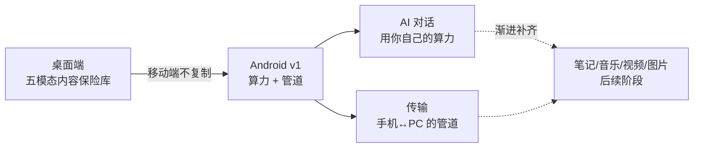
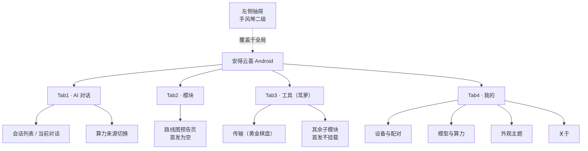
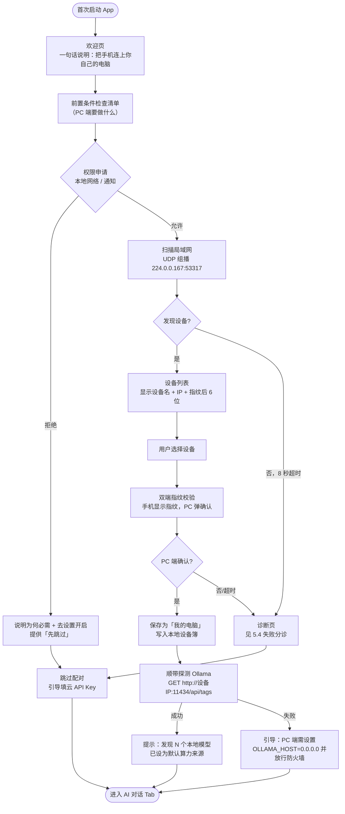
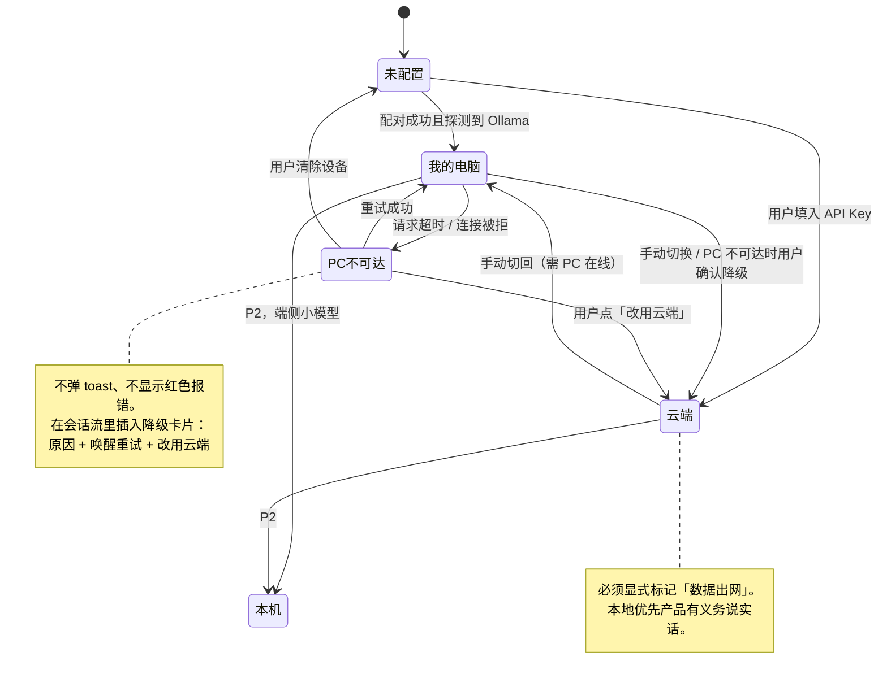
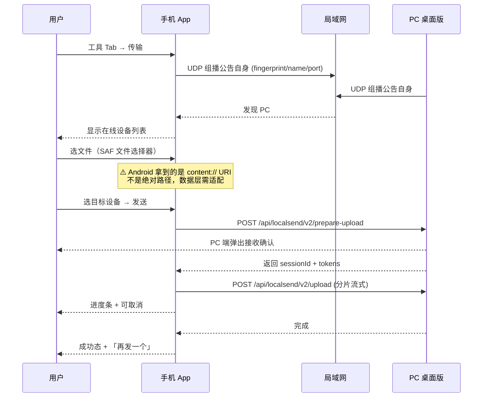
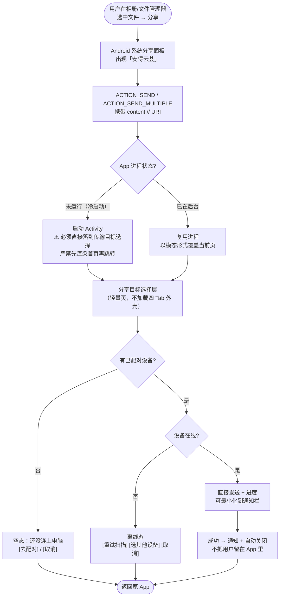
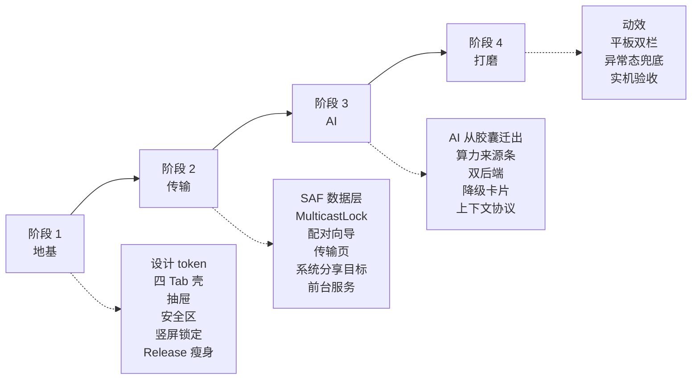

# 安得云荟 Android v1 · 增量产品需求文档（PRD）

| 项 | 值 |
| --- | --- |
| 文档类型 | 增量 PRD（基于已有 Windows 桌面产品的移动端形态定义） |
| 版本 | v1.0 · 草案，待用户评审 |
| 分支 | `feat/android-v1` |
| 撰写 | 许清楚（产品经理） |
| 技术栈 | Tauri v2 + React 18 + TypeScript + Vite + Rust（沿用桌面端，不新增框架栈） |
| 语言 | 简体中文 |
| 前置背景 | 上一轮已打通 Android 构建链路，产出 arm64 debug APK（470MB），MuMu 模拟器实测可运行。用户评价：「能用，但是生搬硬套 Windows 版本」 |

---

## 0. 本文档要解决的根本问题

上一轮 Android v1 被当作**编译目标迁移**执行：让 Rust 交叉编译通过、让 Gradle 出包、让 `.so` 进 APK。全程无产品阶段、无 PRD。

结果是一个**能安装但不能用的产品**——技术上成立，产品上不成立。

本 PRD 的职责不是补一份流程文档，而是回答一个此前从未被提出的问题：

> **在手机上，安得云荟到底是什么？**

答案不是「Windows 版的手机版」。见 §1。

---

## 1. 产品目标

### 1.1 一句话定位

> **安得云荟 Android 版 = 你自己那台电脑的随身终端。**
> 在手机上直接用上家里 PC 的算力和文件，AI 对话不必把数据交给任何厂商。

### 1.2 三个正交目标

| # | 目标 | 成立判据 |
| --- | --- | --- |
| G1 | **算力回流**：让手机用上用户自己 PC 的模型算力，而不是只能用云 API | 用户能在手机上与 PC 上的 Ollama 对话，并清楚知道「这段对话没有出我家路由器」 |
| G2 | **文件双向流动**：手机 ↔ PC 的文件传输，不经过任何第三方服务器 | 从相册分享一张图到 PC，全程不超过 3 步、不需要先打开 App |
| G3 | **去桌面味**：交互原语从「鼠标 + 窗口」重建为「拇指 + 页面」 | 陌生用户拿到手机不需要指导即可完成配对与首次对话 |

### 1.3 目标的取舍逻辑



桌面端的价值主张是「把五类内容收进同一个本地保险库」。手机不适合当保险库（存储受限、分区存储限制、不是主力生产设备）。
手机适合当**入口**和**遥控器**。所以 Android v1 只做两件事：**接上算力**、**接上文件**。

---

## 2. 非目标（明确排除）

> 本章存在的目的是防止范围蔓延。以下内容 **Android v1 明确不做**，出现在任何需求讨论中都应被直接驳回。

### 2.1 桌面隐喻功能（结构性不做）

| 功能 | 桌面端形态 | Android v1 处置 | 理由 |
| --- | --- | --- | --- |
| 系统托盘 / 托盘菜单 | `TrayMenu.tsx` | **不做** | Android 无托盘概念，等价物是前台服务 + 常驻通知，后续阶段评估 |
| 桌宠 | `DeskpetPet.tsx` + 独立 overlay 窗口 | **不做** | 依赖桌面多窗口与穿透窗口，Android 需 `SYSTEM_ALERT_WINDOW` 悬浮窗权限，成本高收益低 |
| 悬浮歌词 | `src/core/lyrics` + overlay | **不做** | 同上，且音乐模块本身不在首发范围 |
| 截图 / 录屏 | `screenshot.rs` / `overlay-recorder.ts` | **不做** | Android 需 `MediaProjection` 全套重写，与首发目标无关 |
| 胶囊浮窗（Capsule） | `Capsule.tsx` 独立窗口 | **不做浮窗形态**，但其内的 AI 对话能力迁移为主 Tab | 见 §6.1，这是本次最关键的形态转换 |
| 桌面拖入 / 拖出（中转站） | `FloatingDropzoneView.tsx`、`import_to_dropzone` | **不做** | 由「系统分享目标」替代，见 §5.3 |
| 窗口标题栏 / 多窗口 | `Titlebar.tsx` | **不做** | Android 单 Activity 全屏 |

### 2.2 首发不做的产品能力

| 能力 | 状态 | 说明 |
| --- | --- | --- |
| 笔记（鸢尾花）、音乐（铃兰）、视频（玉兰）、图片（莲花）、阅读（三色堇）、专业（薄荷） | **不做** | 「模块」Tab 首发为路线图预告页，见 §4.3 |
| AI 剪辑 | **不做** | — |
| 工具调用 / Function Calling | **不做** | AI 只能「读」注入的上下文并回答，不能反向操作 App |
| RAG / 向量检索 | **不做** | 桌面端已有资产（`rag_service.rs` + rusqlite + 分块管线），移动端首发不启用 |
| 内网穿透 / 中继服务器 / 公网访问 | **不做** | 仅局域网。手机与 PC 必须同网段 |
| 账号体系 / 云同步 | **不做** | 本地优先，无账号 |
| 端侧小模型推理 | **可取舍（P2）** | 优先级低于「连回 PC」与「云 API」 |
| 手机横屏 | **不做** | 手机锁定竖屏，仅平板允许横屏 |
| iOS | **不做** | 本轮仅 Android |

---

## 3. 用户故事

### 3.1 核心角色

| 角色 | 描述 | 关键诉求 |
| --- | --- | --- |
| **主力用户「有 PC 的人」** | 家里/工位有一台常开的 Windows PC，已装安得云荟桌面版 | 出门在外或在沙发上，想用手机接着用 PC 的东西 |
| **隐私敏感用户** | 不愿把内容交给云厂商 | 需要确信数据没出本地网络 |
| **尝鲜试用者** | 朋友推荐，第一次装 | 装完能不能 5 分钟内跑通一次对话 |

### 3.2 用户故事清单

#### AI 对话

| ID | 故事 | 优先级 |
| --- | --- | --- |
| US-01 | 作为主力用户，我想在手机上直接与家里 PC 上的 Ollama 模型对话，这样我不用付云 API 的钱，也不用把内容发给厂商 | P0 |
| US-02 | 作为隐私敏感用户，我想在对话界面上**一眼看到**这段对话跑在哪里（我的电脑 / 云端 / 本机），这样我能判断敢不敢把敏感内容发进去 | P0 |
| US-03 | 作为主力用户，当我的 PC 睡眠或不在同一网络时，我想得到明确的原因说明和「改用云端」的一键切换，而不是一个转圈或红色报错 | P0 |
| US-04 | 作为尝鲜试用者，我想在没有 PC 的情况下也能填一个云 API Key 就开始用，这样我不会因为配置门槛直接卸载 | P0 |
| US-05 | 作为主力用户，我想让历史会话在手机上留存并可回看，这样我不用每次重开 | P1 |
| US-06 | 作为主力用户，当对话中途从「我的电脑」切到「云端」时，我想在会话里看到一条分隔标记，这样我知道哪部分内容出过网 | P1 |

#### 传输

| ID | 故事 | 优先级 |
| --- | --- | --- |
| US-07 | 作为主力用户，我想把手机上的照片/文件发到 PC，不经过微信、不经过任何云盘 | P0 |
| US-08 | 作为主力用户，我想从 PC 往手机发文件，手机上收到明确的接收确认弹窗 | P0 |
| US-09 | 作为主力用户，我想在**相册里直接点「分享」→ 选安得云荟**就把图片发给 PC，不用先打开 App 再一层层找入口 | P0 |
| US-10 | 作为主力用户，当局域网里找不到我的 PC 时，我想知道**具体为什么**（不同网段？PC 没开？防火墙？），以及下一步该做什么 | P0 |
| US-11 | 作为主力用户，我想看到传输进度和失败重试，而不是发完不知道有没有到 | P1 |

#### 配对与首次使用

| ID | 故事 | 优先级 |
| --- | --- | --- |
| US-12 | 作为尝鲜试用者，首次打开 App 时我想被一步步引导完成「发现并连上我的电脑」，包括告诉我 PC 端需要做什么 | P0 |
| US-13 | 作为尝鲜试用者，如果我暂时没有 PC，我想能跳过配对直接用云 API，而不是被卡在向导里 | P0 |

#### 平板

| ID | 故事 | 优先级 |
| --- | --- | --- |
| US-14 | 作为平板用户，我想在横屏时看到左侧会话列表 + 右侧对话区的双栏布局，而不是被拉伸的手机界面 | P1 |

---

## 4. 信息架构

### 4.1 四 Tab 定义



| Tab | 导航层文案 | 页内品牌 | 首发内容 | 图标建议 |
| --- | --- | --- | --- | --- |
| 1 | **AI 对话** | —（AI 是能力层，无花名） | 完整可用 | `MessageCircle` / `Sparkles` |
| 2 | **模块** | 各模块进入后显示花名 | 路线图预告页（空态） | `LayoutGrid` |
| 3 | **工具** | 进入后页头显示「茑萝」 | 仅「传输」一项 | `Wrench` |
| 4 | **我的** | — | 设置 + 设备 + 关于 | `User` |

### 4.2 ⚠️ 关键议题：「模块」与「茑萝」的分类边界

> **这是本 PRD 必须解决、而用户此前未直接回答的问题。**

#### 问题陈述

在用户心智里，「模块」和「茑萝」是同一类东西——**都是「一堆功能的集合」**。把它们拆成两个平级 Tab，依据的是「是不是核心模块」，而这个标准**只有开发者知道**（代码里体现为 `plugins/<花名>/` 顶层 vs `plugins/茑萝/<子模块>/`）。

用户已选择「花名 + 功能词双标签」（决策 17）来缓解**命名**问题，但**分类边界**问题依然存在：用户依旧无法预测「传输」该去哪个 Tab 找。

#### 代码现状核实

| 分组 | 代码位置 | 成员 | 共同特征 |
| --- | --- | --- | --- |
| 顶层模块 | `plugins/铃兰\|莲花\|玉兰\|三色堇\|薄荷/` | 音乐、图片、视频、阅读、专业 | 都是**内容类型的容器**——「我的东西存在这里」 |
| 茑萝子模块 | `plugins/茑萝/*`（`parent: niaoluo\|ide`） | 传输、加密、文本工具箱、IDE、WPS、绘画、RAG、桌宠、胶囊、AI 编程 | 都是**对内容做事的工具**——「我要执行一个动作」 |

代码里的分组其实是自洽的，只是**从未向用户表达过这个标准**。

#### 推荐方案 A：内容 / 工具 二分（在四 Tab 约束内成立）

给用户一句能自解释的边界：

> **「模块」= 我的东西放在哪里（内容库）**
> **「工具」= 我要对东西做什么（动作）**

| Tab | 定义句 | 归属判据（用户可自测） | 成员 |
| --- | --- | --- | --- |
| 模块 | 「打开后是**我的一批内容**」 | 进去之后看到的是一个**列表/库**，里面是我自己的文件 | 笔记、音乐、视频、图片、阅读 |
| 工具 | 「打开后是**一个操作台**」 | 进去之后要**选个目标、执行个动作**，做完就走 | 传输、加密、文本工具箱、绘画… |

落地要求：
- 两个 Tab 的空态/首屏必须**写出这句定义**，而不是只放图标网格。让用户第一次进去就学会边界。
- 模块 Tab 路线图页头：「**你的内容库** · 笔记、音乐、视频、图片正在路上」
- 工具 Tab 页头：「**茑萝** · 对文件做点什么」

#### 方案 A 的已知漏洞（必须告知用户）

| 漏洞 | 说明 |
| --- | --- |
| 「专业（薄荷）」归类不清 | 名字听起来是工具集，但在代码里是顶层模块。建议后续更名或改挂 |
| 「AI 对话」既是内容（历史会话是我的内容）又是工具 | 因其被提升为独立 Tab，暂不受此二分影响，但会削弱二分的纯粹性 |
| 首发阶段两个 Tab 都近乎空 | 模块 Tab 全空、工具 Tab 只有 1 项。四 Tab 里有两个是空的，会放大「产品没做完」的观感 |

#### 替代方案 B（供用户决策，**未采纳，仅提出**）

**合并「模块」+「工具」为单一 Tab「发现」，腾出的第 4 位放「传输」。**

```
[AI 对话]  [传输]  [发现]  [我的]
```

- 理由：首发只有 2 个功能，却用 2 个 Tab 装「以后才有的东西」，信息密度过低。
- 「发现」页内用两个分区（内容库 / 工具）承载 A 方案的二分，边界表达不丢。
- 代价：与决策 14（四 Tab 固定为 AI/模块/茑萝/我的）和决策 21（传输不加快捷入口）**直接冲突**。

> 📌 **决策 14 与 21 是硬约束，本 PRD 默认执行方案 A。方案 B 仅作为备选记录在 §9 待确认问题，由用户决定是否推翻。**

### 4.3 「模块」Tab · 路线图预告页

| 规则 | 要求 |
| --- | --- |
| 展示内容 | 笔记（鸢尾花）/ 音乐（铃兰）/ 视频（玉兰）/ 图片（莲花）卡片 |
| **只标顺序，不标时间** | 卡片上只允许出现「第 1 位 / 第 2 位…」或「下一个」，**严禁**出现任何日期、季度、版本号 |
| 卡片状态 | 全部为**不可点击**的预告态，视觉上明确弱化（降透明度 / 无点击反馈） |
| 页头文案 | 必须包含内容库的定义句（见 §4.2） |
| 反预期管理 | 页脚一行小字：「顺序可能调整」 |

> ⚠️ 路线图是对外承诺。标了时间做不到，是负面印象；只标顺序，永远不会违约。

### 4.4 花名与功能词双标签体系

代码核实所得的完整映射：

| 花名 | 功能词 | 插件 ID | 导航层显示 | 页内显示 |
| --- | --- | --- | --- | --- |
| 鸢尾花 | 笔记 | `notes` | 笔记 | 鸢尾花 · 笔记 |
| 铃兰 | 音乐 | `music` | 音乐 | 铃兰 · 音乐 |
| 玉兰 | 视频 | `video` | 视频 | 玉兰 · 视频 |
| 莲花 | 图片 | `image` | 图片 | 莲花 · 图片 |
| 三色堇 | 阅读 | `reading` | 阅读 | 三色堇 · 阅读 |
| 薄荷 | 专业 | `professional` | 专业 | 薄荷 · 专业 |
| 茑萝 | 工具 / 扩展坞 | `niaoluo` | 工具 | 茑萝 |
| （无花名） | 传输 | `transfer` | 传输 | 黄金棋盘 · 传输 |

**规则**：
1. 导航层（Tab 栏、抽屉、面包屑）**只写功能词**，用户永不需要猜谜。
2. 进入页面后，页头以「花名 · 功能词」形式呈现，花名可用品牌字重/色彩强化。
3. 花名**不可**作为唯一标识出现在任何需要用户做选择的位置。

### 4.5 茑萝的定位澄清

> 茑萝 **不是**「办公 / IDE / 绘画」的固定语义集合，而是一个**可挂载一系列子模块的扩展坞容器**。

手机版首发只挂载「传输」一个子模块。这意味着：
- 工具 Tab 首屏 = 茑萝容器页，内含 1 张「传输」卡片。
- 容器页必须能优雅地表达「这里以后会有更多」，但**同样只标顺序不标时间**。
- 不做「因为只有一项所以直接跳过容器页」的优化——这会破坏后续挂载更多子模块时的心智连续性，也与决策 21（传输不加 App 内快捷入口，就走茑萝二级）冲突。

---

## 5. 关键流程

### 5.1 流程 A · 首次配对连接 PC

> 这是**唯一**的首次引导（决策 23），也是整个产品的使用门槛所在。



#### 5.1.1 「PC 端要做什么」清单（向导必须内置）

这是最容易被忽略、也最容易导致失败的部分。向导第二步必须明确列出：

| 项 | 要求 | 为什么 |
| --- | --- | --- |
| 1 | PC 上的安得云荟桌面版**正在运行** | 传输服务随 App 启动 |
| 2 | 手机与 PC 连在**同一个 Wi-Fi**（且非访客网络 / AP 隔离） | 局域网发现依赖同一广播域 |
| 3 | Windows 防火墙放行安得云荟的 **UDP 53317 与 TCP 53317** | 首次运行时 Windows 会弹窗，用户常误点「取消」 |
| 4 | 若要用 PC 的 AI 算力：PC 端设置环境变量 **`OLLAMA_HOST=0.0.0.0`** 后重启 Ollama | ⚠️ Ollama 默认只绑定 `127.0.0.1`，手机**必然连不上**。这是当前代码预设 `http://localhost:11434/v1` 在移动端的直接失效点 |
| 5 | 若要用 PC 的 AI 算力：防火墙放行 **TCP 11434** | 同上 |

> 📌 建议向导内提供「把这份清单发到我的电脑上」按钮——但存在**先有鸡还是先有蛋**问题（还没配对成功就无法发送）。替代方案：生成一个可复制的文本 / 二维码，或直接在文档站放一页 PC 端配置指南。**列入待确认问题 Q6。**

### 5.2 流程 B · AI 对话与三种算力后端切换



| 算力来源 | 实现 | 首发优先级 | 界面标识 |
| --- | --- | --- | --- |
| **我的电脑** | 局域网直连 PC 上的 Ollama（OpenAI 兼容端点 `http://<PC-IP>:11434/v1`） | P0 | 🖥️ 绿色 · 「未出网」 |
| **云端** | 任意 OpenAI 兼容 API，用户自填 Base URL + Key | P0 | ☁️ 琥珀色 · 「数据出网」 |
| **本机** | 端侧小模型 | P2 · 可取舍 | 📱 蓝色 · 「完全离线」 |

**切换规则**：
- 切换入口在对话页顶部「算力来源条」，**不是**埋在设置里的模型下拉框。
- 每条 AI 回复携带来源标记，历史会话可回溯审计。
- 会话中途切换来源时，在消息流插入分隔线：「以下内容改由 云端·OpenAI 处理」。

### 5.3 流程 C · App 内传输



**反向（PC → 手机）**：手机端需在**任意界面**都能弹出接收确认（桌面端已有 `TransferReceiveModal` 的全局挂载模式，移动端沿用），并需前台服务保证接收期间不被系统杀死。

### 5.4 流程 D · 系统分享冷启动路径 ⭐

> **这条路径完全绕过 App 的全部导航设计**，是本次「去 Windows 味」最有效的一招（决策 21）。必须单独设计。



#### 5.4.1 硬性设计约束

| # | 约束 | 理由 |
| --- | --- | --- |
| SH-1 | 冷启动时**不得**先渲染四 Tab 主壳再导航到传输 | 用户会看到首页闪一下，这正是「生搬硬套」的观感来源 |
| SH-2 | 分享目标层是**独立的轻量路由**，不挂载 Tab 栏、不挂载抽屉 | 这是一次「任务式」进入，不是「浏览式」进入 |
| SH-3 | 完成后**自动退出**回到用户原来的 App | 分享是一次性任务，把用户留在 App 里是打断 |
| SH-4 | 传输过程可最小化为**通知栏进度**，App 退到后台仍继续 | 需前台服务；否则大文件必失败 |
| SH-5 | 必须支持 `ACTION_SEND_MULTIPLE`（多选分享） | 相册多选是最高频场景 |
| SH-6 | 需在 `AndroidManifest.xml` 注册 intent-filter，`mimeType` 至少覆盖 `image/*`、`video/*`、`*/*` | 否则不出现在分享面板 |

---

## 6. 桌面交互原语 → 移动端映射表

> 上一轮「生搬硬套」的病灶集中在这里。**任何移动端页面在评审时，必须逐条对照本表自检。**

### 6.1 交互原语映射

| 桌面原语 | 桌面端用途 | Android 映射 | 强制程度 | 代码影响点 |
| --- | --- | --- | --- | --- |
| **hover 悬停** | 显示 tooltip / 次级操作 / 预览 | **取消**。信息常驻可见，操作改长按 | 🔴 强制 | 全站 `hover:` 类需审计；不得有仅 hover 可见的关键信息 |
| **右键 context menu** | 次级操作集合 | **长按 → 底部弹层（Bottom Sheet）** | 🔴 强制 | `@radix-ui/react-context-menu` 必须整体替换。手机上没有右键，此组件在移动端 **100% 不可达** |
| **拖拽（排序）** | 列表重排 | **长按进入排序态** + 拖动手柄 | 🟡 首发不涉及 | — |
| **拖拽（投放文件）** | 拖文件进中转站 | **系统分享目标**（§5.4）+ SAF 文件选择器 | 🔴 强制 | `FloatingDropzoneView` 移动端不加载 |
| **双击** | 打开 / 进入 / 全屏 | **取消双击，单击即打开** | 🔴 强制 | 移动端不存在「选中 vs 打开」二态；双击在触屏上易误判为两次单击 |
| **Ctrl/Shift 多选** | 批量操作 | **长按进入多选态** + 顶部批量操作栏 + 复选框 | 🟡 P1 | 传输多选发送需要 |
| **tooltip** | 补充说明 | **取消**，文案外显或改用行内说明 | 🔴 强制 | `title={...}` 属性在移动端无效，见 `AppNav.tsx:107` |
| **常驻侧边栏** | 一级导航 | 手机 → **抽屉**；平板 → **Rail** | 🔴 强制 | `HostSidebar` / `ModuleSidebarShell` 需移动端分支 |
| **浮窗 / 独立窗口（胶囊）** | AI 对话、快捷面板 | **全屏页（AI→Tab1）** 或 **Bottom Sheet** | 🔴 强制 | `Capsule.tsx` 是独立 Tauri 窗口，Android 无多窗口。AI 能力从胶囊迁至主 Tab，`useAiStream.ts` 逻辑可复用 |
| **窗口标题栏** | 拖动 / 最小化 / 关闭 | **取消**，改系统状态栏 + 应用内页头 | 🔴 强制 | `Titlebar.tsx` 移动端不加载 |
| **滚动条** | 位置指示 | **隐藏**，依赖惯性滚动与回弹 | 🟡 建议 | — |
| **键盘快捷键** | 效率操作 | 无对应；必须保证**纯触控可达全部功能** | 🔴 强制 | 不得有仅快捷键可触发的功能 |
| **鼠标滚轮缩放** | 图片/画布缩放 | **双指捏合** | 🟡 首发不涉及 | 需手势库 |
| **系统托盘** | 后台常驻 | **前台服务 + 常驻通知** | ⚪ 非目标 | 传输后台接收需要，见 SH-4 |
| **文件绝对路径** | `C:\Users\...` | **SAF `content://` URI** | 🔴 强制 | 见 §7.1，数据层改造 |

### 6.2 自检清单（每个移动端页面评审时逐条过）

- [ ] 本页是否存在只有 hover 才能看到的信息或操作？
- [ ] 本页是否存在只能右键触发的操作？
- [ ] 所有可点击元素的触控区是否 ≥ 48dp？
- [ ] 主要操作是否在拇指可及区（屏幕下半部）？
- [ ] 是否存在依赖鼠标精度的小控件（<32dp 的滑块/关闭按钮）？
- [ ] 弹层是否可通过下滑手势关闭 + 是否响应系统返回键？
- [ ] 键盘弹起时，输入框是否被遮挡？
- [ ] 是否处理了系统手势导航区（底部 / 左右边缘）的避让？

---

## 7. 关键技术约束（影响产品决策的部分）

### 7.1 🔴 文件模型：SAF 与分区存储（首发必撞）

| 维度 | Windows 桌面端 | Android | 影响 |
| --- | --- | --- | --- |
| 文件标识 | 绝对路径 `C:\Users\...\a.jpg` | `content://` URI | Rust 侧 `PathBuf` 假设失效 |
| 访问方式 | 直接 `std::fs` 打开 | 需通过 `ContentResolver` 取 fd | 需 JNI 桥或 Tauri 插件 |
| 权限时效 | 永久 | URI 权限可能是**一次性**的，进程重启即失效 | 「重发上次文件」等功能不可直接实现 |
| 落盘位置 | 任意路径 | 应用私有目录 / MediaStore / SAF 选定目录 | 接收文件的落点需用户选择并持久化授权 |
| 目录遍历 | 自由 | 受限，`READ_EXTERNAL_STORAGE` 在 API 33+ 被拆分为按类型权限 | 不做文件浏览器 |

> ⚠️ **这不是「适配一下」，是数据层改造。** `transfer.rs` 当前基于 `PathBuf` 的收发路径需要在移动端走不同的 IO 抽象。请工程侧在排期时按**独立技术任务**计算，不要并入「传输 UI 移动化」。

### 7.2 🔴 局域网发现：Android 组播限制

代码核实：发现机制为 UDP 组播 `224.0.0.167:53317`（LocalSend v2 兼容协议）。

| 约束 | 说明 | 产品影响 |
| --- | --- | --- |
| **MulticastLock** | Android Wi-Fi 驱动默认过滤组播包，必须持有 `WifiManager.MulticastLock` 才能收到 | 不加锁 = 永远发现不了设备。**这是最可能导致「扫不到 PC」的头号原因** |
| **本地网络权限** | Android 13+ 部分 ROM / Android 15 对本地网络访问有额外提示 | 需在配对向导中申请并解释 |
| 省电策略 | 息屏 / Doze 模式下组播接收会被抑制 | 后台接收需前台服务 |
| AP 隔离 | 部分路由器（尤其访客网络）隔离客户端 | 需在失败分诊中列为可能原因 |
| 移动热点 | 手机开热点时网段行为不同 | 需测试 |

### 7.3 🔴 Ollama 默认绑定 127.0.0.1

代码核实：`ModelSettings.tsx:37` 预设 `ollama` 的 base_url 为 `http://localhost:11434/v1`。

在手机上，`localhost` 指向**手机自己**，必然失败。且 Ollama 服务端默认只监听 `127.0.0.1`，即使改成 PC 的 IP 也连不上，除非 PC 端设置 `OLLAMA_HOST=0.0.0.0`。

**产品要求**：
- 移动端配对成功后，自动将 Ollama base_url 改写为 `http://<已配对设备IP>:11434/v1`，**不让用户手填 IP**。
- 探测失败时，向导必须给出 `OLLAMA_HOST=0.0.0.0` 的明确指引（见 §5.1.1 第 4 项）。

### 7.4 🟠 APK 体积 470MB → 必须瘦身

当前 470MB，其中 **292MB 是未 strip 的 Rust debug 符号**。

用户验收标准是「可给别人试用」。470MB 是**劝退级别**的——移动网络下没人会下载，且很多设备装不下。

**因此 release 瘦身进入首发 P0 范围**，非「后续优化」。目标见 §8 需求池 P0-14。

### 7.5 🟡 现有前端栈的移动端适配性

| 资产 | 移动端评价 | 处置 |
| --- | --- | --- |
| Tailwind CSS 3.4 | ✅ 极佳。原子化，样式层可整体重写 | 设计 token 落在 `tailwind.config.js` + `index.css` 即全局生效 |
| Radix UI（headless） | ✅ 好。无样式，只给交互逻辑与无障碍 | 保留，但 `react-context-menu` 除外（见 §6.1） |
| zustand | ✅ 无关平台 | 保留 |
| `@tanstack/react-virtual` | ✅ 对话消息列表正好需要 | 保留，用于 AI 消息流 |
| `lucide-react` | ✅ | 保留，注意移动端图标尺寸下限 |
| `ThemeProvider.tsx` | 🟡 可用，但见下 | 需移动端适配 |
| **无手势库** | 🔴 缺口 | 需引入（决策 22） |
| **`tw-animate-css`** | ✅ 已引入，CSS 动画可直接用 | 高频动效优先走这里，见设计规范 |

#### ⚠️ `ThemeProvider` 的两个移动端隐患（工程侧需注意）

1. **`zoom: ${zoom}%` 包裹层**（`ThemeProvider.tsx:441`）
   CSS `zoom` 在 Android WebView 中会干扰 `vh`/`vw` 单位与媒体查询断点的对应关系，可能导致响应式布局在缩放非 100% 时错乱。移动端建议**禁用该缩放能力**，改由系统字体大小 + `rem` 缩放承载。

2. **`backdrop-blur-md` + `--panel-opacity` 玻璃拟态**（`index.css` `.glass-panel` / `.glass-bg`）
   `backdrop-filter` 是 Android WebView 上已知的 GPU 性能杀手，尤其在滚动容器内。移动端需**限制毛玻璃的使用范围**（详见设计规范的性能红线）。

---

## 8. 需求池

> P0 = 不做则不可发布 ｜ P1 = 应当有 ｜ P2 = 锦上添花

### P0 · 必须有

| ID | 需求 | 归属 | 备注 |
| --- | --- | --- | --- |
| P0-01 | 四 Tab 导航壳（AI 对话 / 模块 / 工具 / 我的） | 导航 | 含系统返回键与 Tab 栈行为 |
| P0-02 | 左侧抽屉：左上角按钮打开 + 内容区限宽侧滑 + 手风琴二级 | 导航 | 侧滑区必须避开系统返回手势带 |
| P0-03 | 手机锁定竖屏；平板允许横屏 | 平台 | `AndroidManifest` 配置 + 运行时判断 |
| P0-04 | AI 对话：消息流、流式输出、停止生成、复制、重新生成 | AI | 复用 `useAiStream.ts` 逻辑 |
| P0-05 | AI 算力来源条：我的电脑 / 云端 双后端 + 显式出网标识 | AI | 差异化核心，见设计规范 |
| P0-06 | AI 后端不可达时的**行内降级卡片**（原因 + 重试 + 改用云端） | AI | 禁止 toast/红字报错 |
| P0-07 | 云 API 配置（Base URL + Key + 模型名），OpenAI 兼容 | AI | 复用 `ModelSettings` 数据结构 |
| P0-08 | 配对向导：权限申请 → 扫描 → 选择 → 指纹确认 → Ollama 探测 | 配对 | 唯一的首次引导 |
| P0-09 | 配对向导内置「PC 端要做什么」清单（含 `OLLAMA_HOST=0.0.0.0`） | 配对 | 见 §5.1.1 |
| P0-10 | 局域网发现失败的**分诊式反馈**（不同网段/PC 未开/防火墙/AP 隔离） | 配对 | 不允许只显示「未找到设备」 |
| P0-11 | Android MulticastLock 持有 | 传输 | 不做则发现功能形同虚设 |
| P0-12 | App 内传输：设备列表、SAF 选文件、发送、进度、取消 | 传输 | |
| P0-13 | 接收确认弹窗（全局可弹）+ 落盘位置选择与持久化授权 | 传输 | |
| P0-14 | **系统分享目标注册**（`ACTION_SEND` / `ACTION_SEND_MULTIPLE`）+ 冷启动直达传输 | 传输 | 去 Windows 味最有效的一招 |
| P0-15 | 前台服务 + 通知栏进度（传输期间不被系统杀死） | 传输 | 大文件必需 |
| P0-16 | **Release 包瘦身**：strip Rust 符号、`opt-level`/LTO、按 ABI 分包 | 工程 | 目标：arm64 单 ABI release ≤ **80MB**（理想 ≤ 50MB） |
| P0-17 | 移动端设计 token 落地（触控 48dp、字阶、间距、安全区） | 设计 | 见设计规范 |
| P0-18 | `@radix-ui/react-context-menu` → 长按 Bottom Sheet 替换 | 设计 | 移动端不可达组件 |
| P0-19 | 「模块」Tab 路线图预告页（只标顺序不标时间） | 内容 | |
| P0-20 | 空状态 / 断网 / 权限被拒 / 加载失败的完整异常态覆盖 | 质量 | 验收标准「可给别人试用」的硬性要求 |
| P0-21 | 安全区适配（状态栏、底部手势条 `env(safe-area-inset-*)`） | 设计 | `viewport-fit=cover` |
| P0-22 | 深浅色主题在移动端正确工作 | 设计 | 复用 `ThemeProvider` 的 `resolved` |

### P1 · 应当有

| ID | 需求 | 归属 |
| --- | --- | --- |
| P1-01 | AI 会话历史列表（本地持久化、重命名、删除） | AI |
| P1-02 | 会话内算力来源切换的**分隔标记** | AI |
| P1-03 | 每条 AI 回复的来源溯源标签 | AI |
| P1-04 | 平板：Tab → Rail 转换 + 内容双栏（≥840dp） | 平板 |
| P1-05 | 平板：AI 对话双栏（左会话列表 / 右对话区） | 平板 |
| P1-06 | 上下文注入协议（Context Injection Protocol）定义与实现 | AI 能力层 |
| P1-07 | 传输多选发送 + 批量进度 | 传输 |
| P1-08 | 传输历史记录 | 传输 |
| P1-09 | 动效库接入 + 关键交互动效（弹层/转场/抽屉） | 设计 |
| P1-10 | 长按多选态（列表通用模式） | 设计 |
| P1-11 | Markdown 渲染 + 代码块高亮（AI 回复） | AI |
| P1-12 | 「我的」页：设备管理（重命名/解绑/切换默认设备） | 设置 |
| P1-13 | 深色模式下的对比度审计（WCAG AA） | 无障碍 |

### P2 · 锦上添花

| ID | 需求 | 归属 |
| --- | --- | --- |
| P2-01 | 端侧小模型推理 | AI |
| P2-02 | 多模态输入（图片提问） | AI |
| P2-03 | 语音输入 | AI |
| P2-04 | Wake-on-LAN 唤醒睡眠中的 PC | 配对 |
| P2-05 | 二维码配对（PC 显示码，手机扫） | 配对 |
| P2-06 | 与官方 LocalSend 客户端互通的显式说明 | 传输 |
| P2-07 | 主题色自定义（沿用桌面端 4 套预设） | 设计 |
| P2-08 | 首页小组件（Widget）快速传输 | 平台 |

---

## 9. 待确认问题

> 以下问题需用户拍板。标 🔴 者会阻塞设计或开发。

| # | 问题 | 背景 | 影响 | 建议 |
| --- | --- | --- | --- | --- |
| **Q1** 🔴 | **上下文注入协议在首发阶段没有真实跨模块消费者** | 决策 3 定「AI 是贯穿全 App 的能力层」，决策 4 定「首个消费者是 AI 对话模块本身」，且用户否决了给传输加「问 AI」入口。结果：协议的**唯一调用方是它自己**——这等于没有被验证过。首发不做工具调用（决策 7）、不做 RAG（决策 8），进一步削弱了协议的实际负载 | 一个从未被第二方调用过的接口，等到笔记/音乐模块真正接入时，大概率需要推倒重来。届时成本高于现在多做一个消费者 | ① 接受风险，协议按最小可用定义、明确标注为「未验证契约」；② 或允许一个极低成本的验证点（例：AI 对话页内「把这个文件的元信息作为上下文」），仅打通链路不做产品化。**请用户在两者间选择** |
| **Q2** 🔴 | **「模块」/「工具」的分类边界** | 见 §4.2。已给出方案 A（内容 vs 工具二分），但存在「专业（薄荷）」归类不清、首发两 Tab 皆空的漏洞。方案 B（合并为「发现」，第 4 位放传输）与决策 14/21 冲突 | 影响整个信息架构与首屏观感 | 默认执行方案 A。若用户认为「四 Tab 里两个是空的」不可接受，则需要重新审视决策 14 |
| **Q3** 🟠 | **抽屉侧滑手势的可发现性** | 决策 16 规定侧滑仅在内容区有效（为避开系统返回手势带 20–24dp）。但内容区中部的侧滑**没有任何边缘视觉暗示**，用户几乎不可能自行发现 | 侧滑实际会退化为「隐藏彩蛋」，全部流量压在左上角按钮 | 接受此现状，把左上角按钮做成**唯一承诺入口**（始终可见、位置固定），侧滑仅作为熟练用户的加速器，不在引导中提及。**请确认这个取舍** |
| **Q4** 🟠 | **APK 瘦身的目标值** | 470MB → P0-16 提出 arm64 单 ABI release ≤ 80MB（理想 ≤50MB） | 若 Rust 侧依赖裁剪不下来，可能需要砍功能 | 请用户确认 80MB 是否可接受为发布门槛；若否，需要更激进的裁剪（可能影响 P2 端侧模型） |
| **Q5** 🟠 | **AI 对话历史的存储位置与加密** | 本地优先产品，会话内容敏感。首发是否加密本地会话库？ | 影响数据层设计 | 建议首发**明文存应用私有目录**（Android 沙箱已隔离），加密列 P2。请确认 |
| **Q6** 🟡 | **「PC 端要做什么」清单的送达方式** | 配对向导需要告知用户在 PC 上做 5 件事，但此时手机与 PC 尚未连通，无法直接发送 | 影响引导完成率 | 候选：① 应用内可复制文本；② 二维码指向在线文档页（需联网）；③ 桌面版同步更新一个「手机连接」引导页。**建议 ③ + ①**，请确认是否允许改动桌面端 |
| **Q7** 🟡 | **平板的定义方式** | 决策 11 要求手机+平板都支持，决策 25 手机锁竖屏、平板可横屏。但「是不是平板」在 Android 上没有可靠 API | 折叠屏展开态如何归类？ | 建议以 **最小宽度 ≥600dp** 作为唯一判据（而非设备类型），折叠屏展开自然进入平板行为。请确认 |
| **Q8** 🟡 | **是否对外说明与 LocalSend 协议兼容** | 代码核实：传输后端是 LocalSend v2 兼容实现（`transfer.rs` 头部已按 Apache-2.0 4(b) 标注）。这意味着**安得云荟手机版可以直接和官方 LocalSend 客户端互传** | 这是一个现成的、零成本的产品卖点，也是一个「用户可能拿别的 App 替代我们」的风险 | 建议 P2 阶段作为「兼容性」正面宣传。请用户定调 |
| **Q9** 🟡 | **视觉方向需要用户拍板** | 决策 20 定「用户自己定视觉方向，PM 辅助」。设计规范中已给出 3 个方向 | 阻塞视觉稿细化 | 见 `design-spec-android-v1.md` §7，请用户选择 |
| **Q10** 🟡 | **`ThemeProvider` 的 UI 缩放能力在移动端是否保留** | 桌面端有 `zoom` 缩放（50%–200%）。移动端 CSS `zoom` 会干扰 `vh`/媒体查询 | 影响响应式正确性 | 建议移动端**禁用**该项，改由系统字体大小承载。请确认 |

---

## 10. 验收标准

用户给定的验收标准是「**可给别人试用**」。翻译为可执行判据：

### 10.1 通过条件

| # | 判据 | 验证方式 |
| --- | --- | --- |
| A1 | 一个**没被指导过**的人，从安装到完成第一次 AI 对话，全程无需询问 | 找 2 名真实用户实测，不给任何口头提示 |
| A2 | 从相册分享一张图到 PC，**≤3 次点击**且不需要先打开 App | 计数实测 |
| A3 | 拔掉 PC 网线 / 让 PC 睡眠后，App 内**所有**受影响功能都给出可理解的原因与下一步，无白屏、无转圈卡死、无英文报错 | 逐页断网测试 |
| A4 | 全部可点击元素触控区 ≥48dp，无误触 | 走查 + 开发者选项「显示布局边界」 |
| A5 | 不存在仅 hover / 仅右键 / 仅快捷键可达的功能 | 按 §6.2 清单逐页自检 |
| A6 | 深浅色主题切换后无不可读文本 | 双主题走查 |
| A7 | 系统返回键在**每一层**都有合理行为，不会直接退出 App | 逐层回退测试 |
| A8 | Release APK ≤ 80MB（arm64） | 构建产物核对 |
| A9 | 权限被拒绝后，App 仍可用（降级到云 API），不崩溃、不卡死 | 拒绝全部权限后测试 |
| A10 | 中端机（骁龙 6 系级别）上，抽屉/转场动效无肉眼可见掉帧 | 实机测试 |

### 10.2 一票否决项

- 出现「生搬硬套」的具体体征：桌面尺寸控件、右键菜单、hover 依赖、窗口标题栏残留
- 冷启动分享时先闪现首页
- 扫不到设备时只说「未找到设备」而不给原因

---

## 11. 分阶段实施建议

> 决策 10 定「重构深度分阶段：先换导航壳 + 触控适配，再按模块逐个重做移动交互」。



**为什么传输排在 AI 前面**：传输依赖的 SAF 数据层改造（§7.1）是本次工程量最大、最不确定的部分，越早暴露风险越好。AI 对话的技术路径相对确定（HTTP + SSE，`useAiStream.ts` 可复用）。

---

## 附录 A · 与 26 项用户决策的对照

| 决策 | 落点 |
| --- | --- |
| 1 定位转向 AI 为主 | §1.1、§4.1 Tab1 |
| 2 首发仅 AI 对话 + 传输 | §2.2、§8 |
| 3 AI 为能力层 | §1.1、Q1 |
| 4 首个消费者是 AI 对话本身 | Q1（已标注风险） |
| 5 算力来源：PC / 云 API / 端侧 | §5.2、P0-05/07、P2-01 |
| 6 仅局域网 | §2.2、§7.2 |
| 7 不做工具调用 | §2.2 |
| 8 不做 RAG | §2.2 |
| 9 茑萝是扩展坞容器 | §4.5 |
| 10 重构分阶段 | §11 |
| 11 手机 + 平板 | P1-04/05、Q7 |
| 12 验收「可给别人试用」 | §10 |
| 13 品牌延续 + 移动重排 | 设计规范 §1 |
| 14 四 Tab | §4.1（Q2 提出备选） |
| 15 抽屉 + 手风琴二级 | P0-02、设计规范 §3 |
| 16 抽屉手势方案 | P0-02、Q3 |
| 17 花名 + 功能词双标签 | §4.4 |
| 18 空 Tab 做路线图，只标顺序 | §4.3、P0-19 |
| 19 AI 界面由 PM 出方案 | 设计规范 §6 |
| 20 用户定视觉方向 | 设计规范 §7、Q9 |
| 21 不加快捷入口，但注册系统分享 | §4.5、§5.4、P0-14 |
| 22 引入动效库，控运行时性能 | P1-09、设计规范 §8 |
| 23 仅配对向导 | §5.1、P0-08 |
| 24 平板 Tab→Rail + 双栏 | P1-04/05、设计规范 §3.4 |
| 25 手机锁竖屏 | P0-03 |
| 26 PRD + 设计规范 + 竞品 | 三份文档 |

---

## 附录 B · 相关文档

- 移动端设计规范：[`design-spec-android-v1.md`](./design-spec-android-v1.md)
- 竞品参考：[`competitive-reference-android.md`](./competitive-reference-android.md)
</content>
</invoke>
