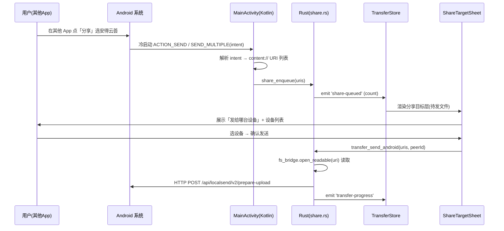
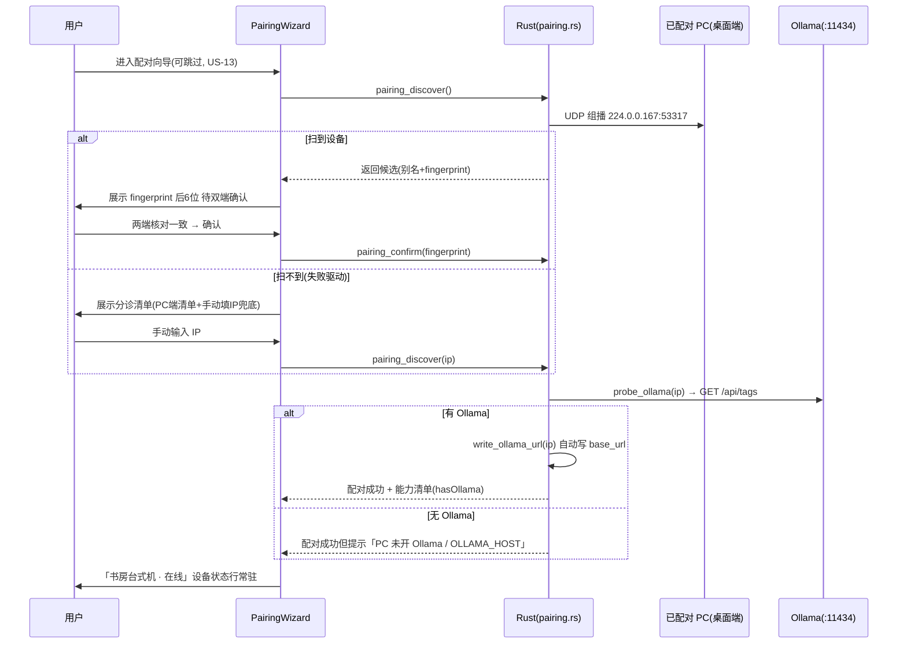
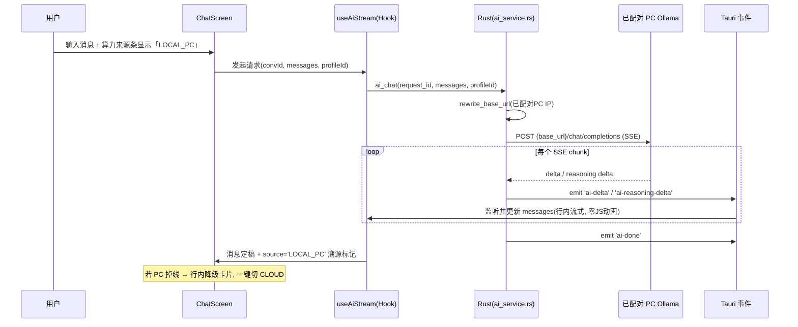
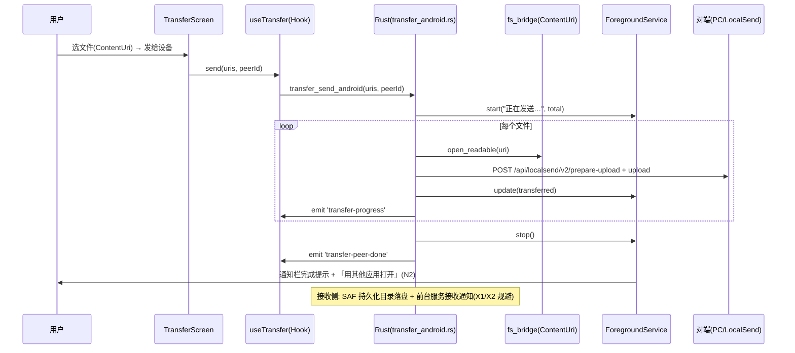
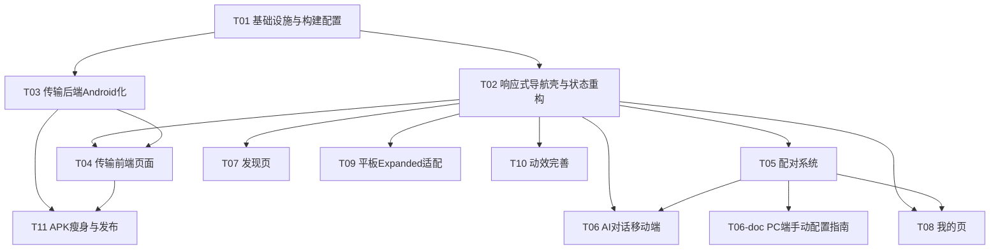

# 安得云荟 Android v1 · 系统架构设计 + 任务分解

| 项 | 值 |
| --- | --- |
| 版本 | v1.0（架构基线，对应 `feat/android-v1` 分支） |
| 撰写 | Bob（软件架构师） |
| 输入 | [`PRD-android-v1.md`](./PRD-android-v1.md) · [`design-spec-android-v1.md`](./design-spec-android-v1.md) · [`competitive-reference-android.md`](./competitive-reference-android.md) |
| 范围 | **仅设计，不修改任何源代码**（本文件为设计交付物，工程师据此实现） |
| 首阶段范围 | AI 对话 + 文件传输（配对为二者前置） |
| 后续阶段 | 发现 / 我的 / 平板(Expanded) / 动效完善 / APK 瘦身 |

> **设计红线（来自 PM 已锁定的决策）**：模块进抽屉、工具合发现；四 Tab 终态 = **中转站 | AI对话 | 发现 | 我的**；导航壳先换（决策 10）；桌面专属能力（桌宠/托盘/悬浮窗）直接隐藏，不做残缺版；断点以最小宽度唯一判据；动效红线（framer-motion 仅限三处静态层，列表/流式/骨架屏零 JS 动画）；视觉方向 = **素纸基调做画布 + 琉璃质感(backdrop-blur)仅限 Tab栏/抽屉/Sheet 三处静态层（ab并行）**，不做实心色分层。

---

## 1. 实现方案 + 框架选型

### 1.1 核心难点

| # | 难点 | 根因 | 策略 |
| --- | --- | --- | --- |
| D1 | **路径模型冲突** | 桌面 `transfer.rs` 用 `PathBuf::from(&p)` + `current_exe().parent()`；Android 无稳定 exe 路径，且分享/下载拿到的是 `content://` URI | 引入 **SAF / ContentResolver 抽象层**（`src-tauri/src/android/fs_bridge.rs`），所有文件读写走 `ContentUri`，不再碰 `PathBuf` |
| D2 | **局域网组播** | Android 默认丢弃组播包，需 `WifiManager.MulticastLock`；且 `NEARBY_WIFI_DEVICES` 权限（Android 13+） | 组播锁由 Rust→Kotlin 桥持有时由 `PairingManager`/`TransferManager` 在 `setup` 中申请；Manifest 补权限 |
| D3 | **Ollama 端点失效** | 手机上 `http://localhost:11434/v1` 指向自身，必失败 | 配对成功后**自动改写** `base_url` 为 `http://<已配对PC IP>:11434/v1`，绝不手填（Tailscale 原则 + Ollama 客户端痛点）；**前置依赖**：PC 端 `OLLAMA_HOST=0.0.0.0` 由用户按《PC 端手动配置指南》手动设置（v1 不改动桌面端），未设时 `probe_ollama` 阶段给出精准指引 |
| D4 | **导航栈错乱** | 桌面 `App.tsx` 单一 `activeModule` 状态，移动端 4 Tab 各需独立栈 | 重构 `appStore` 为 `activeTabs: Record<TabId, NavStack>`，每 Tab 维护独立栈 |
| D5 | **系统分享冷启动** | `ACTION_SEND`/`SEND_MULTIPLE` 需干净 intent-filter + 冷启动直达传输页 | 重写 `AndroidManifest.xml` 分享入口 + `MainActivity.kt` 解析冷启动 intent |
| D6 | **接收无唤醒/无通知** | LocalSend 被批评点（X1/X2）：两端都必须开着，收到不通知 | 前台服务 + 通知栏进度（PRD P0-15）；SAF 持久化授权目录供后台落盘 |
| D7 | **响应式与 zoom 层冲突** | `ThemeProvider` 用 `zoom` 包裹层，破坏 `vh/vw` 与媒体查询断点 | 移动端禁用 zoom 包裹层；断点改用 JS `matchMedia`（最小宽度唯一判据） |
| D8 | **APK 体积** | `bundled-dlc` 172MB + debug 未 strip，APK 达 470MB | release + `strip` + `LTO`；裁剪 `bundled-dlc`（external-deps/plugins）；目标 ≤80MB（P0-16） |

### 1.2 框架与库选型

| 层 | 选型 | 理由 | 是否新增 |
| --- | --- | --- | --- |
| 应用框架 | **Tauri v2（Android）** | 沿用桌面栈，本地优先，体积可控 | 沿用 |
| 前端 UI | **React 18 + TypeScript + Vite** | 沿用 | 沿用 |
| 样式 | **Tailwind CSS 3.4 + CSS 变量 token** | 设计规范 §10 映射；新增 `md-win`/`lg-win` 断点；视觉方向 = 素纸基调做画布 + 琉璃质感(backdrop-blur)仅限 Tab栏/抽屉/Sheet 三处静态层（ab并行），非实心色分层 | 修改配置 |
| 组件原语 | **Radix（仅保留移动友好的 slider/switch/context-menu→长按 Sheet 替代）** | 桌面 context-menu 在移动端改为长按 Bottom Sheet（设计规范 §3.2） | 改造 |
| 状态管理 | **zustand** | 沿用；按 domain 拆分 store（导航/设备/传输/AI） | 沿用 + 重构 |
| 动效 | **framer-motion** | 决策引入；**仅限 Tab栏/抽屉/Sheet 三处静态层**，遵守动效红线 R1–R8 | **新增（npm）** |
| 虚拟列表 | **@tanstack/react-virtual** | 沿用；列表滚动零 JS 动画（红线） | 沿用 |
| Rust 文件抽象 | **tauri-plugin-fs + tauri-plugin-android-fs** | `FsExt`/`AndroidFsExt` 处理 `content://`、SAF 选择器、`take_persistable_uri_permission` | **新增（cargo）** |
| 系统分享 | **分享插件（sharetarget 类）** | 处理 `ACTION_SEND` 冷启动 + `fs:default` capability | **新增（cargo+npm）** |
| 网络发现 | **LocalSend v2 协议兼容实现（自研 `transfer.rs`）** | 沿用桌面 transfer 模块，移动化改造 | 修改 |
| 流式对话 | **Tauri 事件流（emit `ai-delta` 等）+ `useAiStream` Hook** | 沿用桌面 `ai_service.rs` 推流机制 | 修改 |

### 1.3 架构模式

- **分层**：Rust 侧 = 命令层（`#[tauri::command]`）+ 平台抽象层（PAL：`android/` 子模块，`#[cfg(target_os="android")]` 隔离）+ 业务服务层（`services/`、`transfer.rs`）。
- **前端侧**：组件 + 自研导航栈（无外部路由库，状态由 zustand 托管）+ Hook（`useAiStream`、`useTransfer`、`useBreakpoint`）。
- **跨端隔离原则**（继承 `lib.rs` 策略）：Windows/桌面专属依赖在 `[target.'cfg(not(android,ios))']` 隔离；移动端命令在 `android/` 模块按需注册。

---

## 2. 文件列表及相对路径

> 图标：🆕 新增 · ✏️ 修改（相对 `feat/android-v1` 当前状态） · 仓库根 = `C:/Users/Rosary/Desktop/andeyunhui`

### 2.1 Rust 侧（`src-tauri/`）

| 文件 | 状态 | 说明 |
| --- | --- | --- |
| `src-tauri/src/android/mod.rs` | ✏️ | 充实命令注册：传输/配对/AI/前台服务/分享；调用 PAL |
| `src-tauri/src/lib.rs` | ✏️ | 在 `cfg(target_os="android")` 下注册 android 模块命令 |
| `src-tauri/src/android/pal.rs` | 🆕 | 平台抽象层：组播锁桥、SAF 桥、前台服务桥、分享 intent 桥 |
| `src-tauri/src/android/fs_bridge.rs` | 🆕 | `ContentUri` 抽象：`pick`/`open_readable`/`take_persistable_uri_permission`/`public_storage`，对接 `AndroidFsExt`+`FsExt` |
| `src-tauri/src/android/pairing.rs` | 🆕 | 组播发现、fingerprint 双端确认、Ollama `:11434/api/tags` 探测、写回 base_url |
| `src-tauri/src/android/transfer_android.rs` | 🆕 | Android 传输实现：持有 MulticastLock、SAF 落盘、前台服务/通知进度 |
| `src-tauri/src/android/foreground.rs` | 🆕 | 前台服务 + 通知栏进度封装（接 `pal.rs`） |
| `src-tauri/src/android/share.rs` | 🆕 | 系统分享冷启动：解析 intent URI/多文件，转存待传输队列 |
| `src-tauri/src/transfer.rs` | ✏️ | `save_dir` 改为 `ContentUri`（去 `current_exe`）；发送/接收走 `fs_bridge`；MulticastLock 由 android 模块持有 |
| `src-tauri/src/services/ai_service.rs` | ✏️ | `ai_chat` 的 `base_url` 来源改为「已配对 PC IP 优先」，配对后自动改写 |
| `src-tauri/Cargo.toml` | ✏️ | 新增 `tauri-plugin-fs`、`tauri-plugin-android-fs`、分享插件；调整 `[target.*]` 隔离 |
| `src-tauri/tauri.conf.json` | ✏️ | 补 Android bundle 配置（identifier 沿用 `com.rosary.andengyuanhua`）、capabilities（`fs:default`、`sharetarget`）、权限声明 |
| `src-tauri/AndroidManifest.xml`（gen/android） | ✏️ | 补 `NEARBY_WIFI_DEVICES`、`POST_NOTIFICATIONS`、`FOREGROUND_SERVICE`(dataSync)；干净的 `ACTION_SEND`/`ACTION_SEND_MULTIPLE` |
| `src-tauri/gen/android/.../MainActivity.kt` | ✏️ | 处理冷启动 intent → 通过命令/事件把 URI 队列交给 Rust |
| `src-tauri/build.rs` | ✏️ | 按需裁剪 `bundled-dlc` 资源拷贝（瘦身） |

### 2.2 前端侧（`src/` + 根）

| 文件 | 状态 | 说明 |
| --- | --- | --- |
| `index.html` | ✏️ | viewport 配置（设计规范 §10：`viewport-fit=cover`、禁止用户缩放） |
| `src/index.css` | ✏️ | 主题 token CSS 变量（颜色/字阶/间距/圆角/阴影/触控 48dp） |
| `tailwind.config.js` | ✏️ | 补 `md-win`(600px)/`lg-win`(840px) 断点 + 移动端字阶语义映射 |
| `src/lib/ThemeProvider.tsx` | ✏️ | 移动端禁用 `zoom` 包裹层（D7） |
| `src/main.tsx` | ✏️ | 补 `share`/系统分享/Android 冷启动分支；按 window label 分流 |
| `src/App.tsx` | ✏️ | 移动端不加载 `Titlebar`/`AppNav`/`HostSidebar`；改底部 Tab/左抽屉/Rail；调用新导航壳 |
| `src/stores/appStore.ts` | ✏️ | 重构为每 Tab 独立导航栈 `activeTabs: Record<TabId, NavStack>` |
| `src/stores/deviceStore.ts` | 🆕 | 设备关系/配对状态（四态枚举）、fingerprint 后 6 位 |
| `src/stores/transferStore.ts` | 🆕 | 传输状态（peers/progress/staged/autoAccept），`content://` 语义 |
| `src/stores/aiStore.ts` | 🆕 | AI 会话、算力来源（`local-pc`/`cloud`/`offline`）、降级标志 |
| `src/responsive/breakpoints.ts` | 🆕 | 断点常量（compact<600 / medium 600–839 / expanded≥840） |
| `src/responsive/useBreakpoint.ts` | 🆕 | `matchMedia` 最小宽度判据，返回 `'compact'\|'medium'\|'expanded'` |
| `src/theme/tokens.ts` | 🆕 | 主题 token 导出（与设计规范 §10、index.css 对齐） |
| `src/core/transfer/useTransfer.ts` | ✏️ | 改用 `content://` URI（去 `open` 绝对路径）；监听 `transfer-peer-found`/`transfer-progress` |
| `src/core/settings/ModelSettings.tsx` | ✏️ | Ollama `base_url` 配对后自动改写为 PC IP |
| `src/components/capsule/useAiStream.ts` | ✏️ | 复用并迁至 AI Tab（事件前缀 `ai`） |
| `src/components/android/BottomTabBar.tsx` | 🆕 | 底部 4 Tab（中转站\|AI对话\|发现\|我的），56dp |
| `src/components/android/LeftDrawer.tsx` | 🆕 | 全局左抽屉（手风琴二级、默认展开），承载内容模块 |
| `src/components/android/RailNav.tsx` | 🆕 | 宽屏 Rail（80dp），Tab↔Rail 转换 |
| `src/components/android/TwoPaneLayout.tsx` | 🆕 | Expanded 双栏（≥840dp） |
| `src/components/android/PairingWizard.tsx` | 🆕 | 配对向导（失败驱动 3 步：默认直扫→扫到即跳过 PC 端清单直达完成；扫不到才展示 PC 端清单作分诊） |
| `src/components/android/DeviceStatusRow.tsx` | 🆕 | 抽屉顶部设备状态行（设备名 + 在线圆点） |
| `src/components/android/ChatScreen.tsx` | 🆕 | AI 对话页（算力来源条 + 流式） |
| `src/components/android/ComputeChip.tsx` | 🆕 | 算力来源条（设备名 + 模型 + 出网与否） |
| `src/components/android/TransferScreen.tsx` | 🆕 | 传输页（中转站主内容：收/发/设备） |
| `src/components/android/ShareTargetSheet.tsx` | 🆕 | 系统分享目标层（冷启动直达） |
| `src/components/android/BottomSheet.tsx` | 🆕 | 长按 500ms 弹出，替代桌面右键菜单 |
| `src/components/android/StatusPage.tsx` | 🆕 | 状态页四态（加载/空/错误/成功） |
| `src/components/android/DiscoverScreen.tsx` | 🆕 | 发现页（工具合发现，后续阶段） |
| `src/components/android/ProfileScreen.tsx` | 🆕 | 我的页（当前设备卡片首屏，后续阶段） |
| `vite.config.ts` | ✏️ | 处理 Android 分享页入口（可选） |

---

## 3. 数据结构和接口

### 3.1 类图（前端 TS 接口 + Rust 结构体）

```mermaid
classDiagram
    %% ===== 前端状态层 (zustand) =====
    class AppStore {
        +activeTabs: Record~TabId, NavStack~
        +currentTab: TabId
        +setCurrentTab(t: TabId): void
        +pushScreen(tab: TabId, s: ScreenId): void
        +popScreen(tab: TabId): void
        +resetStack(tab: TabId, s: ScreenId): void
    }
    class NavStack {
        +stack: ScreenId[]
        +index: number
    }
    class DeviceStore {
        +devices: PairedDevice[]
        +status: DeviceStatus
        +fingerprint6: string
        +setDevices(d: PairedDevice[]): void
        +updateStatus(s: DeviceStatus): void
    }
    class DeviceStatus {
        <<enumeration>>
        ONLINE
        OFFLINE
        VISIBLE_UNPAIRED
        REMEMBERED_UNREACHABLE
    }
    class TransferStore {
        +peers: Peer[]
        +progress: TransferProgress
        +staged: StagedFile[]
        +autoAccept: boolean
        +setPeers(p: Peer[]): void
        +updateProgress(pr: TransferProgress): void
    }
    class AiStore {
        +conversations: Conversation[]
        +computeSource: ComputeSource
        +busy: boolean
        +setComputeSource(s: ComputeSource): void
    }
    class ComputeSource {
        <<enumeration>>
        LOCAL_PC
        CLOUD
        OFFLINE
    }

    %% ===== 数据模型 (TS) =====
    class PairedDevice {
        +id: string
        +name: string
        +ip: string
        +fingerprint: string
        +hasOllama: boolean
        +status: DeviceStatus
    }
    class Peer {
        +id: string
        +alias: string
        +ip: string
        +port: number
    }
    class TransferProgress {
        +sessionId: string
        +total: number
        +transferred: number
        +state: string
    }
    class StagedFile {
        +uri: string
        +name: string
        +size: number
    }
    class Conversation {
        +id: string
        +messages: ChatMessage[]
        +model: string
        +source: ComputeSource
    }
    class ChatMessage {
        +role: 'user'|'assistant'|'system'
        +content: string
        +reasoning: string
        +source: ComputeSource
        +ts: number
    }

    %% ===== Rust 侧 =====
    class TransferManager {
        -alias: String
        -peers: HashMap~String, RustPeer~
        -sessions: HashMap~String, Session~
        -save_dir: ContentUri
        -staged: Vec~StagedFileR~
        -auto_accept: bool
        +start(): void
        +announce(): void
        +list_peers() Vec~RustPeer~
        +send(files: Vec~ContentUri~): void
        +receive_accept(id: String): void
    }
    class RustPeer {
        +id: String
        +alias: String
        +ip: String
        +port: u16
    }
    class StagedFileR {
        +uri: ContentUri
        +name: String
        +size: u64
    }
    class ContentUri {
        +uri: String
        +take_persistable_permission(): void
        +open_readable() File
    }
    class PairingManager {
        -devices: Vec~PairedDeviceR~
        -multicast_lock: MulticastLock
        +discover(): void
        +confirm(fingerprint: String): bool
        +probe_ollama(ip: String) bool
        +write_ollama_url(ip: String): void
    }
    class PairedDeviceR {
        +id: String
        +name: String
        +ip: String
        +fingerprint: String
        +has_ollama: bool
    }
    class ForegroundService {
        +start(title: String, total: u64): void
        +update(progress: u64): void
        +stop(): void
    }
    class AiService {
        +ai_chat(request_id: String, messages: Vec~Msg~, profile_id: String): void
        -rewrite_base_url(device_ip: Option~String~): String
    }

    %% ===== 关系 =====
    AppStore "1" *-- "4" NavStack : 按 Tab 维护
    DeviceStore "1" *-- "0..*" PairedDevice
    TransferStore "1" *-- "0..*" Peer
    AiStore "1" *-- "0..*" Conversation
    Conversation "1" *-- "0..*" ChatMessage
    PairedDevice "1" --> "1" DeviceStatus
    Conversation "1" --> "1" ComputeSource
    ChatMessage "1" --> "1" ComputeSource

    TransferManager "1" *-- "0..*" StagedFileR
    TransferManager "1" --> "1" ContentUri : save_dir
    StagedFileR "1" --> "1" ContentUri
    PairingManager "1" --> "1" MulticastLock
    PairingManager "1" *-- "0..*" PairedDeviceR
    AiService ..> PairingManager : 读取已配对 PC IP
    ForegroundService ..> TransferManager : 进度回调
```



### 3.2 关键 TS 接口（节选，供工程师实现）

```ts
// 导航栈
type TabId = 'hub' | 'ai' | 'discover' | 'profile';
interface NavStack { stack: ScreenId[]; index: number; }
type ScreenId =
  | 'transfer' | 'share-target' | 'pairing'
  | 'chat' | 'chat-detail'
  | 'discover' | 'profile' | 'device';

// 设备（对齐 KDE Connect 四态 + 设计规范 §4.5）
type DeviceStatus = 'ONLINE' | 'OFFLINE' | 'VISIBLE_UNPAIRED' | 'REMEMBERED_UNREACHABLE';
interface PairedDevice {
  id: string; name: string; ip: string;
  fingerprint: string; hasOllama: boolean; status: DeviceStatus;
}

// 算力来源（对齐设计规范 §6「算力可见的对话」）
type ComputeSource = 'LOCAL_PC' | 'CLOUD' | 'OFFLINE';
interface ChatMessage {
  role: 'user' | 'assistant' | 'system';
  content: string; reasoning: string;
  source: ComputeSource; ts: number;
}

// 断点
type Breakpoint = 'compact' | 'medium' | 'expanded'; // <600 / 600–839 / ≥840
```

### 3.3 Rust 关键命令签名（新增/修改）

```rust
// pairing.rs（新增）
#[tauri::command] fn pairing_discover() -> Vec<PairedDeviceR>;
#[tauri::command] fn pairing_confirm(fingerprint: String) -> bool;
#[tauri::command] fn pairing_probe_ollama(ip: String) -> bool;

// transfer_android.rs（新增，替代桌面 send_files 的 PathBuf 路径）
#[tauri::command] fn transfer_send_android(uris: Vec<String>) -> Result<(), String>;
#[tauri::command] fn transfer_pick_save_dir() -> String; // 返回持久化 ContentUri

// share.rs（新增）
#[tauri::command] fn share_enqueue(uris: Vec<String>) -> usize;

// ai_service.rs（修改 base_url 来源）
#[tauri::command] fn ai_chat(app, request_id: String, messages: Vec<Msg>, profile_id: String);
```

---

## 4. 程序调用流程（时序图）

### 4.1 系统分享冷启动（PRD §5.4，SH-1~SH-6 硬约束）



### 4.2 设备配对（PRD §5.1，失败驱动 3 步）

> **失败驱动 3 步**：①进入向导即默认组播直扫；②扫到设备 → 展示 fingerprint 后 6 位双端确认 → 直接完成（跳过 PC 端清单）；③扫不到 → 才展示 PC 端清单 + 手动填 IP 作分诊。可跳过（US-13）。



### 4.3 AI 对话流式（设计规范 §6「算力可见的对话」）



### 4.4 文件传输（App 内，PRD §5.3，前台服务+通知）



---

## 5. 任务列表（有序、按实现顺序，区分首阶段/后续阶段）

> **分组说明**：本项目的真实复杂度高于通用 SOP 的 5 任务上限，故在尊重「有序 + 依赖 + 分阶段」原则下展开为 11 个任务，并显式标注 **首阶段（AI对话+传输）** 与 **后续阶段**。依赖关系见 §5.1 依赖图。优先级 P0=首阶段核心，P1=后续核心，P2=完善。

### Phase 0 — 地基（基础设施 + 导航壳）

| Task | 名称 | 源文件（见 §2） | 依赖 | 优先级 |
| --- | --- | --- | --- | --- |
| **T01** | 项目基础设施与构建配置 | `AndroidManifest.xml`✏️ · `tauri.conf.json`✏️ · `Cargo.toml`✏️ · `tailwind.config.js`✏️ · `index.css`✏️ · `index.html`✏️ · `ThemeProvider.tsx`✏️ · `main.tsx`✏️ | 无 | P0 |
| **T02** | 响应式导航壳与状态重构 | `appStore.ts`✏️ · `breakpoints.ts`🆕 · `useBreakpoint.ts`🆕 · `BottomTabBar.tsx`🆕 · `LeftDrawer.tsx`🆕 · `RailNav.tsx`🆕 · `TwoPaneLayout.tsx`🆕 · `App.tsx`✏️ | T01 | P0 |

### 首阶段（AI 对话 + 传输，含配对前置）

| Task | 名称 | 源文件 | 依赖 | 优先级 |
| --- | --- | --- | --- | --- |
| **T03** | 传输后端 Android 化 | `transfer.rs`✏️ · `fs_bridge.rs`🆕 · `transfer_android.rs`🆕 · `foreground.rs`🆕 · `pal.rs`🆕 · `Cargo.toml`✏️ | T01 | P0 |
| **T04** | 传输前端页面 | `TransferScreen.tsx`🆕 · `ShareTargetSheet.tsx`🆕 · `useTransfer.ts`✏️ · `transferStore.ts`🆕 · `StatusPage.tsx`🆕 · `BottomSheet.tsx`🆕 | T02, T03 | P0 |
| **T05** | 配对系统 | `pairing.rs`🆕 · `PairingWizard.tsx`🆕 · `DeviceStatusRow.tsx`🆕 · `deviceStore.ts`🆕 | T02 | P0 |
| **T06** | AI 对话移动端 | `ai_service.rs`✏️ · `useAiStream.ts`✏️ · `ChatScreen.tsx`🆕 · `ComputeChip.tsx`🆕 · `aiStore.ts`🆕 · `ModelSettings.tsx`✏️ | T02, T05 | P0 |
| **T06-doc** | 《PC 端手动配置指南》（文档类，无代码，首阶段交付） | `docs/android-v1/pc-setup-guide.md`🆕 | T05 | P1 |

### 后续阶段（发现 / 我的 / 平板 / 动效 / 瘦身）

| Task | 名称 | 源文件 | 依赖 | 优先级 |
| --- | --- | --- | --- | --- |
| **T07** | 发现页（工具合发现） | `DiscoverScreen.tsx`🆕 | T02 | P1 |
| **T08** | 我的页（设备卡片首屏） | `ProfileScreen.tsx`🆕 | T02, T05 | P1 |
| **T09** | 平板 / Expanded 适配 | `TwoPaneLayout.tsx`✏️ · `RailNav.tsx`✏️ · Compact 竖屏锁定 | T02 | P1 |
| **T10** | 动效完善（framer-motion 红线） | `tokens.ts`🆕 · 三处静态层动效（Tab/抽屉/Sheet） | T02 | P2 |
| **T11** | APK 瘦身与发布 | `build.rs`✏️ · `bundled-dlc` 裁剪 · release+strip+LTO 验证 | T03, T04 | P0-16/P2 |

### 5.1 任务依赖图



### 5.2 实现顺序建议

1. **T01 → T02**：先打通构建/权限/响应式骨架，确保移动端能起来且不加载桌面组件。
2. **T03 → T04**：传输后端（SAF/组播锁/前台服务）先于前端页面，验证可收可发。
3. **T05**：配对独立于传输，但 AI 依赖其拿到的 PC IP，故先于 T06。
4. **T06**：AI 对话复用 `useAiStream`，依赖配对写回的 base_url。
5. **T07/T08/T09/T10**：后续阶段可并行推进（均只依赖 T02，T08 额外依赖 T05）。
6. **T11**：最后做瘦身与发布验证（需 T03/T04 稳定）。

---

## 6. 依赖包列表

### 6.1 前端 npm（新增 / 修改）

```
# 新增
framer-motion@^11        # 动效（仅三处静态层，遵守红线）
@tauri-apps/plugin-fs@^2        # FilePath / content:// 抽象（FsExt）
@tauri-apps/plugin-android-fs@^0.x  # AndroidFsExt: pick_files/open_readable/take_persistable_uri_permission
@tauri-apps/plugin-sharetarget@^0.x # 系统分享冷启动（或等价 share 插件）

# 沿用（已存在 package.json）
react@^18.2.0
@tanstack/react-virtual@^3
zustand@^4
tailwindcss@^3.4.19
@tauri-apps/api@^2
@tauri-apps/plugin-dialog@^2
@tauri-apps/plugin-opener@^2
lucide-react
clsx / tailwind-merge
marked
```

### 6.2 Rust cargo（新增 / 修改）

```toml
# 新增（src-tauri/Cargo.toml）
tauri-plugin-fs = "2"
tauri-plugin-android-fs = "0.x"   # aiueo13: AndroidFsExt
tauri-plugin-sharetarget = "0.x"  # 系统分享

# 修改隔离策略
[target.'cfg(target_os = "android")']
# 启用 android-fs / sharetarget / 组播相关
[target.'cfg(not(android, ios))']
# Windows/桌面专属依赖（global-shortcut / dialog 桌面部分等）保持隔离

# 已有（沿用）
tauri = "2"
tokio = { version = "1", features = ["full"] }
reqwest = { version = "0.12", default-features = false, features = ["rustls-tls", "json", "stream"] }
axum = "0.7"
futures-util = "0.3"
rusqlite = "0.31"
notify = "6"

[profile.release]
lto = true
codegen-units = 1
panic = "abort"
opt-level = 3
overflow-checks = true
strip = true        # 瘦身（P0-16）
```

---

## 7. 共享知识（跨文件约定，供工程师实现）

```
— 状态管理 —
• 全部用 zustand，按 domain 拆分：appStore(导航) / deviceStore(设备) / transferStore(传输) / aiStore(AI)。
• 禁止跨 store 互相 import 造成环；跨域读取通过 selector 或事件。

— 路由方案 —
• 不引入外部路由库。自研每 Tab 独立导航栈，由 appStore.activeTabs: Record<TabId, NavStack> 托管。
• Tab 枚举固定为 'hub' | 'ai' | 'discover' | 'profile'（对应 中转站|AI对话|发现|我的）。
• 模块进左抽屉（手风琴二级、默认展开）；工具合入「发现」Tab（决策：模块 vs 工具）。

— 导航栈实现 —
• NavStack = { stack: ScreenId[], index }；pushScreen/popScreen/resetStack 触发 re-render。
• Android 系统返回键 → 当前 Tab 的 popScreen；栈底则交还系统（不退出 App 除非栈空且用户确认）。

— 断点响应 —
• useBreakpoint() 返回 'compact' | 'medium' | 'expanded'，判据唯一：窗口最小宽度（matchMedia）。
• compact <600dp（手机，竖屏锁定）/ medium 600–839dp（Rail）/ expanded ≥840dp（Rail+双栏）。
• 任何响应式判断不得用 UA 或 orientation 作为主判据。

— content:// 抽象 —
• 前端永远不直接持有 PathBuf/绝对路径；文件用 content:// 字符串或 @tauri-apps/plugin-fs 的 FilePath。
• 落盘目录必须经 SAF 选择器并 take_persistable_uri_permission 持久化，避免重启失效。

— Tauri 事件命名约定 —
• 传输：'transfer-peer-found' / 'transfer-progress' / 'transfer-peer-done' / 'share-queued'
• AI：'ai-delta' / 'ai-done' / 'ai-error' / 'ai-reasoning-delta'（useAiStream 前缀可配）
• 设备：'device-status-changed'

— 设备状态四态 —
• DeviceStatus = 'ONLINE' | 'OFFLINE' | 'VISIBLE_UNPAIRED' | 'REMEMBERED_UNREACHABLE'（对齐 KDE Connect）
• fingerprint 仅展示后 6 位用于双端校验（Syncthing 反面 SX3）。

— 算力来源实时可见（设计规范 §6）—
• ComputeSource = 'LOCAL_PC' | 'CLOUD' | 'OFFLINE'
• ComputeChip 常驻显示「设备名 + 模型 + 出网与否」；每条 AI 消息带 source 溯源标记。
• PC 掉线 → 行内降级卡片，一键切 CLOUD（不红色报错）。

— 动效红线（R1–R8）—
• framer-motion 仅用于 Tab栏 / 抽屉 / Sheet 三处静态层。
• 列表滚动、虚拟列表、流式文字、骨架屏：零 JS 动画（用 CSS/原生）。
• 同时运行的 JS 动画 ≤3；流式输出期间禁动画。
• 琉璃质感（backdrop-blur）仅限上述三处静态层，规避低端机 GPU 风险。

— 主题 token 落地 —
• index.css 定义 CSS 变量（色/字阶/间距/圆角/阴影/触控 48dp）；tailwind.config.js 语义映射。
• 移动端禁用 ThemeProvider 的 zoom 包裹层。

— 桌面专属能力处理 —
• 桌宠/托盘/悬浮歌词/截图录屏在 Android 不加载、不显示（直接隐藏，不做残缺版，Obsidian 原则 O2）。
```

---

## 8. 待明确事项

### 8.1 PC 端手动配置（v1 由用户手动配置，不在本仓库改动，非阻塞）

> **重要转向**：v1 **不改动 Windows 桌面端**。手机端所需的 PC 侧前提条件，改由文档《PC 端手动配置指南》引导用户手动完成——**不写任何 PC 端代码，也不阻塞 Android v1 实现**。该指南归首阶段文档类交付（见 §5 T06-doc）。

| # | PC 侧前提条件 | 作用 | 满足方式（用户手动，非代码） |
| --- | --- | --- | --- |
| D-PC1 | **读取桌面端 fingerprint** | 手机配对时双端核对一致（设计规范 §4.5） | 用户按《PC 端手动配置指南》在桌面端读取本机 fingerprint 后 6 位 |
| D-PC2 | **`OLLAMA_HOST=0.0.0.0`** | PC 端 Ollama 绑定 0.0.0.0，否则手机连不上（Ollama 客户端头号痛点） | 用户按指南手动设置环境变量后重启 Ollama |
| D-PC3 | **中转站桌面侧常驻** | PC 端本地服务供手机组播发现 / 配对（手机发现的是「我的电脑」本体） | 桌面端本就常驻，用户确保安得云荟桌面版在运行 |
| D-PC4 | **协议版本一致** | 手机版 ↔ PC 桌面版协议版本需匹配，不匹配时 App 内明确提示（竞品 N4/I3） | 用户保持两端均为 v1；不匹配时由 App 给出明确提示 |

- **D3 前置依赖确认（架构成立）**：手机配对成功后**自动改写** `base_url` 为 `http://<已配对PC IP>:11434/v1`（绝不手填）；但 PC 端 `OLLAMA_HOST=0.0.0.0` 属前述**用户手动配置前提**——架构上注明此依赖：若用户未设置，配对仍可完成，但 AI 算力回流会在 `probe_ollama`（§4.2）阶段给出精准指引，而非静默失败。

### 8.2 APK 瘦身路径（P0-16，目标 ≤80MB）

- **主因**：`bundled-dlc` 占用 172MB（含 `plugins/*.mufurong` 与 `external-deps`），是 470MB APK 主因之一。
- **路径**：
  1. `build.rs` 按需裁剪/不打包移动端用不到的 `bundled-dlc` 子资源；
  2. `tauri.conf.json` 的 `resources` 移动端改为最小集；
  3. release 构建开启 `lto=true` + `codegen-units=1` + `strip=true`（Cargo.toml 已部分配置，补 `strip`）；
  4. 验证 arm64 release APK ≤80MB。
- **对标（C4）**：LocalSend Android 仅 16.7MB（竞品参考 🟢）。80MB 相对同品类约 5 倍，差距较大但功能密度更高；**请用户确认此差距可接受，或要求更激进裁剪**。

### 8.3 LocalSend 协议兼容对外说明（PRD Q8 / 竞品 C2）

- **事实**：传输后端是 LocalSend v2 协议的兼容实现（协议头已按 Apache-2.0 4(b) 标注），可与官方 LocalSend 客户端互传。
- **建议**：作为零成本卖点，在 P2 阶段正面提及兼容性；同时提示用户「可用别的 App 替代传输功能」（既是优势也是替代威胁，需话术把控）。

### 8.4 AI 会话加密（PRD Q5）

- **待确认**：是否要求端到端加密（手机↔PC 的对话内容）？当前设计为明文经局域网 HTTP（LocalSend 同款，运行时自签 TLS 可选）。
- **影响**：若要求加密，需改 `ai_service.rs` 传输层 + 落盘加密；建议列为 P2，首发可不强求。

### 8.6 其他竞品新增建议（供需求池扩充，非首发阻塞）

| # | 建议 | 来源 | 建议优先级 |
| --- | --- | --- | --- |
| N1 | Quick Save（自动接收）开关，默认关 + 风险提示 | LocalSend | P1（C3 待确认是否首发） |
| N2 | 接收完成提供「用其他应用打开」 | LocalSend 缺陷 | P1 |
| N3 | 传输网络条件约束（仅 Wi-Fi 传大文件） | Syncthing | P1 |
| N4 | 协议版本不匹配明确提示 | Immich/Jellyfin | P1 |
| N5 | 设备状态四态细化 | KDE Connect | P1（已落地四态枚举） |
| N6 | 配对后展示 PC 能力清单（有无 Ollama/几个模型） | KDE Connect | P0（已隐含 §4.5 Step5） |
| N7 | 按 Wi-Fi SSID 自动切换算力来源（在家 PC / 外出云） | Home Assistant | P2 |
| N8 | 默认设备名「XXX 的电脑」而非随机别名 | LocalSend 缺陷 | P1 |

---

> **交付说明**：本文档为纯设计交付物，未修改任何源代码。工程师依据 §2 文件清单、§3 接口与 §5 任务列表实现；§7 为跨文件约定须严格遵守。§8 待明确项中，桌面端改动已转为用户手动配置（非阻塞，见 §8.1）；其余（C4 APK 体积、Q5 AI 加密、N1 Quick Save 等）仍须在对应阶段开工前确认闭环。
