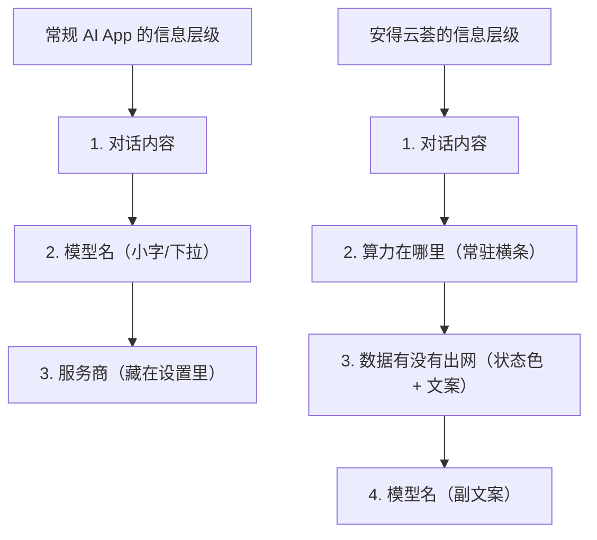

# 安得云荟 Android v1 · 移动端设计规范

| 项 | 值 |
| --- | --- |
| 版本 | v1.0 · 草案 |
| 撰写 | 许清楚（产品经理） |
| 配套 | [`PRD-android-v1.md`](./PRD-android-v1.md) · [`competitive-reference-android.md`](./competitive-reference-android.md) |
| 基线 | Tailwind CSS 3.4 + Radix UI(headless) + lucide-react + `tw-animate-css` |
| 令牌源 | `src/index.css`（CSS 变量单一事实来源）+ `tailwind.config.js`（语义映射） |
| 适用 | 手机（竖屏锁定）+ 平板（可横屏） |

---

## 0. 设计原则

本规范遵循决策 13：**品牌延续 + 移动重排**。

| 保留（品牌辨识度） | 重制（移动适配） |
| --- | --- |
| 配色体系（4 套主题预设 + 深浅色） | 间距节奏 |
| 花名体系与图标语言 | 字号阶梯 |
| oklch 色彩空间与语义令牌架构 | 触控尺寸 |
| 圆角与阴影的「柔和」气质 | 层级结构与导航模型 |
| 主题面板色的 `color-mix` 混合手法 | 交互原语（见 PRD §6） |

### 三条不可违背的红线

1. **一切信息与操作必须在纯触控下可达。** 无 hover、无右键、无快捷键依赖。
2. **一切可点击元素触控区 ≥ 48dp。** 视觉尺寸可以小，命中区不可以。
3. **一切异步与失败状态必须有对应设计。** 空态、加载、断网、权限拒绝、超时——缺一即不可发布（验收标准「可给别人试用」的直接要求）。

---

## 1. Design Tokens

### 1.1 颜色

#### 1.1.1 现状核实（沿用，不改）

桌面端已建立完整的 oklch 语义令牌体系，移动端**完整继承**，不新增色彩语义。

| 主题预设 | 色值 | 说明 |
| --- | --- | --- |
| 经典绿 | `#5a7f5d` | 浅色模式默认 |
| 经典蓝 | `#4a6fa5` | |
| 紫色 | `#7c5c9e` | 深色模式默认 |
| 橙色 | `#c97a3a` | |

「默认」的解析规则（`ThemeProvider.tsx:99`）：浅色 → 经典绿，深色 → 紫色。移动端保持一致。

#### 1.1.2 语义令牌（继承）

```
--background / --foreground        页面底与主文字
--card / --card-foreground         卡片
--popover / --popover-foreground   弹层（移动端主要是 Bottom Sheet）
--muted / --muted-foreground       次级文字与弱背景
--border / --input / --ring        描边、输入框、焦点环
--destructive                      破坏性操作
--element-bg / --element-fg        强调元素（按钮、激活态）
--element-muted / --element-border 强调元素的弱化态
--theme-panel-color                主题面板色（导航栏底色的混合源）
--nav-primary-bg                   一级导航底色 → 移动端复用为「底部 Tab 栏底色」
--nav-secondary-bg                 二级导航底色 → 移动端复用为「抽屉底色」
--main-panel-bg                    主内容区底色
```

#### 1.1.3 移动端新增令牌

```css
/* === Android 专用：安全区 === */
--safe-top:    env(safe-area-inset-top, 0px);
--safe-bottom: env(safe-area-inset-bottom, 0px);
--safe-left:   env(safe-area-inset-left, 0px);
--safe-right:  env(safe-area-inset-right, 0px);

/* === Android 专用：导航壳尺寸 === */
--tabbar-h:      56px;   /* 不含安全区 */
--tabbar-total:  calc(var(--tabbar-h) + var(--safe-bottom));
--appbar-h:      56px;
--rail-w:        80px;   /* 平板竖向导航 Rail */
--drawer-w:      min(84vw, 320px);
--touch-min:     48px;   /* 最小触控命中区 */

/* === Android 专用：算力来源状态色（AI 对话核心）=== */
--compute-local:  oklch(0.62 0.13 155);   /* 我的电脑 · 绿 · 未出网 */
--compute-cloud:  oklch(0.72 0.14  70);   /* 云端 · 琥珀 · 数据出网 */
--compute-device: oklch(0.62 0.12 250);   /* 本机 · 蓝 · 完全离线 */
--compute-down:   oklch(0.65 0.02  60);   /* 不可达 · 中性灰 */
```

> ⚠️ **算力来源色是本次唯一新增的品牌语义色。** 它承载 PRD §1 的核心价值主张（数据在哪里跑），必须在深浅两种主题下都通过 WCAG AA 对比度。选用绿/琥珀/蓝而非绿/红：**云端不是错误状态**，用红色会误导用户以为出问题了。琥珀表达的是「注意，这条数据要出门了」。

#### 1.1.4 深色模式

继承 `index.css` 的 `.dark` 定义（暖调深色，`oklch(0.18 0.005 60)` 打底）。

移动端额外要求：

| 项 | 要求 |
| --- | --- |
| 纯黑 | **不使用** `#000`。OLED 省电诱惑不值得牺牲既有的暖灰质感与层级表达 |
| 阴影 | 深色模式下阴影几乎不可见，**改用边框 + 背景明度差**表达层级 |
| 对比度 | 正文 ≥ 4.5:1，大字与图标 ≥ 3:1（P1-13 需专项审计） |
| 系统栏 | 状态栏与导航栏颜色随主题切换，需 Android 侧配合设置 |

### 1.2 字阶

桌面端令牌（`--text-xs` 0.75rem ~ `--text-3xl` 1.875rem）在移动端**重排**——桌面的正文 14px 在手机上偏小。

| 令牌 | 尺寸 | 行高 | 字重 | 用途 |
| --- | --- | --- | --- | --- |
| `--m-text-display` | 28px | 36px | 600 | 空态主标题、向导大标题 |
| `--m-text-title` | 22px | 28px | 600 | 页面标题（AppBar 大标题态） |
| `--m-text-headline` | 18px | 26px | 600 | 区块标题、卡片主标题 |
| `--m-text-body-lg` | 17px | 26px | 400 | **AI 对话消息正文**（长阅读，特意放大） |
| `--m-text-body` | 15px | 22px | 400 | 通用正文 |
| `--m-text-label` | 14px | 20px | 500 | 按钮、列表主文案 |
| `--m-text-caption` | 13px | 18px | 400 | 辅助说明、时间戳 |
| `--m-text-overline` | 11px | 16px | 500 | Tab 标签、角标、来源标记 |

**规则**：
- 正文最小 **13px**，Tab 标签可到 11px（因其有图标冗余）。任何低于 11px 的文字一律不允许。
- 必须响应系统字体缩放（Android 显示大小 / 字体大小设置）。因此**全部使用 `rem`**，禁止在文本上写死 `px`。
- 中文行高比英文需更宽松，已在上表体现（行高 ≈ 1.45–1.55 倍）。

### 1.3 间距

沿用桌面端 4px 基准的间距令牌（`--space-1` ~ `--space-12`），但**移动端的使用节奏不同**：

| 场景 | 桌面习惯 | 移动端规定 |
| --- | --- | --- |
| 页面左右边距 | 24–32px | **16px**（`--space-4`） |
| 卡片内边距 | 12–16px | **16px** |
| 卡片间距 | 8px | **12px**（`--space-3`） |
| 区块间距 | 16px | **24px**（`--space-6`） |
| 列表项高度 | 32–40px | **≥56px**（含 48dp 触控区 + 呼吸） |
| 表单项垂直间距 | 8px | **16px** |
| 底部内容安全距 | — | **`--tabbar-total` + 16px**（防止内容被 Tab 栏压住） |

> 移动端的核心间距原则：**横向收紧（屏幕窄），纵向放宽（手指粗）**。

### 1.4 圆角

| 令牌 | 值 | 用途 |
| --- | --- | --- |
| `--radius-sm` | `calc(var(--radius) - 4px)` ≈ 6px | 小标签、角标 |
| `--radius-md` | `calc(var(--radius) - 2px)` ≈ 8px | 输入框、小按钮 |
| `--radius-lg` | `var(--radius)` = 10px | 按钮、卡片 |
| `--radius-xl` | `calc(var(--radius) + 4px)` ≈ 14px | 大卡片、消息气泡 |
| `--m-radius-sheet` | **20px（仅上两角）** | Bottom Sheet 顶部 |
| `--radius-full` | 9999px | 头像、算力来源芯片、FAB |

移动端新增：Bottom Sheet 的 20px 上圆角是移动平台的强惯例，不遵守会立刻「不像原生」。

### 1.5 阴影 / 层级

桌面端 4 级阴影令牌（`--shadow-sm/md/lg/xl`）在移动端**降级使用**：

| 层级 | 桌面 | 移动端 | 说明 |
| --- | --- | --- | --- |
| 平面元素（卡片） | `shadow-card` | **无阴影**，改用 `--border` 描边 | 移动端阴影泛滥会显脏，且深色模式无效 |
| 底部 Tab 栏 | — | `--shadow-sm` 向上 + 顶部 1px 描边 | 与内容区分离 |
| Bottom Sheet | `--shadow-lg` | `--shadow-lg` + 遮罩 | 保留 |
| FAB / 悬浮按钮 | `--shadow-xl` | `--shadow-md` | 移动端不需要那么强 |
| 抽屉 | — | `--shadow-lg` + 遮罩 | 保留 |

**深色模式统一规则**：阴影全部替换为 `--border` 描边 + 背景明度提升一档。

### 1.6 触控尺寸

| 元素 | 视觉尺寸 | 命中区 |
| --- | --- | --- |
| 图标按钮 | 24px 图标 | **48×48dp** |
| 列表项 | — | **整行 ≥56dp** |
| Tab 项 | — | **等分宽 × 56dp** |
| 主按钮 | 高 48dp | 48dp |
| 次按钮 | 高 40dp | **上下各扩 4dp 至 48dp** |
| 开关 / 复选框 | 视觉小 | **48×48dp** |
| 消息气泡内的复制按钮 | 20px 图标 | **44×44dp**（消息流内密集，可放宽到 44） |

实现方式：视觉小、命中大 —— 用透明 padding 或 `::after` 伪元素扩展命中区，**不要**为了命中区把视觉元素撑大。

### 1.7 断点

采用 Material 3 Window Size Class 对齐的三档，以**屏幕最小宽度**为唯一判据（回应 PRD Q7：不判断「是不是平板」，只判断宽度）。

| 断点 | 范围 | 名称 | 导航形态 | 内容布局 |
| --- | --- | --- | --- | --- |
| **Compact** | `< 600dp` | 手机竖屏 | 底部 Tab 栏 + 抽屉 | 单栏 |
| **Medium** | `600–839dp` | 小平板 / 折叠展开 / 平板竖屏 | **左侧 Rail** + 抽屉 | 单栏（加宽，最大内容宽 720dp 居中） |
| **Expanded** | `≥ 840dp` | 平板横屏 / 大平板 | **左侧 Rail**（可展开为常驻抽屉） | **双栏**（列表 + 详情） |

```css
/* Tailwind 断点配置（tailwind.config.js theme.extend.screens） */
'md-win': '600px',   /* Compact → Medium */
'lg-win': '840px',   /* Medium → Expanded */
```

**方向策略**（决策 25）：
- `< 600dp` 设备：**锁定竖屏**（`android:screenOrientation="portrait"`）
- `≥ 600dp` 设备：允许自由旋转

> ⚠️ 工程注意：CSS 的 `px` 在 Android WebView 中对应 CSS 像素，需保证 `<meta name="viewport" content="width=device-width, initial-scale=1, viewport-fit=cover">`，此时 CSS px ≈ dp。另见 PRD Q10：`ThemeProvider` 的 `zoom` 包裹层会破坏这一对应关系，移动端建议禁用。

---

## 2. 布局基线

### 2.1 手机（Compact）整体结构

```
┌─────────────────────────────┐
│ ▓▓▓ 状态栏 (safe-top) ▓▓▓  │  系统绘制，颜色随主题
├─────────────────────────────┤
│ ☰   页面标题        ⚙ ⋮   │  AppBar 56dp
│                             │  ☰ = 抽屉入口，始终可见（决策 16）
├─────────────────────────────┤
│                             │
│                             │
│        内容区                │  可滚动
│                             │  底部预留 tabbar-total + 16
│                             │
│                             │
├─────────────────────────────┤
│  💬     ⊞      🔧     👤   │  Tab 栏 56dp
│ AI对话  模块   工具    我的  │
├─────────────────────────────┤
│ ░░ 手势导航条 (safe-bottom)░│  系统绘制
└─────────────────────────────┘
```

### 2.2 安全区处理

| 区域 | 处理 |
| --- | --- |
| 状态栏 | AppBar 背景延伸至状态栏下方，内容 `padding-top: var(--safe-top)` |
| 底部手势条 | Tab 栏背景延伸至底部，内容 `padding-bottom: var(--safe-bottom)` |
| 挖孔屏 / 刘海 | 横屏时（平板）左右需 `--safe-left/right` |
| 键盘弹起 | 输入区必须上推，**不得**遮挡输入框。AI 对话页尤其关键 |

---

## 3. 导航壳规格

### 3.1 底部 Tab 栏

| 属性 | 规格 |
| --- | --- |
| 高度 | 56dp + `--safe-bottom` |
| 背景 | `--nav-primary-bg`（继承桌面端一级导航底色）+ 顶部 1px `--border` |
| 项数 | 固定 4 项，等分宽度 |
| 图标 | 24dp，`lucide-react` |
| 标签 | 11px，**常驻显示**（不做「仅激活项显示标签」——中文四字标签靠图标无法自解释） |
| 激活态 | 图标填充/加粗 + 文字与图标转 `--element-bg` 色 + 图标上方 3dp 短指示条 |
| 非激活态 | `--muted-foreground` |
| 角标 | 传输中/未读时右上角 8dp 圆点，`--element-bg` |
| 点击反馈 | 无涟漪（Web 环境难做原生涟漪），改用 120ms 的 `scale(0.94)` + 背景闪现 |

#### 3.1.1 Tab 切换行为规范

| 场景 | 行为 |
| --- | --- |
| 点击非当前 Tab | 切换，**保留该 Tab 的导航栈与滚动位置** |
| 点击当前 Tab（一级） | 滚动到顶部 |
| 点击当前 Tab（在二级页） | 返回该 Tab 的一级页 |
| 系统返回键（在二级页） | 返回上一级 |
| 系统返回键（在一级页，非 Tab1） | **回到 Tab1（AI 对话）** |
| 系统返回键（在 Tab1 一级页） | 退出 App（需二次确认或直接退出，建议直接退出） |

> ⚠️ 每个 Tab 维护独立导航栈，这是移动端强惯例。用桌面端「单一 activeModule 状态」的模型（`App.tsx` 现状）会导致返回行为错乱，需要在导航层重做。

### 3.2 侧滑抽屉

#### 3.2.1 触发方式（决策 16 严格执行）

```
┌─────────────────────────────┐
│ ▓▓▓▓▓▓▓▓▓▓▓▓▓▓▓▓▓▓▓▓▓▓▓▓▓▓ │
├──┬──────────────────────────┤
│☰ │  ← ① 左上角按钮：主入口   │  始终可见，48×48dp
├──┴──────────────────────────┤
│▒▒│                        │▒│
│▒▒│                        │▒│  ▒ = 系统返回手势带
│XX│    ② 侧滑有效区         │▒│      20–24dp，禁止占用
│XX│                        │▒│
│XX│  XX = 侧滑起始区        │▒│  X 区：从左边缘 24dp 处
│▒▒│  （24dp ~ 96dp）        │▒│      向右到 96dp
│▒▒│                        │▒│
├──┴──────────────────────────┤
│         Tab 栏               │
└─────────────────────────────┘
```

| 属性 | 规格 |
| --- | --- |
| 主入口 | 左上角 ☰ 按钮，**所有一级页面始终可见** |
| 侧滑起始区 | 距屏幕左边缘 **24dp 起**、宽 **72dp**（即 24–96dp 区间） |
| 系统手势避让 | 0–24dp **完全不监听**，交给 Android 系统返回手势 |
| 触发阈值 | 水平位移 > 20dp 且 水平/垂直位移比 > 1.5（避免与列表纵向滚动冲突） |
| 跟手 | 抽屉随手指实时位移，松手按速度/位置判定吸附 |
| 关闭 | ① 点遮罩 ② 右滑 ③ 系统返回键 ④ 点已选项 |
| 宽度 | `min(84vw, 320px)` |
| 遮罩 | `rgba(0,0,0,0.45)`，随抽屉位移线性渐显 |

> 🔴 **可发现性风险（PRD Q3）**：内容区中部的侧滑没有任何边缘视觉暗示，绝大多数用户不会发现。**因此左上角 ☰ 按钮是唯一承诺入口**，侧滑仅作熟练用户加速器。首次引导中**不提及**侧滑手势——教一个用户学不会的手势只会增加挫败感。

#### 3.2.2 抽屉内容与手风琴二级（决策 15）

```
┌────────────────────────┐
│  安得云荟               │  品牌区
│  🖥 书房台式机 · 在线   │  ← 当前配对设备状态，常驻
├────────────────────────┤
│  💬  AI 对话            │  一级项，直接跳转
├────────────────────────┤
│  ⊞  模块            ▾  │  一级项，可展开
│      ├ 笔记（即将）     │  二级，禁用态
│      ├ 音乐（即将）     │
│      ├ 视频（即将）     │
│      └ 图片（即将）     │
├────────────────────────┤
│  🔧  工具            ▾  │  一级项，可展开
│      └ 传输             │  二级，可用
├────────────────────────┤
│  👤  我的               │
├────────────────────────┤
│  ⚙  设置                │
└────────────────────────┘
```

| 属性 | 规格 |
| --- | --- |
| 层级 | 最多二级（决策 15：暂时只有二级） |
| 展开方式 | 手风琴，**同时只允许一个一级项展开** |
| 展开动效 | 高度过渡 200ms `--ease-standard`，箭头旋转 180° |
| 一级项高度 | 52dp |
| 二级项高度 | 48dp，左侧缩进 32dp + 竖向引导线 |
| 禁用态二级项 | 40% 透明度，右侧「即将」标签，点击无反馈 |
| 设备状态行 | 显示当前默认设备名 + 在线/离线圆点，点击进入设备管理 |

> 抽屉顶部的**设备状态行**是刻意设计：本产品的一切都依赖「有没有连上我的电脑」，把它放在全局可达的位置，让用户随时能确认。

### 3.3 AppBar

| 属性 | 规格 |
| --- | --- |
| 高度 | 56dp（+ `--safe-top`） |
| 左 | ☰ 抽屉按钮（一级页）/ ← 返回（二级页），48×48dp |
| 中 | 页面标题，`--m-text-headline`，**左对齐**（不居中——中文标题居中在窄屏易与两侧按钮挤压） |
| 右 | 最多 2 个图标按钮，各 48×48dp |
| 滚动行为 | 内容上滑时 AppBar **保持常驻**（不做折叠大标题——首发页面层级浅，收益低） |
| 花名展示 | 进入模块页后，标题区显示「花名 · 功能词」，花名用 `--element-bg` 着色（决策 17） |

### 3.4 平板：Tab → Rail 转换

#### 3.4.1 转换规则

| 宽度 | 导航 | 内容 |
| --- | --- | --- |
| `<600dp` | 底部 Tab 栏（56dp） | 单栏 |
| `600–839dp` | 左侧 Rail（80dp） | 单栏，内容最大宽 720dp 居中 |
| `≥840dp` | 左侧 Rail（80dp），可展开为 256dp 常驻抽屉 | **双栏**：列表 280–360dp + 详情自适应 |

#### 3.4.2 Rail 规格

```
┌────┬────────────────────────────────┐
│ ☰  │  页面标题                      │
├────┼────────────────────────────────┤
│    │                                │
│ 💬 │                                │
│AI  │                                │
│    │        内容区                   │
│ ⊞  │                                │
│模块 │                                │
│    │                                │
│ 🔧 │                                │
│工具 │                                │
│    │                                │
│ 👤 │                                │
│我的 │                                │
│    │                                │
├────┤                                │
│ ⚙  │                                │
└────┴────────────────────────────────┘
 80dp
```

| 属性 | 规格 |
| --- | --- |
| 宽度 | 80dp |
| 项高 | 64dp（图标 24dp + 标签 11px） |
| 对齐 | 顶部对齐（不垂直居中——项数少时居中会显得漂浮） |
| 顶部 | ☰ 按钮（展开常驻抽屉） |
| 底部 | 设置入口 |
| 激活态 | 图标外一个 `--element-muted` 的胶囊背景（56×32dp，`--radius-full`） |
| 安全区 | `padding-left: var(--safe-left)` |

#### 3.4.3 双栏行为（≥840dp）

| 规则 | 说明 |
| --- | --- |
| 分栏比例 | 列表固定 320dp，详情占满剩余 |
| 分隔 | 1px `--border`，不做可拖拽分隔条（首发） |
| 空详情态 | 详情区显示占位插画 + 「从左侧选择一项」 |
| 列表选中态 | 常驻高亮（不同于手机的瞬时点击态） |
| 返回键 | 双栏下返回键**不清空详情**，而是退出当前 Tab 层级 |
| 旋转保持 | 横竖屏切换时保持当前选中项 |

---

## 4. 核心页面线框

### 4.1 AI 对话页（手机）

```
┌─────────────────────────────────┐
│ ☰   AI 对话              ⊕  ⋮  │  ⊕ = 新建会话
├─────────────────────────────────┤
│ ╭───────────────────────────╮   │
│ │🖥 书房台式机 · qwen2.5:14b │▾ │  ← 算力来源条（核心）
│ │   局域网直连 · 未出网       │   │     常驻，可点击切换
│ ╰───────────────────────────╯   │
├─────────────────────────────────┤
│                                 │
│              ╭────────────────╮ │
│              │ 帮我把这段整理  │ │  用户消息：右对齐
│              │ 成要点          │ │  气泡 --element-bg
│              ╰────────────────╯ │
│                                 │
│ ╭─────────────────────────────╮ │
│ │ 好的，要点如下：             │ │  AI 消息：左对齐
│ │ 1. ...                      │ │  无气泡，纯文字块
│ │ 2. ...                      │ │  17px 正文
│ ╰─────────────────────────────╯ │
│  🖥 书房台式机   ⧉ 复制  ↻ 重来 │  ← 来源溯源 + 操作
│                                 │
├─────────────────────────────────┤
│ ╭───────────────────────────╮   │
│ │ 说点什么…            📎  ⬆ │   │  输入区
│ ╰───────────────────────────╯   │  多行自增高，最多 5 行
├─────────────────────────────────┤
│  💬     ⊞      🔧     👤       │
└─────────────────────────────────┘
```

#### 4.1.1 降级卡片（PC 不可达时，行内插入）

```
│ ╭─────────────────────────────╮ │
│ │ ⚠ 书房台式机 没有响应        │ │  背景 --muted
│ │                             │ │  左侧 3dp --compute-down 竖条
│ │ 可能是电脑睡眠了，或者不在   │ │
│ │ 同一个 Wi-Fi。               │ │
│ │                             │ │
│ │ ╭────────╮ ╭─────────────╮  │ │
│ │ │ 重试   │ │ 改用云端 ☁  │  │ │  48dp 高按钮
│ │ ╰────────╯ ╰─────────────╯  │ │
│ ╰─────────────────────────────╯ │
```

#### 4.1.2 来源切换分隔标记（会话中途切换后插入）

```
│  ──────  以下改由 ☁ OpenAI 处理  ────── │   11px，--compute-cloud 色
```

### 4.2 AI 对话页（平板 ≥840dp 双栏）

```
┌────┬──────────────────┬────────────────────────────────┐
│ ☰  │ 会话              │ 关于向量数据库的讨论        ⋮  │
├────┼──────────────────┼────────────────────────────────┤
│ 💬 │ ╭──────────────╮ │ ╭────────────────────────────╮ │
│ AI │ │▸ 关于向量… ●│ │ │🖥 书房台式机 · qwen2.5:14b▾│ │
│    │ ╰──────────────╯ │ ╰────────────────────────────╯ │
│ ⊞  │ ╭──────────────╮ │                                │
│模块 │ │  周报草稿    │ │              ╭───────────────╮ │
│    │ ╰──────────────╯ │              │ 用户消息      │ │
│ 🔧 │ ╭──────────────╮ │              ╰───────────────╯ │
│工具 │ │  代码重构    │ │                                │
│    │ ╰──────────────╯ │ ╭────────────────────────────╮ │
│ 👤 │                  │ │ AI 回复正文…                │ │
│我的 │                  │ ╰────────────────────────────╯ │
│    │                  │  🖥 书房台式机  ⧉ 复制  ↻ 重来 │
│    │                  │                                │
│    │ ╭──────────────╮ │ ╭────────────────────────────╮ │
│    │ │  ⊕ 新建会话  │ │ │ 说点什么…            📎 ⬆ │ │
├────┤ ╰──────────────╯ │ ╰────────────────────────────╯ │
│ ⚙  │                  │                                │
└────┴──────────────────┴────────────────────────────────┘
 80dp       320dp                   自适应
```

### 4.3 传输页（工具 Tab → 茑萝 → 传输）

```
┌─────────────────────────────────┐
│ ←   黄金棋盘 · 传输         ↻  │  花名品牌在页内展现
├─────────────────────────────────┤
│  这台设备                        │
│  ╭───────────────────────────╮  │
│  │ 📱 Redmi K60 · 可被发现   │  │
│  │    192.168.1.37           │  │
│  ╰───────────────────────────╯  │
├─────────────────────────────────┤
│  附近设备                    ⟳  │
│  ╭───────────────────────────╮  │
│  │ 🖥 书房台式机          ●  │  │  ● 绿 = 在线
│  │    192.168.1.10 · 已配对  │  │  整行 ≥56dp
│  ╰───────────────────────────╯  │  长按 → Bottom Sheet
│  ╭───────────────────────────╮  │  （重命名/解绑/设为默认）
│  │ 💻 办公笔记本          ○  │  │  ○ 灰 = 离线
│  │    上次在线 2 小时前       │  │
│  ╰───────────────────────────╯  │
├─────────────────────────────────┤
│  传输中                          │
│  ╭───────────────────────────╮  │
│  │ 📷 IMG_2043.jpg      ✕   │  │
│  │ ▓▓▓▓▓▓▓▓░░░░  62% 1.2MB/s │  │
│  ╰───────────────────────────╯  │
├─────────────────────────────────┤
│        ╭─────────────────╮      │
│        │  ⬆  发送文件     │      │  主按钮 48dp
│        ╰─────────────────╯      │  唤起 SAF 选择器
├─────────────────────────────────┤
│  💬     ⊞      🔧     👤       │
└─────────────────────────────────┘
```

#### 4.3.1 发现失败态（PRD P0-10 分诊式反馈）

```
┌─────────────────────────────────┐
│  附近设备                    ⟳  │
│                                 │
│         ╭─────────╮             │
│         │   📡    │             │  插画/图标
│         ╰─────────╯             │
│                                 │
│      没有找到你的电脑            │  --m-text-headline
│                                 │
│  逐条检查：                      │  ← 关键：给原因，不是只说失败
│                                 │
│  ○ 电脑上的安得云荟开着吗？      │  每条可点击展开说明
│  ○ 手机和电脑连的是同一个        │
│    Wi-Fi 吗？（不能是访客网络）  │
│  ○ 电脑防火墙放行了吗？          │
│    需要 UDP/TCP 53317           │
│                                 │
│  ╭───────────╮ ╭─────────────╮  │
│  │ 重新扫描   │ │ 手动填 IP   │  │
│  ╰───────────╯ ╰─────────────╯  │
└─────────────────────────────────┘
```

> 「手动填 IP」是必要的逃生舱：组播在某些路由器/企业网下必然失败，没有兜底路径会直接损失用户。

### 4.4 模块 Tab · 路线图预告页（决策 18）

```
┌─────────────────────────────────┐
│ ☰   模块                        │
├─────────────────────────────────┤
│                                 │
│  你的内容库                      │  --m-text-display
│                                 │
│  这里放你自己的东西——            │  ← §4.2 边界定义句
│  笔记、音乐、视频、图片。         │     教会用户分类标准
│  想对文件做点什么，去「工具」。   │
│                                 │
│  正在路上：                      │
│                                 │
│  ╭───────────────────────────╮  │
│  │ 1  📝  笔记                │  │  全部 40% 透明度
│  │       鸢尾花               │  │  不可点击
│  ╰───────────────────────────╯  │  无点击反馈
│  ╭───────────────────────────╮  │
│  │ 2  🎵  音乐                │  │
│  │       铃兰                 │  │
│  ╰───────────────────────────╯  │
│  ╭───────────────────────────╮  │
│  │ 3  🎬  视频                │  │
│  │       玉兰                 │  │
│  ╰───────────────────────────╯  │
│  ╭───────────────────────────╮  │
│  │ 4  🖼  图片                │  │
│  │       莲花                 │  │
│  ╰───────────────────────────╯  │
│                                 │
│  顺序可能调整                    │  11px，--muted-foreground
│                                 │
├─────────────────────────────────┤
│  💬     ⊞      🔧     👤       │
└─────────────────────────────────┘
```

**硬性约束**：卡片上只有序号 `1 2 3 4`，**不允许出现任何日期、季度、版本号、"敬请期待"以外的时间承诺**。

### 4.5 配对向导（决策 23 · 唯一的首次引导）

五步，每步全屏，底部固定主按钮。

```
Step 1 · 欢迎          Step 2 · PC 端准备      Step 3 · 权限
┌──────────────┐      ┌──────────────┐       ┌──────────────┐
│              │      │ 在你的电脑上： │       │              │
│    🖥 ↔ 📱   │      │              │       │      🔓      │
│              │      │ ☐ 打开安得云荟│       │              │
│  连上你自己   │      │ ☐ 连同一 WiFi │       │ 需要本地网络  │
│  的电脑       │      │ ☐ 防火墙放行  │       │ 权限来找到    │
│              │      │   53317      │       │ 你的电脑      │
│ 手机上用电脑  │      │ ☐ 若要用 AI： │       │              │
│ 的算力和文件  │      │   设置        │       │ 我们不会访问  │
│ 不经过任何    │      │   OLLAMA_HOST│       │ 互联网        │
│ 第三方服务器  │      │   =0.0.0.0   │       │              │
│              │      │              │       │              │
│ ╭──────────╮ │      │ ╭──────────╮ │       │ ╭──────────╮ │
│ │  开始     │ │      │ │ 都好了    │ │       │ │ 允许      │ │
│ ╰──────────╯ │      │ ╰──────────╯ │       │ ╰──────────╯ │
│  暂时跳过     │      │ 复制这份清单  │       │  暂时跳过     │
└──────────────┘      └──────────────┘       └──────────────┘

Step 4 · 扫描与选择    Step 5 · 完成
┌──────────────┐      ┌──────────────┐
│ 正在找…       │      │      ✓       │
│              │      │              │
│  ◜◝ 扫描动画  │      │  已连上       │
│              │      │  书房台式机   │
│ 找到 1 台：   │      │              │
│ ╭──────────╮ │      │ 🖥 发现 3 个  │
│ │🖥 书房台式│ │      │   本地模型    │
│ │ .1.10     │ │      │   已设为默认  │
│ │ 指纹 a4f2e│ │      │   算力来源    │
│ ╰──────────╯ │      │              │
│              │      │ ╭──────────╮ │
│ 请在电脑上    │      │ │ 开始对话  │ │
│ 确认这个指纹  │      │ ╰──────────╯ │
└──────────────┘      └──────────────┘
```

| 要求 | 说明 |
| --- | --- |
| **每步都可跳过** | 决策 13（US-13）：没有 PC 的人必须能直达云 API 配置，不被卡死 |
| **指纹双端校验** | 手机显示指纹后 6 位，PC 端弹确认框显示同样的 6 位（`transfer.rs` 已有 fingerprint 机制） |
| **Step 2 清单可复制** | 回应 PRD Q6：先给「复制清单」的最低成本方案 |
| **Step 5 顺带探测 Ollama** | 成功则自动写入 `http://<设备IP>:11434/v1`，**绝不让用户手填 IP** |
| **Ollama 探测失败** | 不算配对失败，Step 5 变为「已连上，但没找到 AI 模型」+ `OLLAMA_HOST` 指引 + 「先用云端」 |

### 4.6 我的页

```
┌─────────────────────────────────┐
│ ☰   我的                        │
├─────────────────────────────────┤
│  ╭───────────────────────────╮  │
│  │ 🖥 书房台式机         ●  │  │  当前设备卡片
│  │    192.168.1.10           │  │  点击 → 设备管理
│  │    在线 · 3 个本地模型     │  │
│  ╰───────────────────────────╯  │
├─────────────────────────────────┤
│  算力                            │
│  🖥 我的电脑            已连接 › │
│  ☁ 云端 API           未配置 › │
│  📱 本机模型           不可用 › │  P2，首发置灰
├─────────────────────────────────┤
│  设备                            │
│  📡 已配对设备              1 › │
│  📥 接收文件保存到              ›│
├─────────────────────────────────┤
│  外观                            │
│  🎨 主题         跟随系统 ›     │
│  🌈 主题色           经典绿 ›   │
├─────────────────────────────────┤
│  关于                            │
│  ℹ 版本                 v1.0.0 │
│  📄 开源许可                   ›│  含 LocalSend NOTICE
├─────────────────────────────────┤
│  💬     ⊞      🔧     👤       │
└─────────────────────────────────┘
```

### 4.7 系统分享目标层（PRD §5.4 · 独立轻量路由）

```
┌─────────────────────────────────┐
│         （半透明遮罩）            │
│                                 │
│                                 │
├─────────────────────────────────┤
│           ───                   │  拖拽指示条
│  发送到                          │
│                                 │
│  📷 3 张图片 · 共 8.4 MB         │  内容摘要
│                                 │
│  ╭───────────────────────────╮  │
│  │ 🖥 书房台式机          ●  │  │  在线设备优先
│  ╰───────────────────────────╯  │
│  ╭───────────────────────────╮  │
│  │ 💻 办公笔记本          ○  │  │  离线置灰
│  ╰───────────────────────────╯  │
│                                 │
│  ╭───────────────────────────╮  │
│  │        发送                │  │
│  ╰───────────────────────────╯  │
└─────────────────────────────────┘
   ⚠ 无 Tab 栏、无抽屉、无 AppBar
```

**关键**：这一层**不加载四 Tab 外壳**（PRD SH-2）。冷启动时直接渲染此层，发送完成后自动关闭返回原 App（SH-3）。

---

## 5. 组件规范（移动端专有）

### 5.1 Bottom Sheet（替代右键菜单，PRD P0-18）

| 属性 | 规格 |
| --- | --- |
| 触发 | **长按 500ms** + 触觉反馈（`navigator.vibrate(10)`） |
| 圆角 | 上两角 20dp |
| 顶部 | 4dp × 32dp 拖拽指示条，`--muted-foreground` |
| 项高 | 56dp |
| 破坏性操作 | `--destructive` 色，置于末位，与其他项间隔 8dp + 分隔线 |
| 关闭 | 下滑 / 点遮罩 / 系统返回键 |
| 最大高度 | 60vh，超出内部滚动 |
| 底部 | `padding-bottom: var(--safe-bottom)` |
| 实现 | Radix `Dialog` 或 `Popover` 的 headless 基座 + 自定义移动端样式 |

### 5.2 算力来源芯片（Compute Chip）

本产品的**标志性组件**，需要专门规范。

```
╭─────────────────────────────────────╮
│ 🖥  书房台式机 · qwen2.5:14b      ▾ │
│     局域网直连 · 未出网              │
╰─────────────────────────────────────╯
```

| 状态 | 图标 | 主色 | 副文案 | 场景 |
| --- | --- | --- | --- | --- |
| 我的电脑 | 🖥 | `--compute-local` | 局域网直连 · 未出网 | 已连 PC Ollama |
| 云端 | ☁ | `--compute-cloud` | OpenAI 兼容 · **数据出网** | 用云 API |
| 本机 | 📱 | `--compute-device` | 端侧运行 · 完全离线 | P2 |
| 不可达 | ⚠ | `--compute-down` | 没有响应 · 点击处理 | PC 掉线 |
| 未配置 | ⊕ | `--muted-foreground` | 还没设置算力来源 | 首次 |

| 属性 | 规格 |
| --- | --- |
| 位置 | AI 对话页顶部，AppBar 下方，**常驻不随消息滚动** |
| 高度 | 双行 56dp |
| 背景 | 对应状态色的 12% 透明混合（`color-mix`） |
| 左边框 | 3dp 实心状态色 |
| 点击 | 展开 Bottom Sheet 切换来源 |
| 消息内溯源标记 | 单行 11px，仅图标 + 设备名，`--muted-foreground` |

### 5.3 长按多选态（P1-10）

| 属性 | 规格 |
| --- | --- |
| 进入 | 列表项长按 500ms |
| AppBar 变形 | 标题 → 「已选 N 项」，左侧 ← 变 ✕，右侧显示批量操作 |
| 列表项 | 左侧滑入复选框（200ms） |
| 退出 | ✕ / 系统返回键 / 取消全选 |

### 5.4 状态页模板（P0-20 · 验收硬性要求）

所有异步区域必须实现四态，缺一不可：

| 态 | 构成 | 禁止 |
| --- | --- | --- |
| **加载中** | 骨架屏（列表）或旋转指示（操作） | 禁止无限空白 |
| **空** | 图标 + 一句主文案 + 一句解释 + 一个主行动按钮 | 禁止只有「暂无数据」 |
| **错误** | 图标 + **具体原因** + 可诊断清单 + 重试按钮 | 禁止英文报错、禁止错误码裸露、禁止只说「失败」 |
| **无权限** | 图标 + 为什么需要 + 去设置按钮 + 降级方案 | 禁止卡死 |

---

## 6. AI 对话界面方案 ⭐（决策 19 · PM 出方案）

### 6.1 设计问题

用户要求：「未来肯定是要极致完善的，但是暂时可以先出能用的方案」，且差异化定位是「本地优先 + 连回 PC」。

**要回避的失败模式**：做成第 500 个套壳聊天窗口——顶部一个模型下拉框、中间气泡流、底部输入框。那样的界面里，「跑在我自己的电脑上」这件事**完全不可见**，产品最核心的价值主张被埋没在设置页的一个下拉选项里。

### 6.2 方案：「算力可见的对话」

**核心主张：把「算力在哪里」从设置项提升为界面的第一公民。**



### 6.3 四个设计支点

#### 支点 1 · 算力来源条常驻（不是模型下拉框）

它回答的不是「用哪个模型」，而是「**我这句话会发到哪里去**」。

- 常驻在对话顶部，不随滚动消失
- 用颜色 + 文字**双通道**编码（不能只靠颜色——色盲用户、以及颜色在不同主题下的辨识度问题）
- 云端标注「数据出网」——**这是本地优先产品的诚实义务**。不写这句，产品的价值主张就是空话

#### 支点 2 · 每条回复带来源溯源

一段长对话往回滚时，用户能看到每一条回复分别由谁生成。

理由：会话中途可能因 PC 掉线而切到云端。如果不标记，用户永远不知道自己哪些内容出过网。**这是可审计性，不是装饰。**

#### 支点 3 · 降级是设计，不是报错

「PC 睡着了」是这个产品**最高频的失败场景**（远比 API Key 错误高频）。用 toast 或红字处理它是错的——它不是异常，是常态。

处理方式：在消息流中**行内插入降级卡片**（§4.1.1），提供原因猜测 + 两个出口（重试 / 改用云端）。用户选择改用云端后，插入分隔标记（§4.1.2）。

整个过程**不打断对话流**，用户不需要离开页面去设置里改配置。

#### 支点 4 · 输入区预留上下文注入位

为 PRD P1-06 的上下文注入协议预留 UI 位置：输入框上方可堆叠「上下文芯片」。

```
╭─────────────────────────────────╮
│ 📎 IMG_2043.jpg  ✕              │  ← 上下文芯片区
├─────────────────────────────────┤
│ 说点什么…                 📎 ⬆ │
╰─────────────────────────────────╯
```

> ⚠️ 与 PRD Q1 关联：首发阶段该协议**没有真实的跨模块调用方**。此处 UI 位可先只支持「本地选文件」这一种注入，避免为一个未验证的契约做过度设计。

### 6.4 与常规聊天 App 的差异对照

| 维度 | 常规 AI App | 安得云荟 |
| --- | --- | --- |
| 顶部主控件 | 模型下拉框 | **算力去向条** |
| 服务商信息 | 藏在设置 | 常驻可见 + 每条溯源 |
| 隐私表达 | 隐私政策文本 | **界面状态色实时表达** |
| 后端故障 | 红色 toast | 行内降级卡片 + 一键切换 |
| 切换后端 | 去设置改配置 | 对话流内直接切 + 留痕 |
| 消息气泡 | 双向气泡 | 用户带气泡 / AI 纯文字块（长文阅读友好） |

### 6.5 首发范围内的取舍

| 做 | 不做（后续） |
| --- | --- |
| 流式输出 + 停止生成 | 分支对话 / 消息编辑重发 |
| Markdown + 代码高亮（P1） | LaTeX / 图表渲染 |
| 复制 / 重新生成 | 消息级引用回复 |
| 会话列表（P1） | 会话搜索 / 标签 / 归档 |
| 本地文件作上下文（P1） | 跨模块上下文注入（依赖 Q1 结论） |
| 单一系统提示词 | 提示词模板库 / 角色 |

---

## 7. 视觉方向选项（决策 20 · 请用户拍板）

> 团队无 UI 设计师角色。以下提供 3 个方向的**框架**，不定死审美。三者共用同一套 token 结构，切换成本低——差异主要在**层级表达手法**与**质感倾向**。

### 方向 A · 「素纸」——克制留白

| 维度 | 取向 |
| --- | --- |
| 层级表达 | 纯靠**留白 + 分隔线**，几乎不用卡片和阴影 |
| 背景 | 大面积 `--background` 单色 |
| 主题色用量 | 极少，仅激活态与主按钮 |
| 圆角 | 偏小（8–10dp） |
| 质感 | 平面、无渐变、无毛玻璃 |
| 参考气质 | Things 3、Bear、iA Writer |
| ✅ 优点 | 性能最好（无 `backdrop-filter`）；长文阅读舒适；深色模式最容易做对；最不容易过时 |
| ❌ 缺点 | 品牌辨识度弱，与桌面端现有的玻璃质感断裂较大 |
| 品牌延续性 | 🔴 弱 |

### 方向 B · 「琉璃」——延续桌面端玻璃质感

| 维度 | 取向 |
| --- | --- |
| 层级表达 | 半透明层叠 + 毛玻璃模糊 |
| 背景 | 支持用户自定义背景图（沿用桌面端 `bgImage` 能力） |
| 主题色用量 | 中等，主题面板色混入导航栏与卡片底 |
| 圆角 | 偏大（14–20dp） |
| 质感 | `backdrop-blur` + `--panel-opacity` |
| 参考气质 | 桌面端现状、iOS 系统组件 |
| ✅ 优点 | **品牌延续性最强**；与桌面端视觉一致；用户自定义背景是差异化玩法 |
| ❌ 缺点 | 🔴 **`backdrop-filter` 在 Android WebView 上是已知的 GPU 性能杀手**，尤其在滚动容器内。中低端机可能明显掉帧。深色模式下毛玻璃层次容易糊成一片 |
| 品牌延续性 | 🟢 强 |
| 若选此项 | 必须限制毛玻璃**仅用于 3 处静态层**：底部 Tab 栏、抽屉、Bottom Sheet。**严禁**用于任何滚动内容内的元素 |

### 方向 C · 「织物」——柔和实心分层（推荐默认）

| 维度 | 取向 |
| --- | --- |
| 层级表达 | **实心色块的明度差**分层（不透明，无模糊） |
| 背景 | `--main-panel-bg`（已是主题色 15% 混合），卡片用 `--card` 提亮一档 |
| 主题色用量 | 中等偏多，通过 `color-mix` 让主题色渗透到面板底色（**复用桌面端现有手法**） |
| 圆角 | 中等（12–14dp） |
| 质感 | 实心、微妙明度差、极轻描边 |
| 参考气质 | Material You、Notion 移动版 |
| ✅ 优点 | 性能与方向 A 持平（无 `backdrop-filter`）；**保留了桌面端的主题色渗透手法，品牌延续性好**；深色模式表现稳定；四套主题预设的差异感最明显 |
| ❌ 缺点 | 视觉上不如 B 有「高级感」；需要仔细调明度阶梯，否则层级模糊 |
| 品牌延续性 | 🟡 中上 |

### 对比与建议

| | A 素纸 | B 琉璃 | C 织物 |
| --- | --- | --- | --- |
| 品牌延续（决策 13） | 🔴 弱 | 🟢 强 | 🟡 中上 |
| 移动端性能 | 🟢 最好 | 🔴 有风险 | 🟢 好 |
| 深色模式难度 | 🟢 易 | 🔴 难 | 🟢 易 |
| 实现工作量 | 🟢 小 | 🟡 中 | 🟡 中 |
| 与现有 token 复用度 | 🟡 中 | 🟢 高 | 🟢 高 |

> 📌 **PM 建议：方向 C（织物）**。它在「品牌延续」（决策 13 的硬要求）与「移动端性能」（验收标准 A10）之间取得平衡，且**直接复用桌面端已有的 `--nav-primary-bg` / `--main-panel-bg` 主题色混合机制**，实现成本最低。
>
> 若用户强烈希望保留玻璃质感，选 B，但必须接受「毛玻璃仅限 3 处静态层」的性能约束。
>
> **最终由用户拍板（PRD Q9）。**

---

## 8. 动效规范（决策 22）

### 8.1 基本判断

用户已决定引入完整动效库（framer-motion 级别），并明确**体积不是问题**（gzip 后 30–50KB，相对 470MB 的 APK 可忽略）。

**真正的约束是运行时性能**：framer-motion 是 JS 驱动的动画，跑在 Tauri WebView 里，每帧都要过 JS 主线程。在低端机上，高频场景必然掉帧。

### 8.2 分工规则（硬性）

| 场景 | 实现方式 | 理由 |
| --- | --- | --- |
| **页面转场** | framer-motion | 低频，需要编排与打断 |
| **Bottom Sheet 弹出/收起** | framer-motion | 需要跟手拖拽 + 速度判定 |
| **抽屉侧滑** | framer-motion（`drag` + `dragConstraints`） | 需要跟手 + 惯性吸附 |
| **模态/对话框** | framer-motion | 低频 |
| **列表项进入（首屏 stagger）** | framer-motion，**仅首屏 ≤10 项** | 超出即改 CSS |
| **列表滚动** | 🔴 **原生滚动，零 JS 介入** | 最高频场景，绝不允许 JS 动画 |
| **虚拟列表项复用** | 🔴 **无动画** | `@tanstack/react-virtual` 的项不做进出场动画 |
| **按钮点击反馈** | CSS `transition` / `tw-animate-css` | 高频 |
| **hover/focus 态** | CSS | — |
| **骨架屏闪烁** | CSS `@keyframes` | 常驻循环动画，绝不用 JS |
| **加载旋转** | CSS | 同上 |
| **Tab 切换指示条** | CSS `transition` | 高频 |
| **流式文字输出** | 🔴 **无动画**，直接 DOM 追加 | 每秒数十次更新，任何动画都会拖垮 |
| **手风琴展开** | CSS `grid-template-rows` 过渡 | 可纯 CSS 实现 |

> `tw-animate-css` 已在 `index.css:21` 引入，CSS 动画侧无需新增依赖。

### 8.3 时长与曲线

复用桌面端令牌，不新增：

| 令牌 | 值 | 用途 |
| --- | --- | --- |
| `--dur-fast` | 100ms | 按钮反馈、状态切换 |
| `--dur-base` | 200ms | 手风琴、Tab 指示条、遮罩渐变 |
| `--dur-slow` | 300ms | 页面转场、Bottom Sheet、抽屉 |
| `--ease-standard` | `cubic-bezier(0.4, 0, 0.2, 1)` | 通用 |
| `--ease-out` | `cubic-bezier(0.16, 1, 0.3, 1)` | 入场、弹出（有「减速停稳」感） |

**移动端补充**：
- 任何动效**不得超过 350ms**。移动端用户操作节奏快，超过 350ms 就是「卡」。
- 跟手手势（抽屉、Sheet 拖拽）**不设时长**，1:1 跟随手指；仅松手后的吸附用 `--dur-slow` + 弹簧。

### 8.4 性能红线（不可逾越）

| # | 红线 |
| --- | --- |
| R1 | **只动 `transform` 和 `opacity`**。禁止动画 `width`/`height`/`top`/`left`/`margin`/`filter`（触发 layout/paint） |
| R2 | **禁止在滚动容器内使用 `backdrop-filter`** |
| R3 | **同时运行的 JS 动画 ≤ 3 个** |
| R4 | **列表滚动期间零 JS 动画** |
| R5 | **流式输出期间禁止任何动画** |
| R6 | 谨慎使用 `will-change`，用完必须移除（长期挂载会耗尽 GPU 内存） |
| R7 | 必须响应 `prefers-reduced-motion`，降级为瞬时切换 |
| R8 | **中端机（骁龙 6 系级别）实机验证无肉眼掉帧**（验收标准 A10） |

### 8.5 触觉反馈

| 场景 | 强度 |
| --- | --- |
| 长按触发 Bottom Sheet | 10ms 轻震 |
| 传输完成 | 20ms |
| 传输失败 / 配对失败 | 双击式 `[10, 50, 10]` |
| Tab 切换 | **无**（过于高频，会烦） |

---

## 9. 无障碍与适配底线

| # | 要求 |
| --- | --- |
| A11Y-1 | 所有图标按钮必须有 `aria-label`（Radix 已提供基础支持，不要绕过） |
| A11Y-2 | 文字对比度 ≥ 4.5:1（正文）/ 3:1（大字与图标） |
| A11Y-3 | 状态**不得仅用颜色表达**——算力来源条必须同时有图标 + 文字 |
| A11Y-4 | 支持系统字体缩放至 200% 不破版（全 `rem`，容器用 `min-height` 而非 `height`） |
| A11Y-5 | TalkBack 可完整朗读对话内容与状态 |
| A11Y-6 | 响应 `prefers-reduced-motion` |
| A11Y-7 | 焦点顺序合理（外接键盘/无障碍设备场景） |

---

## 10. 工程落地映射

### 10.1 token 落地位置

| 内容 | 落地文件 |
| --- | --- |
| 移动端新增 CSS 变量（安全区、导航尺寸、算力色） | `src/index.css` 的 `:root` 与 `.dark` |
| 断点 `md-win` / `lg-win` | `tailwind.config.js` → `theme.extend.screens` |
| 移动端字阶 | `tailwind.config.js` → `theme.extend.fontSize`，值引用 `--m-text-*` |
| 触控尺寸工具类 | `tailwind.config.js` → `theme.extend.spacing.touch: 'var(--touch-min)'` |

> 遵循 `index.css` 头部既定约定：**先加令牌，再引用；禁止在组件里写死色值**。

### 10.2 需要移动端分支的现有组件

| 组件 | 处置 |
| --- | --- |
| `Titlebar.tsx` | 移动端不加载 |
| `HostSidebar.tsx` / `ModuleSidebarShell.tsx` / `SecondaryNavShell.tsx` | 移动端替换为抽屉 / Rail |
| `AppNav.tsx` | 移动端替换为底部 Tab / Rail；注意其 `title={...}` tooltip 在移动端无效 |
| `TrayMenu.tsx` / `DeskpetPet.tsx` / `Capsule.tsx` / `ScreenshotOverlay.tsx` | 移动端不加载 |
| `FloatingDropzoneView.tsx` | 移动端不加载，由系统分享替代 |
| 使用 `@radix-ui/react-context-menu` 的所有位置 | 🔴 替换为长按 Bottom Sheet |
| `TransferStationPanel.tsx` / `TransferReceiveModal.tsx` | 移动端重排布局，接收弹窗保持全局挂载 |
| `useAiStream.ts`（`components/capsule/`） | ✅ **逻辑可直接复用**，从胶囊迁至 AI Tab |
| `ThemeProvider.tsx` | 移动端禁用 `zoom` 包裹（见 PRD Q10） |

### 10.3 index.html 必需配置

```html
<meta name="viewport"
      content="width=device-width, initial-scale=1, maximum-scale=1,
               user-scalable=no, viewport-fit=cover">
```

`viewport-fit=cover` 是 `env(safe-area-inset-*)` 生效的前提。

---

## 11. 待确认（设计侧）

| # | 问题 | 归属 |
| --- | --- | --- |
| D1 | **视觉方向 A / B / C 选哪个？** | 用户拍板（= PRD Q9） |
| D2 | 是否保留桌面端的「自定义背景图/视频」能力到移动端？（影响方向 B/C 的实现） | 用户 |
| D3 | 是否保留 UI 缩放能力？建议禁用（= PRD Q10） | 用户 |
| D4 | 四套主题预设是否全部保留到移动端，还是首发只给「默认」？ | 用户 |
| D5 | 底部 Tab 标签常驻显示 vs 仅激活项显示——本规范定为**常驻**，请确认 | 用户 |
| D6 | 「工具」Tab 首发只有 1 项，是否仍走「容器页 → 传输」两级？本规范按决策 21 定为**是** | 用户确认 |
</content>
